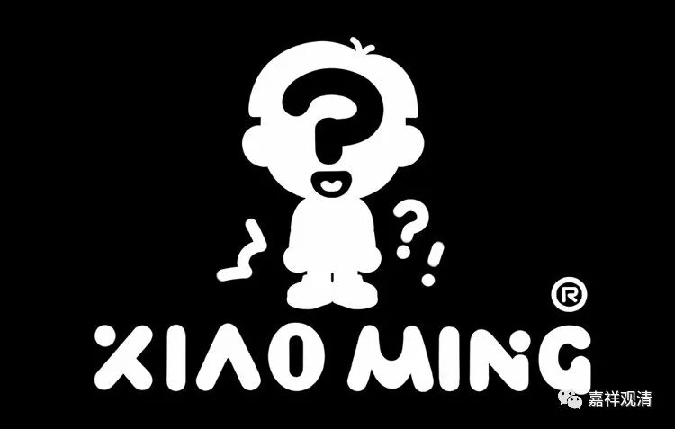

**《善说精髓》015（中）**

** “依师教授获决定，一切圣言之含意，**

** 观止实修次第明，根绝谤法现为诀。”**

“现为诀”的是什么呢？就是这一颂里面“现为诀”前面的这些内容——因为知道这一切圣言现为教授，就不会出现谤法的罪过。觉得佛所讲的一部分是重要的，另外一部分就没有必要看的——这个就是谤法。如果能够通达一切圣言现为教授呢，就不会出现这样的谤法的罪过。

“依师”，就是依照老师的教言或者教授，就能够对一切的圣言——佛陀所讲的一切经典都是修行用的这点获得决定，这个“获决定”的就是一切圣言的核心内容都是教授——全部的佛语教授，或者观察修，或者止住修，全都是实修的次第，是修行的前后差别。对于这一点能够获得决定呢，就可以断除谤法（这里的谤法，指的是某部分是需要的，某部分是不需要的，可以舍弃）的罪过。这个，就是无上的口诀——“现为诀”，也可以说是现为心要。

现在很多人听到口诀就很激动啊，其实道次第里面的内容基本上都是口诀的意思，《心经》也差不多，《心经》的意思基本上也是口诀的意思，心就是核心的内容，也相当于口诀、精要。

所以有些道次第的著作在讲到这个内容的时候，会说有些人看到口诀就特别地激动，把教法就放到一边，却把师父的口诀很当回事，其实师父的口诀也是从教法里来的。如果你认为佛陀的教典都是可以放弃的，唯独把师父的口诀当回事，这个就是谤法。如果你认为这段时间师父教的这个内容比较重要，其他的先放一放，这倒没问题啊。可是，如果你认为教法不重要，反而重要的是师父的口诀，那就是有问题了哦。

师父的口诀实际上全部都是从经典里面来的，否则就会变成师父的口诀和教法是相违背的了。如果师父的口诀和教法是相违的，那你要赶快逃走，肯定要赶快逃走，或者学一下小明，多问几句：“明明经典里面讲戒、定、慧，师父你为什么说我们不需要戒、定、慧？”后面会讲到，辨别是非、辨别善恶的智慧讲起来是很容易的，但是实践起来的话真的有点难，因为我们如果真的对师父产生了一些信心，你敢不敢问他这句话呢？具体的事情不理解，该问的时候还是要问。

