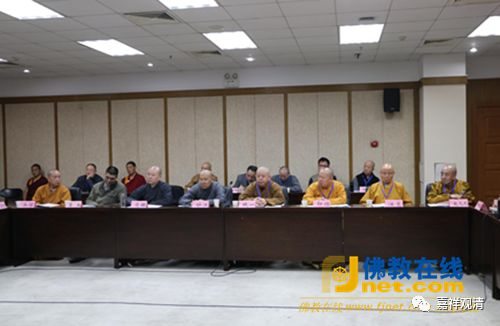

**《善说精髓》015（下）**

** “（乙三）易获胜者密意殊胜：”**

** **

如果你能够知道有些是道的主干，有些是道的支分，这一切呢，都是为了任意一个人修行用的，那你就已经获得胜者的密意了。你就会知道这个就是道次第，你就易于获得胜者的密意，能够知道他到底（密）想说什么（意）。

** “虽诸教典为妙诀，”**

** **

所有的教典呢，都是我们修行的最上的口诀。

** “未学难获其密意，”**

** **

如果放在那里不学，你也不可能获得它背后的意思。汉地有一种观点就是：学了也难获其密意，所以我就不学了。这个在因明上是有点问题的。学了难获其密意，这是确实的，但是因为学了难获，所以就不学了，这个是有问题的。有些病人也是这样，是吧？药吃了也未必治得好，那我就不吃了。可是不吃肯定要翘啊……

** “纵获亦须久辛劳，此则易解佛密意。”**

** **

如果不学，也能获得吗？这个太难了吧！纵然获得，也需要很久，这个久，要多久啊？通过自力趣的话，太难了。** “此则易解佛密意。”**

** **

如果你能够通达前面两个，这第三个基本上就能够理解了，就能够知道佛所讲的背后的意思是什么。

“通达密意”，用今天的话来说，就是“领会精神”，迅速、正确地领会精神！

** “（乙四）极大恶行自趣消灭殊胜：”**

** **

或者是“损灭殊胜”，这个“极大恶行”是指谤法的恶行。

** “是故有分佛之教，障碍方便二次第，**

** 舍弃善说此诀除，极大恶行自消亡。”**

** **

有些佛教内部的人，把佛陀的言教，分为障碍次第和方便次第的。障碍次第，就是障碍的，他们认为有些佛经的内容是不需要的、多余的，障碍解脱的。另一些呢，他们认为是“方便次第”，是趋向于解脱的方便。

** “舍弃善说此诀除，”**这里的意思是，有些人认为佛的教法当中，有一类是障碍修行的，有一类是对修行有用的。那么，这些人就会舍弃佛陀的善说，因为他认为有些是障碍，是佛讲得不必要的地方，这种内容他就会舍弃。对于这种人，因为他有这种理解，所以他会舍弃了佛的善说。

那么，用什么方法来解决这个问题呢？** “此诀除”**，这个此诀，就是能够通达一切的菩提道次第，一切的佛陀教言，都是互不相违的，都是现为教授的。如果了解这个的话，就不会舍弃佛法，也不会认为佛陀讲的某些内容是障碍的——这样认为要出问题了。

实际上藏传、汉传都有这种情况，都有人认为某些内容是障碍，比如布施、持戒、忍辱都是障碍——很多人都是这么讲的。因为他们看到般若经当中说如果有执布施的话，就是障碍，于是他们就认为那就不需要布施了。这明明是背后智慧不够的问题，并不是布施本身的问题，这个就是理解能力不够。

不过这一点确实有点难，老实说在同时学佛的人当中，真正能够很好地理解一堂课的内容的人，通常来说并不多的，确实不多，需要进行长期的学习。通过长期的训练以后，或者说通过一定的套路以后，你就能够了解背后的意思。如果我们不通过一定的学习，试图以自己的想法去理解的话，那是很难的。所以一开始真的极其需要善知识的正确引导，需要对善知识有坚固的信心……

