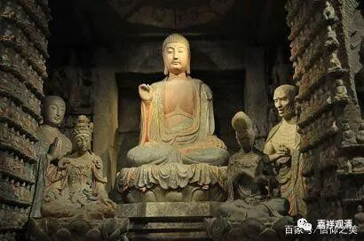

**《善说精髓》116（中）**

在背文字的时候大家也要小心哦，不要随便加字减字啊。我们平时的习惯总是“我认为……”。有段时间我也试着慢慢地教学，像道次第和阿毗达磨，我发现了一个很有趣的情况，就是我刚刚讲完一个定义，然后让大家去复述，多半你们会漏掉其中很重要的字，有时候是漏一个，有时候会漏一串。可能你们自己觉得已经把定义当中的核心给拎出来了，结果却是漏了很重要的内容，其实是一个字也少不了的。所以在初始阶段（对大部分人而言，这个“阶段”可能贯穿你一辈子）你就不要用自己的理解去理解了，不妨先把它背下来，然后再琢磨每个字背后的意思。在这点上呢，汉传和藏传可以说是一样的，都是延续了印度的习惯，每一个字都有很重要的意思。

这两天我发的这个微信推送，在讲九住心的部分，包括昨天、前天和今天，这一段内容都是比较重要的，很有可能窥基大师给的答案在印度佛教的立场看来是错的，但是他的方法是非常正确的。他的方法实际上就是印度传统的方法，而这些方法呢，西藏也在用。他是把每一个字的意思都决择出来的——实际上，窥基大师们在做“佛教的中国化”，让它变成中文语法、中国人的解读。

比如他说“及”这个字如果没有意思的话，为什么要在这里放这个“及”字呢？所以他认为这个原文里的“及”的意思就是“安住”，所以第二个力当中也要包括安住，要包括三个住。这是他的一个解读，一个“佛教中国化”的努力和尝试。这个解词的方法和印度佛教里的一些固有的套路是一样的。

我们在背阿毗达磨，背佛教的定义的时候，很有可能是漏字的，但是哪怕漏掉一个字也比较麻烦。不管你是按照哪本书背下来的，这样的答案通常我们也不太敢马上说你是错的，至少也要绕了一大圈才敢说。如果真正要在已有的固定答案里找错的话，恐怕还得再过三五年或者三五十年了——一般人就不要去想这个事了。

** “（甲三）如何闻说其法。”**

** **

第一个是造者的殊胜，用今天的词来说，就是作者是如何“牛”，是吧？作者是多么地特别，多么地伟大！第二个呢，就是这本书或者道次第相应的教法的好处在哪里，这四条大家也是可以背诵的。第三个呢，就是“如何闻说其法”。接下来就是，我们应该怎么听和怎么讲。“闻”，就是听。“说”，就是讲。怎么听和怎么讲。

** “分三：（乙一）听法之理；”**我们应该怎么听。** “（乙二）说法之理；”**应该怎么说法。** “（乙三）结束时共作之理。”**结束的时候应该怎么做。这个是大的方向。

