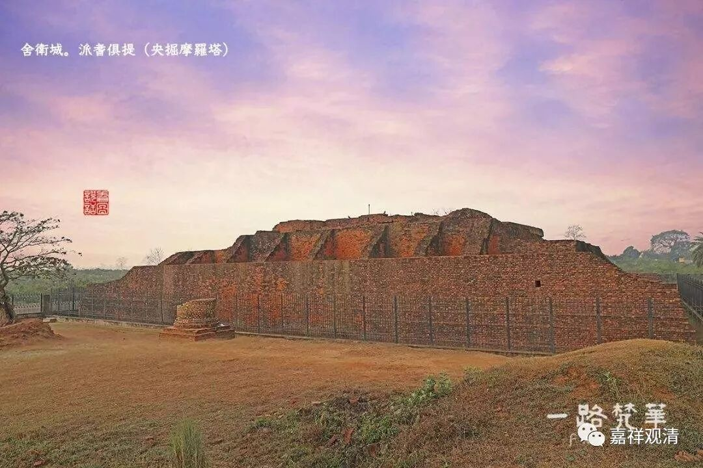
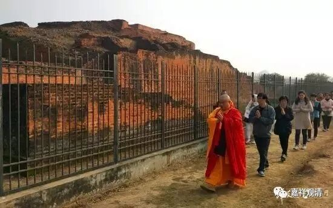

**《善说精髓》016（中）**

** “（丙二）于法及法师发起承事：**

** **

** 专信恭敬而闻法，离慢不轻法法师，**

** 发起承事恭敬者，谓于师起如佛想。”**

** **

我们先把这个故事讲完吧。那个罗刹王不是把月王子抓住了吗？后来王子被放回国，又回来了——这中间的故事我就不讲了，罗刹王就说：“哎，既然你说用自肉买亦应理，那么用你的肉去换他讲的法也合算。那你来给我讲讲看，你听到的这个偈子——你听到的佛教的内容，到底是什么？正好现在我锅里要煮你的水还没有烧开，那就不妨听听你到底学了些什么东西过来。”

然后这个时候呢，月王子居然摆谱了。他是被罗刹王抓住，并且马上就要被要吃掉的，可是他说：“这不行！既然你要听法，那你必须要尊重法的规矩才行。”哎呀！要是我被抓住的话，我恐怕没有这么镇定。

月王子接着说：“如果你要听闻法的话，应该是** ‘专信恭敬而闻法’**，你应该要至诚地相信，听法应该要恭敬。** ‘离慢’**，你应该要离开你的傲慢心，** ‘不轻法法师’**，你不要轻慢法和法师，就是不要轻慢我所讲的法和我。** ‘发起承事’**，你要对我发起承事——最简单的就是服侍，要恭敬法和法师。”

然后他说：“你应该坐在比较低的地方，应该让我坐在比较高的地方，然后向我顶礼，再听法，那才是比较正常的。”这个时候，那个罗刹王——苏达萨子居然听从他的话了。（哇！这个恐怕就是善根深厚啊！不过，有时候确实也发现，一些黑社会老大还挺讲道理的，好像基本上是很讲道理的。）罗刹王居然就听从了，铺设了一个高座让月王子坐在上面讲，然后自己很认真地蹲在下面去听。听完以后他就说：“你讲的真有道理，我把你们都放了吧！”

本生故事里说，这个罗刹王，就是央掘摩罗的前身；月王子，就是释迦佛的前世。

央掘摩罗塔遗址

** “谓于师起如佛想。”**

** **

这句话的意思是什么呢？既然这些话是佛说的，那么现在我现在讲法，就等于在复述佛的教法，也就相当于佛在讲嘛，所以要对师长起** “如佛想”**。

这个就叫** “于法及法师发起承事”**，就是对法和法师都要恭敬。藏地有时候也会出现一些不是很符合规矩的情况，所以这里这个内容也是有一定的针对性。比如，有些活佛听法的时候，一些师父坐得比较低，而活佛弟子坐得比较高，这就有点问题啦。尊重法和法师的话，不管法和法师有其他什么样的低劣条件，既然是在讲法，那就应该让法师坐得高一点。

当然，也会有特殊情况。如果你的膝盖有问题或者是打了石膏的，那你就没法这样盘腿，没法坐在下面的，需要坐得高一点，那也没有问题的。你们的腿现在怎么样呢？

