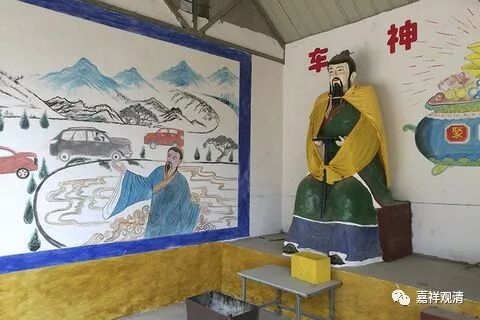

**《善说精髓》017（下）**

** “（丙三）正听闻之理。”**

** **

在听课的时候应该怎么样呢？

** “分二：（丁一）依六种想；（丁二）断器三过。”**

** **

我们要具备什么呢？这个又是一个套路。我们在听课的时候应该怎么样？就是要有** “六种想”**，另外还要准备好** “断器三过”**。

那么哪六种想呢？

** “（丁一）依六种想者：**

** 自如病者师如医，”**

** **

你去听师父讲课的时候把自己当作什么呢？把自己当作重病人。师父像什么呢？师父就像治病的医生一样，** “自如病者师如医”**。

** “教诫为药”**，师父讲的教授、教诫就像给你开的药一样。然后** “修为疗”**，开了这个药以后，你是要去修行的，否则开了药之后光是放在那里，也没用的，是吧？要去修行，修行就好像治疗自己的疾病一样。

** “于如來起善士想，”**这一段好像都是《十法经》当中的内容，要对如来——对佛** “起善士想”**。

** “及发正法久住想。”**最后是回向，希望正法能够得到久住，希望更多的人能够听到这样殊胜的教法。

那么，在这六点当中，最重要的就是第一点，就是** “自如病者”**。如果你自己都不觉得自己是病人的话，自己不觉得自己是有问题的话，后面几个基本上都没用了。

有些人他其实是真的生病了，然后家里人带他去看病，包括还有找到我这里来看病的，我就说：“你把他带到我这边也没用啊，他自己都不认为自己有病，你给他做再多的事或者开再多的药，他都不会想吃的，他即使吃药也是应付应付而已，根本没有用的。”如果他自己不认为自己生病了，自己不认为自己有麻烦的话，你就是把他带到佛那里，又怎么样呢？

所以，首先必须感觉到“我是重病人”，认为“我是病人”，然后才会有趋向于医生的想法。同样地，知道自己有烦恼，有解决不了的问题，然后才会去趋向于佛，去听闻对方的劝告——至少是劝告吧：什么事情你该做，什么事情你不该做。在佛法当中，最下最下的就是“诸恶莫做，众善奉行”——坏的事情不要做，好的事情要多做，然后按照教授教诫去好好地修行。

我一直讲过唐老在文革的时候做医生的故事，其实很多和尚在文革的时候都在做医生，清定上师在文革的时候在监狱里面也做医生，包括现任班禅大师的经师在文革期间也做医生。好像和尚转业的话，主要的一个职业就是医生。我另外有一位师父在文革的时候转业做会计了，成为他们公社里的会计。

大家知道唐老做过医生，然后就请他看病，他呢就给病人开了药方。可是非常有趣的是，那些人中间有些人根本就不去抓药（我觉得这帮人都是脑子有点不太正常的)，他们天天把这个药方子当作护身符带在身上。我觉得他们的脑子肯定有问题。他们觉得唐老是大菩萨，好像他们认为小唐老至少是初地菩萨，那么老唐老应该是比初地菩萨更加高的菩萨，这样的话，菩萨开的药方就有治病的能力，所以他们直接把药方天天带在身上。(我不知道佛陀或者龙树、宗喀巴开药以后，他们的弟子会不会当护身符带着，如果有的话，我觉得应该被骂做“痴人”！)

真的，智慧的上限我知道是佛，但人类愚痴的底线我实在不知道在哪里……

        修改于