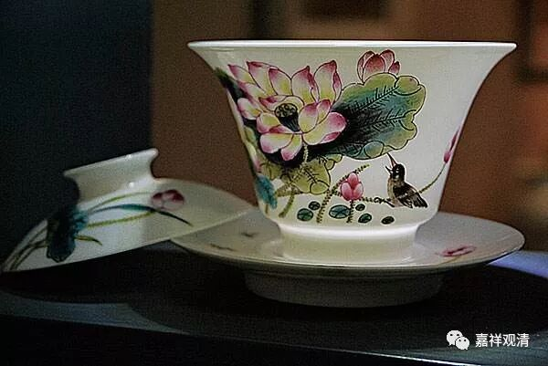

**《善说精髓》讲记018（上）**

一直到我过去的时候，他们跟我讲还是有这样的事情（把药方当护身符）发生，那些师兄弟们讲的时候，并不是把这个当作批判的对象，而是把这个事情当作灵异来讲的。我的内心其实是很鄙夷的。这种事情不知道以后会不会在我们圈内发生呢？这个很难说的哦，徒弟收多了，很多事情都很难说的。不过，这和我没关系——我先声明免责哦。这个药方是让你去配药的，然后吃药了才对你的病有用。

所以这个就是六种想：第一，** “自如病者”**，第二** “师如医”**，第三是** “教诫为药”**，第四是** “修为疗”**，第五** “于如来起善士想”**，第六是** “正法久住”**。

如果你自己讲经的话，那就只有五种想，“自如病者”就没有了，而是“自作医师”，“修为疗”变成“视听者如病人”，其他的不变。

** “（丁二）断器三过：”**

** **

这个内容我们一直在讲的：不能是一个倒扣的杯子，不能是一个脏的杯子，也不能是一个漏的杯子。当然，你首先要知道给你倒的这个水不是污水哦，那就是你一定要找一个好的老师哦。如果你找到了一个好的老师，那你听闻佛法的时候，就要“谛听”、“善思”、“念之”，是吧？

第一，“谛听”，就是你要听，你不能是个倒扣的杯子。倒扣的杯子，讲得再多，水倒得再多，也进不去啊。

第二个呢，不能是个脏的杯子，要“善思”。你在下面光找师父的缺点，光找老师的错误：“嗯？师父的这个口音有问题！拼音z、c不分，普通话不好，奉化方言……”真的是有点累哦。现在很多弟子更像是学术委员会的，你在上面讲课，他在下面找你的错。

第三呢，不能是一个漏的杯子，一边听一边忘，这也是问题。所以呢，在道次第的教授当中有一个叫作经验引导，它的方式就是在引导当中要讲三次。第一遍讲完以后，还要重复一遍，晚上回去再把前面的这些内容想一想，至少科判要想一遍，第二天讲的时候再重复一遍。这个方式呢，确实有道理。你学完了以后，自己要消化一下的，否则也不入心，是吧？否则就这样过去了。要复习一下，消化一下。当然，消化也存在问题的，就是你消化的东西到底是什么，这也是一个问题。所以呢，在消化之前要先学因明，得确保你理解正确。

