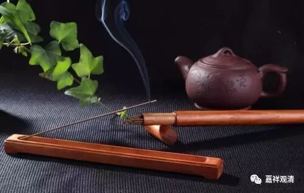

**《善说精髓》018（下）**

** “总之忆念成佛因，及闻功德而喜闻。”**

** **

总之呢，要忆念成佛的因。成佛的因，最初的因就是我们听闻佛法。在唯识派当中有一个常用的名词叫“闻熏习”，我们要多多地闻熏习，一点一点就被“熏”出来了。因为唯识派讲阿赖耶识是要熏的嘛，熏着熏着就熏出来了。

放香的这个盒盖子，熏着熏着，就熏香了。大家请香的时候，要请好一点的香……自从我闻过日本的沉香以后，其他的香在我的鼻子里都不太容易过得去。生活的其他方面也是这样哦，好的环境经历了之后……都由奢入俭难。我自从某次在佛展会上闻过日本的沉香以后，一般的香都不太愿意闻了，感觉就是柴禾。当然现在很多香确实就是柴禾。我认识一家香厂，和他们聊天的时候就了解到，他们直接从家具厂拿了木屑，然后添加化学合成香料，就调成了我们平时买来的这个香了。

** “及闻功德而喜闻。”**

** **

应该想一想听闻的功德，那么，听闻有什么功德呢？首先是获得闻所成慧，我们在听闻中慢慢地增长我们的智慧。这一点的确如是，即使我们的思所成慧或者我们的水平不够，你听得多了以后，就会知道某某人讲经讲得好不好、讲得对不对，因为听得多了你还是会有感觉的。

有些老和尚自己的水平不高，但是他们在水平很高的师父那里呆了很多年，听了很多课。你让他讲经，他是讲不来的，但是他在下面听课，就会说：“嗯，这个师父讲得好。”“嗯，这个师父讲得不错。”“哎，这个师父讲得不行。”你让他自己讲，他也讲不来。但是这种听闻的功德，他至少已经有了，这就是闻所成慧了。

** “及闻功德而喜闻。”**

** **

就是知道了听闻的功德，就非常欢喜地愿意听闻。

我们要赶快先学点梵文了，可以现场吓人。学了梵文以后，真的觉得它至少在音方面的技巧，总结得很好啊，印度人在这方面确实有很特殊的人才，总结了很多语音的规律。我记住了“面包”那个词。后来想想其实也很简单，他在念前面一个词的时候，因为接在后面的那个词是闭嘴的音，所以前面这个词也必须变成闭嘴的音。这个情形在普通话里面应该也有，但是一般我们不太讲这个事情，就直接变成固定用法了，不会去强调。

