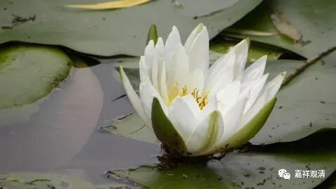
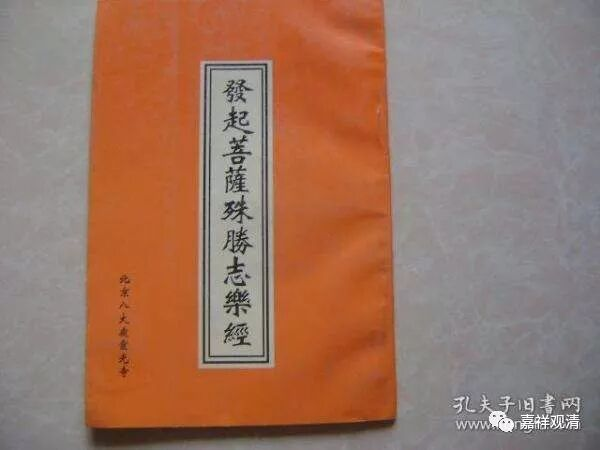
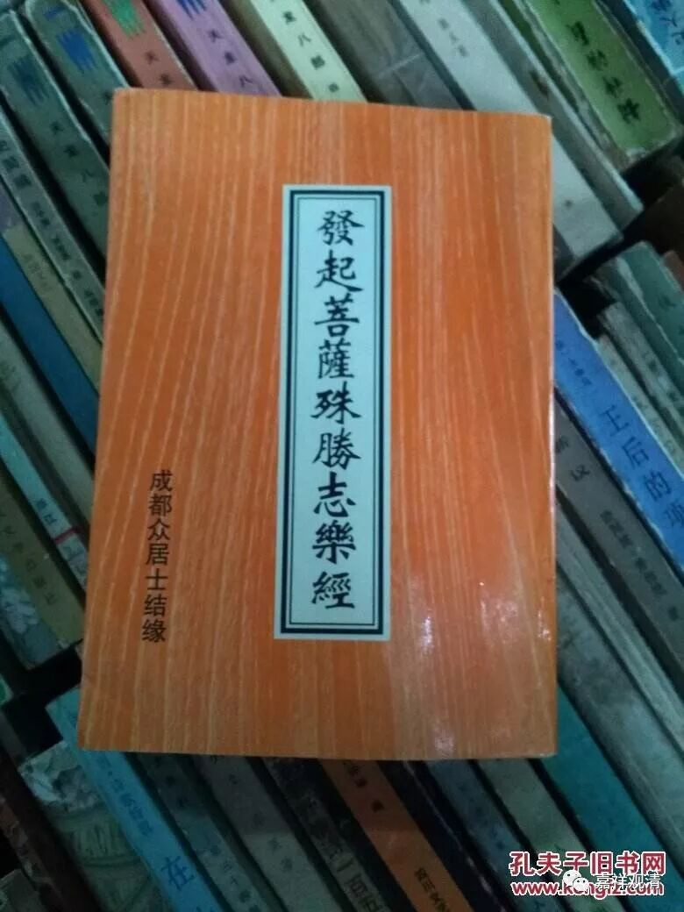

**《善说精髓》019（中）**

** “及除邪见如实宣，”**

** **

除自己的邪见，除别人的邪见，该怎么说就怎么说，不要因为面子或者其他人的原因，有些问题就不讲了等等。关于除邪见，有时候想想也挺累的，挺麻烦的。我现在是挺轻松，但是假如我做了中国佛教协会的会长，你们设想一下，要是有人来问为：“苯教是不是佛教？”怎么办？我觉得压力是有点大的，我到底说“是”还是说“不是”呢？

好像最近几届的中国佛教协会会长都说“是”，实际上应该要说“不是”的，因为苯教不是佛教。如果要说“苯教是佛教”呢，就有点像在汉传佛教圈子里面讲“道教就是佛教”。大家要清楚哦，“三教合一”、“三教一家”可不是我们自己想要讲的，只是出于统战的需要，我们在开会的时候和大家握握手、聊聊天，然后说我们和你们差不多，这样还可以。但实际上，这三个根本不是一件事情。

在汉传佛教当中，如果有人问：“道教是不是佛教？”作为一位好的法师，应该讲道教不是佛教。当然，现在有很多法师都在讲三教是一家，是吧？但三教是一家这个说法，真的不是我们应该讲的。如果是一名僧官，在有些场合说话就比较困难，有时候不一定能讲他自己想讲的话，这个就没办法了。我觉得自己在某些方面也是很幸运的，没有当上僧官。从另外一方面来讲，是因为我的水平不够，我连一张选票都没有，连提名都没有。

** “《劝发增上》《具威经》，”**

** **

《劝发增上意乐经》，这部经在汉地的名称叫《发起菩萨殊胜志乐经》，净空法师的佛陀教育基金会有单行本面世的。《具威经》，具足什么威德，这个不记得了，《广论》当中好像也提到了。

** “说无量理当思之。”**

** **

这个无量，不完全是无量的意思，就是说了很多很多理的意思。在《发起菩萨殊胜志乐经》当中总共讲了说法的四十种利益，在《广论》当中就引用了其中的二十种利益，在《集经论》当中也有引用到。《劝发增上意乐经》当中是有两个地方各出现二十种利益，加起来是四十种利益。那么，这么多的道理呢，我们应该去看，去思惟，去理解，然后去实践。

** “（丙二）于大师及法发起承事：”**

** **

讲经的时候呢，对大师、对佛、对佛法都要发起恭敬心。下面的偈颂其实就是举例说明。

** “佛说佛母自设座，”**

** **

比如《金刚经》里面，佛在讲经之前是敷座而坐，是吧？就是自己把讲经的座位准备好了。在经典的解释系统当中就会说，平时佛讲经的时候都是由阿难给他敷座的，而般若是佛要尊重的对象，所以在讲般若的时候，他就亲自来敷座。可以说，这就是举个例子。

这个佛母呢，就是指佛母经。一般佛母经就是指般若经，因为我们称般若为佛母。印度人说：佛是众生的父亲，那般若就是众生的奶奶，在《赞般若波罗蜜多偈》当中就是这么讲的。般若是佛母，佛是众生父，所以般若波罗蜜多就是众生之祖母，是众生的奶奶。

《赞般若波罗蜜多偈》是罗睺罗写的，在后期的般若经的前面都会有这个《赞般若波罗蜜多偈》。汉传的这个偈出现是在《大智度论》里面的。

