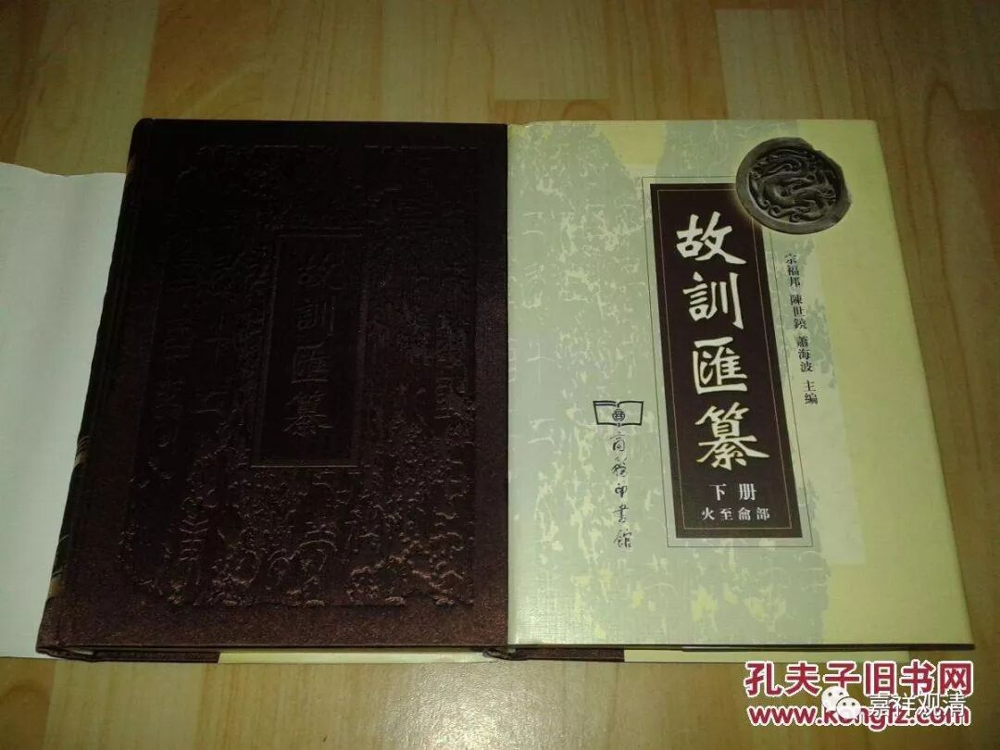

**《善说精髓》019（下）**

** “法乃诸佛应敬境，”**

** **

可以理解为：法乃至是佛应该礼敬的对象。这个境，就是对象的意思。

** “故应于法及大师，”**

** **

所以应该对于无上的、趋向于解脱的佛法（这里的法不是一切法的法。法有广义和狭义之分，广义的法就是指一切的存在、一切的事物，统称为一切法。在这里的这个法呢，是趋向于解脱的教法的意思。）** “及大师”**，这里的大师呢，是指佛。

“大师”这个词呢，有时候是有变化的。比如说，我们现在称法尊法师为大师应该也可以，称玄奘法师为大师也可以，并不是说他们就是佛。同时，我们也看到语意是可以有变化的。

我还在佛学院做老师的时候，有一次带着两位师兄弟去佛学院，其实他们的水平不怎么样的。结果没想到，一位兄弟就和佛学院的人吵起来了，吵什么呢？就吵这个“大师”的称谓。他说：“一般人怎么可以称‘大师’呢？只有佛才可以称大师，你们称大师都是不可以的。”

哎呀！你要搞清楚啊，其实文字有它的原意，也有引申意，是吧？文字是可以变化的。两千多年以来的文字，完全是可以变化的啊。平常我们在讲某人是大师的时候，并不是认为这个人就是佛。这种大师的说法并不是不可以，其实是可以的，也是没有问题的。当然，我们需要知道，“大师”，在佛教里，在佛经里的原意，是指佛。

其实这样称呼大师是没问题的，就好像我们查字典的时候，最初的一个是它的原意，后面还有引申意，或者其他更多的意思。这里有一本《故训汇纂》，每个词可能有七八十个意思，其中最重要的、最主要的可能也就一个意思。

现在称大师的情况就很多了，还有气功大师，是吧？好像什么都是大师了，弹古琴的也是大师，是吧？甚至我们在江湖上走动的时候，人家不知道和尚应该怎么称呼，也都叫大师。他们一叫大师，我就觉得自己像骗子。其实叫法师就可以了，叫观清师就可以了。但是他们还是习惯叫大师，生怕自己没有礼貌，又不知道江湖上应该怎么叫，反正往大了叫都没错，所以就叫大师。所以，我以后应该回一句“菩萨”？或者都叫“施主”——西游记里的玄奘法师都是称呼别人为“菩萨”、为“施主”的。

