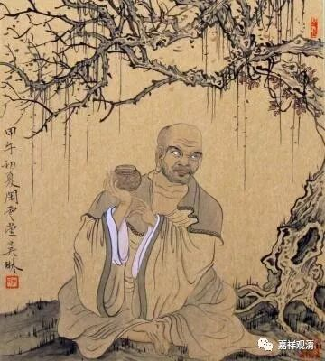

**《善說精髓》讲记020（上）**

** “故应于法及大师，随念德恩起敬重。”**

** **

要念他的功德，念他的恩情，要对佛和法起敬重心。所以应该要礼拜啊、供养啊等等。

** “（丙三）以何意乐与加行而说。”**

** **

应该怎么想、应该怎么做呢？

** “分二：（丁一）意乐；（丁二）加行。**

** （丁一）意乐：**

** **

** 吝法自赞厌说法，举过推延嫉应断；”**

** **

这些都应该断除。那么，要断除的是什么呢？第一是** “吝法”**，就是吝啬法，不想讲。哎呀！不想讲，为什么呢？“我花了这么大的精力学来的，你们这么轻轻松松就想学到了？不成！”

前面我讲过的那个事例也是一样，明明是师父传下来的书，就是不想拿出来，这种“吝法”的情况其实挺明显的。这个呢，也不能完全怪他们吝啬，是他们自己理解错了。因为密法确实是不对外的，所以对于密法确实要小心地、谨慎地去传播，密法确实如此。但是呢，实际上他们距离藏地比较远，不太了解西藏的一些做法。即使是密法，在印刷的时候，该印的还是要印的。而学僧都会知道自己应不应该去请这个法。

如果所有的密法都只是放在那里，也不印刷，那么大家都看不到这些典籍了。虽说严格一点是好的，另外呢，类似像《俱舍释》这种，像《辨了不了义善说藏论》这种，都是可以对外传播的，一般来说，没有必要去守住这些经典不让别人看，或者不让别人知道。当然整理的时候对文字谨慎慢慢再拿出来出版，这是完全正确的做法。

戒律当中提到佛世时的一位阿罗汉，往世因吝法而不传播，但最后醒悟，在过世的前七天大开法宴……释迦佛世，他起先表现为极其笨拙，最后经过二十多年终于证得罗汉果位（不是周利盘陀）……这是给我们一种示现吧，告诉我们万勿吝法。

所以，不应该吝法。

