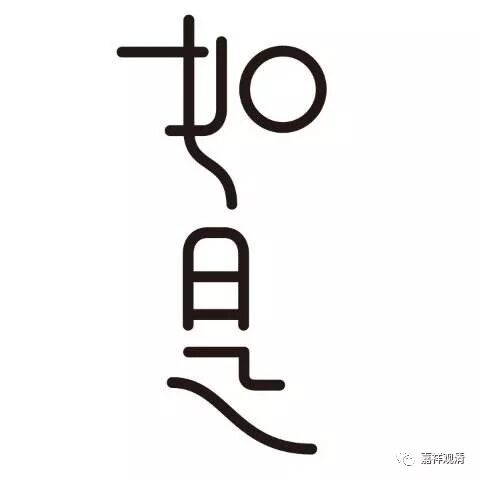

**《善说精髓》020（中）**

** “善回”**，善巧地回向大菩提。

** “如**是”，这样。这个** “如是**”蛮重要的，据说藏传有一位大师，解释“如是”这两个字写了半本书哦，我不知道怎么解释的。《大智度论》当中对“如是”也解释了半卷。

** “如是每座之听讲，”**

** **

这样每一座、每一次地听和讲。

** “皆有所说无量利，”**

** **

都会有佛经所讲的无量的功德和利益，会有这样的好处，是什么功德和利益呢？每次听讲道次第，都有听和讲一遍全圆佛法的功德。实际上也就是说，道次第诠释了全圆的佛法，是这个意思哦。

** “听讲入道此关要，”**

** **

听和讲是入道的要门，关键点。

** “前行妙诀当爱重。”**

** **

这个是后面所有要学习的内容当中，都应该加进去的。就是前面听和讲的这些内容，在后面都应该加进去——听之前应该怎么做，讲之前应该怎么做，听讲以后的结行应该怎么做。所以应当爱重听闻、爱重讲说。

接下来就是：** “道之根本依止知识”**。

这个知识，是指善知识，就是道的根本要依止善知识。用我们今天的话来说，就叫抱大腿，是吧？“依止善知识”就是抱大腿，你只要抱到一个好的大腿，那么基本上“一人得道，鸡犬升天”。

但如果是非常不好的弟子，那就比较麻烦了，不是鸡犬升天，而是师父跟着一起倒霉了，特别是密法当中有这样的说法。前两天我们还看到过这样的说法哦，某某大师在讲解道次第的时候就讲到了，如果师父和弟子之间不如理地观察的话，恐怕师父对弟子、弟子对师父都会有伤害。那么，怎么解决呢？就要把前面的这个内容学学好，知道应该找怎样的师父，和自己做怎样的弟子。

早期的时候确实有些比较倒霉的事情，就是师徒之间互相不了解，可以说完全不了解。我们以为所有西藏过来的活佛全部都是真的活的佛，那就完了，他明明不是一个Living Buddha——不是一个活着的佛。或者呢，西藏的师父们一到汉地来，看到这些居士学得这么多，字都认识，不用讲了，肯定都是大德。既然都是佛教徒，那肯定都信佛。可是西藏的师父们不知道一点啊，汉地的很多“佛教徒”其实还没信佛，对他们来说，还没有“三世因果”和“六道轮回”方面的信仰。你对这样的人去传授密法，那很危险啊，非常危险哦！而这些人都挤进来求灌顶，也很麻烦，他们中的很多人并不是因为相信密法才来的，只是因为大家都说好，是因为“热心人”们的广告做得好。如果有另外一个广告做得更好，那他们就会直接把密法放下，又去学那个所谓更好的东西了。

前段时间我也碰到过这样的人，我就很奇怪：“奇怪了，你们那个时候干嘛削尖着脑袋一定要往这个灌顶的地方钻呢？你们又不懂，然后拼命钻进来，进来以后又轻易地把这些誓言和规矩全破了，你们这是干嘛呢？”……这些事情在今天的佛教圈仍然不断地在上演，背景就是道次第没学好，不知道应该跟随怎样的老师，也不知道应该把自己锤炼成怎样的弟子，自己这个器还是不成就的。就好像这个杯子，你还没进炉烧过，仅仅是一个干的泥坯，你在这个时候就把开水倒进去，那就好看了——直接变成一摊烂泥，这个“器”就完全损坏了。我们现在就是，自以为自己拿出来还挺不错的，好像是一个杯子的样子，但是忘了自己根本没烧过，根本就是连器都不成就的。当然还有原因，前面讲过的，师徒之间不了解。所以双方都要加强了解。

