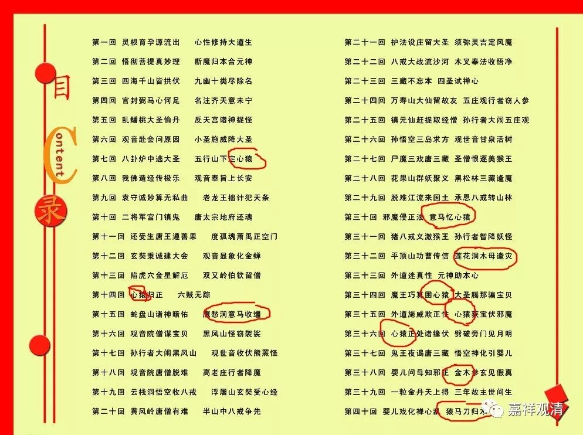

**《善说精髓》022（中）**

** “（丁一）所依善知识之相：”**

** **

我们应该拜什么样的师父，师父应该具备哪些特征。

** “次说实修正教授：”**

** **

好，接下来我们就说实修的正教授。“次”就是接下来的意思。因为很多人对古文确实不了解，就有人认为这个“次”不是第一等的，是第二等的。实际上不是这个意思哦，这是在说接下来我们来说一下实修的教授。那么，下面就是教授。

** “弟子相续发一德，亦观待于善知识，”**

** **

我们这些学生的心中所发起的哪怕一个很小的功德，都是依赖于善知识的引导，依赖于师父的教导，这个就是“相续”。这个“相续”是指我们的身心或者心，心中发起的任何一种功德，都要观待于善知识，都要靠依止善知识。

有时候我们还认为是自己突然之间想到的，会觉得自己很了不起：“嗯？我突然之间想到的！”但是如果你是一个每天记日记的人，你往前面翻日记本，会发现这句话在七年之前你师父已经跟你讲过了，只是你忘了。最后突然之间发觉是你自己想起来了，觉得自己很聪明，等到翻日记的时候才发现：不过是师父早就讲过的，自己这才记起来了而已。

** “初依止法关要大。”**

** **

最初在师父那里依止的这种行为，是很重要的，称为叫“门槛”。这个门槛跨过去了，就算入门了。

你们如果去故宫或者大的寺院等等，会发现那儿的门槛很高（我们这个门槛也有点高啊）。很多小孩迈不过去就直接踩在门槛上了，是吧？很多大寺院包括一些宫殿的门槛真的很高，以前是不能踩在门槛上的。（唉？我们是不是也装一个高的门槛？下次我们来装一个高的门槛吧，以后江湖上就会有传说了：“观清师这里的门槛有点高啊！”上面再刷点金。“观清师的门槛有点金啊！”）

** “能以戒学制心马，”**

** **

这个讲的就是善知识的第一个德相。善知识首先要有戒律，他要能够以戒学来制心。

你们看《西游记》的章回目录里面都有这样的文字：心猿、意马、木母……心猿是孙悟空，意马是白龙马，木母是猪八戒。我们确实是心猿意马，心像猿猴一样到处跑，意像马一样到处奔。我们可以用现前的来做比喻，我们的心和意就像楼下的多吉（狗名）一样，一定要把它拴住，如果不拴住的话，它马上就不知道跑去哪里了，你要再等它回来，不知道猴年马月了。

