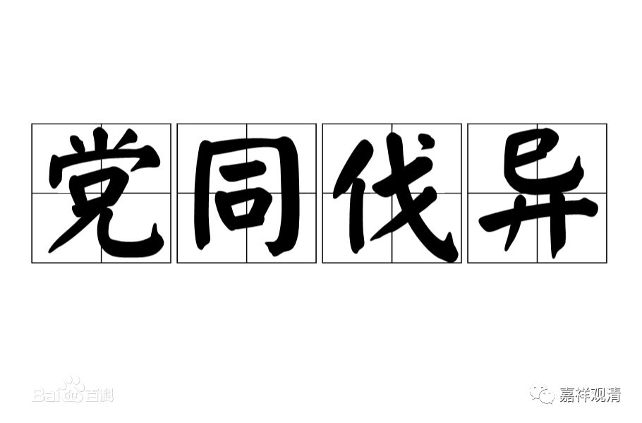
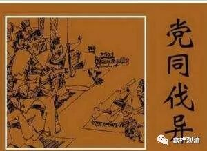

**《善说精髓》023（下）**

** “此等具足堪依止。”**

** **

如果这些功德都圆满的话，这十条全部都具备了，那就要马上抱大腿了。** “堪依止”**，这样的师父堪能依止，堪能就是可以的意思。具足这些功德的话，我们就拜他做师父。

现在我还听到有人说这句话：“我昨天又收了一个师父。”这是一句口头语，但是这个口头语是不对哦的。这个情况很有趣，他的意思是不妨多“** 收集**”一点师父，可能这确实是他自己真挚的心声。有些人真的是这么讲的：“我多** 收集**几个师父，只要有一个成功了，我就抱上大腿了。”他说这句话好像也是有道理的哦，多** 收集**几个师父，万一其中的一个成功了呢？就像今天搞投资的人一样，是吧？投资十个项目，只要有一个项目成功了，那就发财了。

那你们自己看看，你们是多拜拜师父呢，还是少拜拜师父呢？你们自己讨论吧。据说厉害的投资人，投资十个项目可以有八个成功的。好像上次有人就给我介绍了一个做天使投资的人，十个投资项目中有八个成功了，太厉害了！这个眼神太厉害了哦。我们要是具备这样的眼神，那解脱就有望了。

如果是天使轮的话，我们今天应该到小沙弥当中去拜师父啊！这个真的有点像投资啊，天使轮、A轮、B轮……对对，我们也应该收集一下，老、中、青、少四代的师父。我们经常这么说，老的呢，想犯戒也不容易了，少的呢，保证我死的时候还有人给我超度，所以我们应该** 收集**老、中、青、少四代的师父，多收集一点哦……这个是有点开玩笑的，但也有一部分是心里话。那么少的师父呢，我们就等着转世的祈竹仁波切长大了……

** “（丁二）能依弟子之相：”**

** **

就是作为学生，应该怎么做，应该具备哪些条件。

** “不墮党类广希求，”**

** **

意思就是，你在做学生的时候，不要讲什么“师父是禅宗的，我是净土宗的，我不学”或者“师父是华严的，我是天台的，我不学”。** “堕党类”**，好像自己就已经分开宗派了。如果你是弟子的话，那你首先要想学嘛，你想学的话，你才具有弟子之相。你都不想学，都不要学，那弟子之相就跟你没关系。

** “党类”**差不多就是派别的意思，现在关于这个“党类”我都不好意思说，况且我们还在录音。其实在同一派当中，也有互相堕党类的情况——我们是这样的，你们这帮是那样的，我们这帮是如何如何地好，你们这帮是如何如何地坏。于是，互相之间不来往，互相之间排斥。“党同伐异”而且越近的支派互相之间的敌视越严重——人啊……

