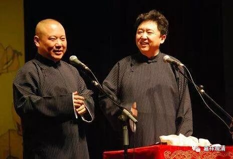

**《善说精髓》讲记024（上）**

我一直都觉得很奇怪，为什么越接近的人越排斥呢？后来看了一段郭德纲的“教授”，我就懂了。郭德纲说：“骂我郭德纲讲相声讲得不好的，全是圈内的人，那些卖豆腐的、做木匠的……绝对不会说郭德纲讲相声讲得不好。说我讲得不好的，全是说相声的。问题是，那些说我讲得不好的人，就算是我死了，你们也还是说不好相声啊！最后就是看水平……”

我觉得确实是有道理。通常，同行之间是互相坑得最厉害的，不是同行的话没有利益关系，反而不说啥了。你看，我们现在看到某某宗教对世界产生了很大的伤害，对吧？那是没看到他们自己对内部的异端杀得有多厉害，他们内部之间是杀得更厉害啊！

哎呀！真的是越亲近的人越知道对方的弱点在哪里。我们可以去看，一家人，特别是夫妻之间的吵架，那种恶毒啊……因为对方那个最软弱的心在哪里，你是知道的，在你吵架实在吵不过的时候，你就会把这个抛出去，你想的就是最好能够一刀捅到对方最伤的深处，然后自己就赢了。那对方呢，既然被你捅了一刀，也是想着要捅回去，也是把最伤你的那句话扔出来……

哎呀！我们人就是这样的，对吧？呵呵。所以郭德纲的这个“教授”，我觉得我学到了，相当有道理！

** “不堕党类广希求，”**

** **

后面的这个** “广希求”**就是要“求懂”。就是你在听课的时候，不仅仅是坐在这里就可以了，不能想着：“哎呀！我今天又多了一个听经的功德，至于听进去还是没听进去再说，反正我有听经的功德就可以了。”听经的功德固然是有了，但是你既然来听经的话，那就应该求听懂嘛。

你既然拜师父的话，就不能像我们刚才所说的那样，只是单纯地“收集”师父，只是单纯地希望师父来超度我，你还是应该希望在师父这里学到点东西的嘛。** “广希求”**，有什么问题还是要经常问一问。不过，提问应该比较正面一点，就是要问该问的东西，而不该问的就没有必要问了。有些事情你来问我的话，我也很难回答的。比如你来问：“师父，那什么……密码是多少？”我觉得……我也太不想回答了。

