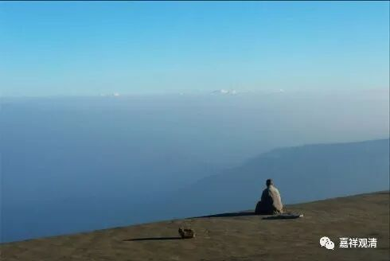

**《善说精髓》024（下）**

** “（丁三）彼应如何依师之理。”**

** **

我们应该怎么样去依师。

** “分二：（戊一）意乐依止之理；（戊二）加行依止之理。”**

** **

就是我们应该怎么去想，应该怎么去做。

** “（戊一）意乐依止之理。**

** 分二：（己一）修信以为根本；（己二）随念深恩应起敬重。”**

** **

首先呢，应该对师父要相信，相信了以后呢，要敬重师父。

** “（己一）修信以为根本：**

** **

** 增上信取轨范德，”**

** **

信有很多种，这里的** “信”**是指对师父的信。平时我们说的信，主要是指对三宝、四谛、业果的信，而在这里是指对师父的信。** “增上信”**是指佛教内道的信。** “轨范”**是指师父。

师父如果有正面的和负面的，那就在正面的方面多去考虑一点。其实有时候也是挺难的，如果你拜的师父正面的比较多一点那还好，如果真的是只有51%控股的话，那也挺累的。那就要多看正面的。如果光看负面的话，很容易崩掉的。你们谈恋爱应该也是这样，是吧？多看正面的就结婚了，多看负面的就离婚了，就是这样的。

** “剎那亦不观师过，”**

** **

我们应该做到的是** “刹那也不观师过”**，可是这个毕竟很难，是因为我们心中有原始的种子，以前所种下的种子肯定有“观师过”的地方。但是呢，我们应该尽量多想想师父正面的地方，有些其实是我们不能理解——我们水平差，肯定不理解的嘛。如果我们水平那么好的话，师父的每一个密意我们都能理解，那我们早就变成上首弟子了嘛。师父每一个矛盾的地方你都能看得出来的话，那你绝对非常非常聪明，是上座弟子。我们肯定有好多地方是看不出来的嘛，那么，应该多看正面。

** “或成或障悉地故；”**

** **

成悉地的话，是因为不观师过，对吧？而障碍悉地的话，是因为多观师过。

这个问题我自己也有啊——经常观师父的过，麻烦了。经常观过的人，就会把他身边所有负面的东西串成一条线：“隔壁这个人很坏很坏……肯定是他偷的鸡……”最后发现是鸡自己跑掉的。

** “若放逸观即刻悔。”**

** **

如果放逸了，就是我们没有抓住自己的心，去观察师父的过失了，那么赶快赶快地忏悔，或者是过一段时间以后了，也要忏悔。

师父的过失到底有没有呢？恐怕是有的——我也不敢说肯定是有的，以我们目前的水平来说，可能师父还是会有些过失的。那就少去观察，不要多想，多想的话，自己也很痛苦，是吧？师父要做到满分是不容易的，特别是在我们这个时代，要做到满分是不可能的，或者说我认为是不可能的。只能是尽量做得好一点，尽量好一点。

不过这里还有一个问题，如果你在拜师后出现了发现师父过失的问题，那一定是你在前面就出现问题了。肯定是你前面拜师父的时候观察的时间不够长，观察得也不够多，所以才会出现“发现”师父的负面比较多。那么，既然已经拜了师父，那也得认，是吧？就多看正面的，不要看负面的嘛。（唉，这也确实是我们的福报不够啊！）我们在生活条件方面的福报越来越好了，在依师方面的福报就越来越差了。

** “（己二）随念深恩应起敬重：**

** **

** 此处随念师深恩，”**

** **

念就是想，** “随念”**就是要多想。

那么，应该怎么想呢？把经典当中讲师父好处的内容多读一读，慢慢地把自己催眠了，就好了——就是这个意思。

