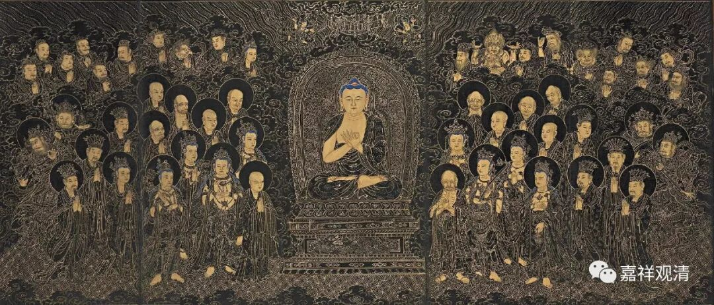
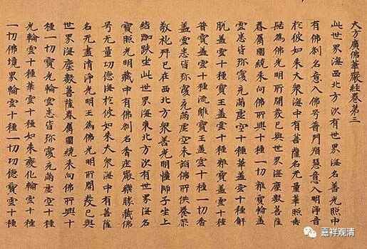

**《善说精髓》讲记025（上）**

** **

** “当如《十法》《华严经》，”**

** **

** “《十法》”**就是《十法经》。《华严经·入法界品》当中也提到了善知识有若干若干的功德，要多念念。还有一点就是，因为你多念了以后呢，就能够找到师父身上那么多好的地方了，是吧？平时该想的，你却想不到，师父到底有哪些好处，你都看不到。而《华严经》当中讲了有两百多条师父的功德，是吧？我记得是两百二十多条，好好地去看吧。

** “所说吟诵且思惟，”**

** **

这些经典呢，多念念，顺着经文多想想，师父有哪些好处blablabla……

** “此乃意乐依止理。”**

** **

这个就是意乐依止的好处。

比如说我们学习《百法》也是一样，看看这些善法当中我们自己具备了哪些，再倒过来把烦恼和随烦恼也想一想，是不是有哪些在自己身上。顺过来看的话，应该思维善法、六度四摄我们具备哪些比较好。

我们应该这样多想想，多念念。这里说的《华严经》实际上是指《华严经》的《入法界品》，这是哪一段呢？是善财童子去向弥勒菩萨的那一段当中，前面有一长段讲了善知识有怎样的好处，这一段可以多念。善知识有哪些好处，像什么、像什么……比喻非常多。

说到比喻，《现观庄严论》当中有二十二个比喻，是吧？《经庄严论》也是二十二个比喻——菩提心二十二喻。大家能背吗？这二十二个比喻，我们以前是当作功课念的，所以还能记住。哎呀！现在当功课念的少了，就记不住了。我们以前念的是能海上师的译本，是吧？

“如地金月火，大藏宝源瀛，

金刚山药善，如意日韻音，

王库藏大路，乘骑流无尽，

乐闻声河云，二十二种等。”

看样子还行，还能背。

我们现在是背的东西太少了吧！今年要给大家准备点功课背背，讨论哈。

