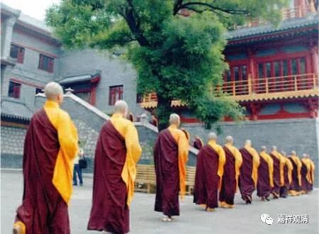

**《善说精髓》025（下）**

所以这就需要侍者很机灵的，侍者不机灵的话，师父也是挺累的。一般侍者不是随便找的，而且有时候侍者就相当于公司的总经理一样，他获得的信息量是更多的，你和他获得的信息是不对称的。甚至可以说，你这个方丈或者住持所得到的信息比侍者还要少，因为都是他过滤之后给你的，所以说侍者是非常重要的。

那么，这也是为什么汉地的寺院在方丈去世以后，通常都是侍者上位的原因，因为他几乎独占了所有的资源，甚至比原先的方丈占有更多的资源，所以他上位的话大家更容易接受。应该怎么说呢？顺利交班。包括当地政府等等，都是跟这位侍者打交道更多。所以在汉地是很有趣的，寺院方丈的侍者一般都是将来接替方丈位置的。

但是在藏地不是这样的，在藏地的话，侍者以后并没有上位的机会，仅仅是协助师父做事，真的是“侍者”、“管家”一样，离开师父并没有独立的地位。而在汉地的话，要真正有水平的才行啊，因为汉地更重要的是寺院的运营，所以侍者绝对是很重要的，所以我到现在也没有侍者，也有这个原因。其实，我觉得我没有侍者更重要的原因是，带他出去坐飞机得买两张飞机票。

** “（丁四）依止胜利：”**

** **

依止师父以后有什么好处？

** “诸佛欢喜知识亲，”**

** **

依止师父以后诸佛都会欢喜，为什么** “诸佛欢喜”**呢？你好好地依止师父以后，你离佛也近了嘛，你就会更快地成佛，或者更快地利益众生嘛。** “知识亲，”**不是知识亲你一下啊，善知识没事亲你一下？不是这个意思。是亲近的意思。

** “不堕恶趣业惑衰，”**

** **

坏的事情不做了，那些负面的烦恼、恶业等等，都会渐渐地衰竭。有时候你跟着师父，也就知道该怎么做了嘛。我自己也是，跟着师父以后，很多的改变是潜移默化的。真的要感谢师父啊！的确是哦，我跟着禅宗的师父，潜移默化地，好像现在也喜欢怼人。

业、惑，就是烦恼和基于烦恼而造的业；衰，就是衰减。在善知识身边能学到很多修行的理论并付诸实践，所以业惑衰减，远离恶趣。

** “功德渐增悉成办，”**

** **

在师父身边的话，师父的功德在那里，你在师父身边做事，自己的功德也会渐渐地增长。** “悉成办，”**成就也一点一点地获得了。

** “现久义利胜供佛。”**

** **

** “现”**就是现实，现在的。** “久”**就是久远的。现在呢，就是福报一点一点地增上，而久远的呢，就是获得最后的解脱。所以，** “现”**和** “久”**，指的是现实的增上和久远的解脱。现前的是安乐，久远的是断障。** “胜供佛，”**胜过供养佛。老实说，我们现在要找个佛来供养还找不到呢，只能找佛像来供养。那么，师父就在自己的面前，还是比较容易找得到的。

