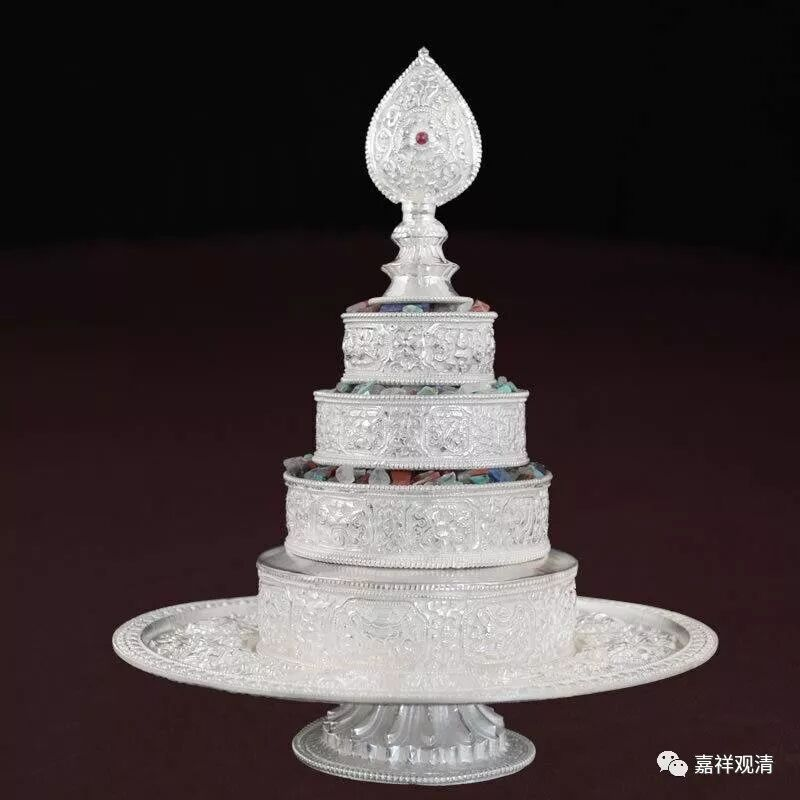

**《善說精髓》讲记027（上）**

** “礼供劝请随喜五，”**

** **

1、“** 礼**”拜；2、“** 供**”养；3、“** 劝**”请转法轮；和，4、“** 请**”住世；5、“** 随喜**”功德这五个。

** “集福忏净喜令增，”**

** **

** “集福”，**就是积累福德；“** 忏净**”，就是忏悔、净除业障；“** 喜令增**”，就是令欢喜增长。我们先这样简单讲讲吧。

** “为令集净增诸善，”**

** **

为了1、积累资粮；2、净除障碍；3、增长这些善法。那么，七支就分这三大类：一个是积累资粮，一个是净除障碍，一个是增长无尽。前面讲的** “礼、供、劝、请、随喜”**这五个属于“积累资粮”，“忏悔”是净除障碍，“回向”是令增长无尽。

** “终无穷尽故回向，”**

** **

这一句是讲回向——为了让前面的这些积累资粮的功德终无穷尽呢，就要回向大菩提。就是，要集资、净障，然后增长无尽。前面五个是集资，忏悔是净除障碍，回向是令增长无尽。就是** “礼、供、劝、请、随喜五”**这些都是积累福德，忏悔呢，是净除障碍，回向令善根增长无尽——是这个意思哦。

** “摄集净增无尽三。”**

** **

这里的** “摄”**就是包含的意思。普贤的七支当中包含在三个内容里：第一个是** “集”**——积累资粮；第二个是** “净”**——净除障碍；第三个是** “增”**——** “增无尽”**。普贤七支，摄为三个，哪三个呢？集资、净障和增长无尽。

** “供曼陀罗作祈求：”（**这个“陀”其实是它，da，古音不分清浊音，t就是d……好爽啊！刚学了一节梵文课就可以装叉了。）在这以后呢，可以再专门供曼陀罗。在格鲁系统当中（当然其他系统也会有），在供七支积累资粮、净除障碍的时候呢，有些是在前面供养部分，有些是在中间忏悔部分，还有些是在做完整个七支供以后，加入供曼扎，可以是长的（三十七堆），也可以短的（七堆）。有些在前面的时候就直接加在供养支里面了，也有些单独放在最后面，再加一个供曼陀罗结束“七支供”部分。本文的做法是放在最后。

