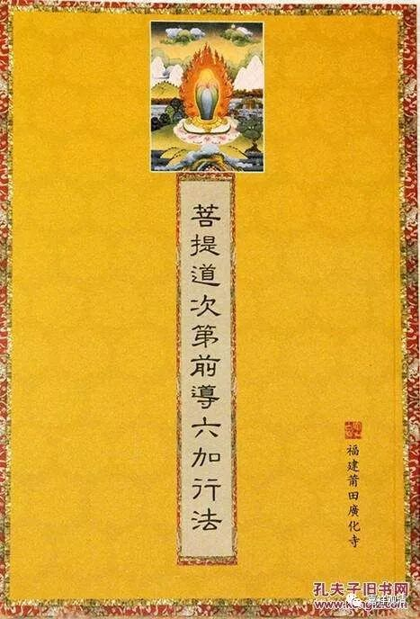

**《善说精髓》028（下）**

现在讲到座上修时的加行，就是道次第里面的六加行，我们课颂本里面的功课——陈设身语意啊、资具啊等等，礼拜啊、供养啊等等都算。

那么这里的六加行和我们平时说的四加行、五加行、六加行、九加行是不一样的。现在很多人一听到加行，就认为是磕大头、供曼扎等等。这里的六加行不是这个内容，就是修道次第正行前面要做的加行、准备。

我们平时讲的四加行、五加行、六加行、九加行，实际上是在密宗（特别是无上密）的大闭关之前要求完成的集资净障的一些内容。比如说，要念诵十万遍百字明咒、完成十万个磕大头、十万皈依、供水……等等。

那么现在呢，考虑到大家的福报都比较差，甚至在学显宗的时候，还没有碰到密宗的时候，师父就已经要求磕大头等等。其实格鲁派以前没有这种要求，但是现在有些法师觉得这样（先做这些积资净障的行为）也不错，就安排了这些功课。我呢，觉得这么做也有道理，意思就是：你要是愿意做完这些，就说明你还是真的愿意学的,是吧？你要是不愿意做完这些，那估计你也不怎么愿意学的。

道次第的“六加行”不是这个意思，是指修道次第各个所缘、各个内容之前的准备。还有一种加行道的“四善根”，也叫四加行，也不是这里的意思，那个是说加行道（顺抉择分）的暖、顶、忍、世第一这“四加行”。大家不要混淆，因为真有人混淆的，还是挺有名的人呢……

“道次第六加行”是哪些呢？他们是：

第一加行法：洒扫住处、庄严安布身语意所依。

第二加行法：由无谄诳求诸供具、端严陈设。

第三加行法：身具毗卢七法坐安乐座、从殊胜善心中修皈依发心等。

第四加行法：观资粮田

第五加行法：摄集积净扼要——奉献七支及曼荼罗

第六加行法：启请道次第传承上师，决定令与相续和合。

这样的“道次第六加行”。

