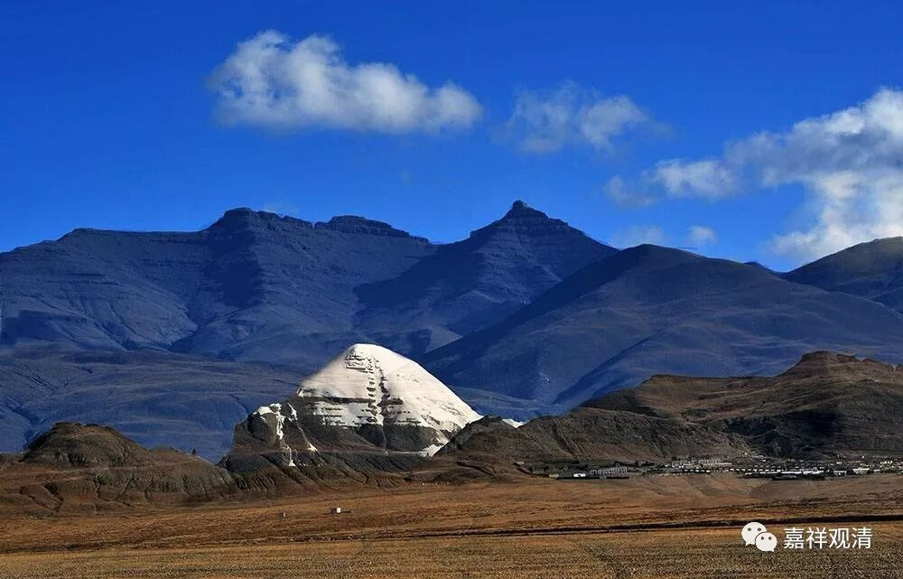

**《善说精髓》030（下）**

以前只是听到快念的传说，不了解是怎么个原理。后来格西就和我聊过这个事情，他说，在《普贤行愿品》当中就有“一一口有无量舌，一一舌出众音声”这样的意思。说是一个舌头里面有很多个舌根，是同时念的。当然后来看到真实的现象不是这样的，就是念得快，并不是一下子分别念几行。（后来发现《华严经》里还有这样说：“此不可说中一头，示现于舌不可说；此不可说中一舌，示现于声不可说”，这个比较接近。）

这种事情一定要见过才会相信的。用今天的话来说，就是你一定要见过高山。我自己比较幸运，我还是有机会见过高山的，然后就知道，我们以前是自己见识太差，觉得三个月念完《大般若经》已经不错了，直到后来见过才相信了，康萨仁波切左脚跨进马镫、右脚跨进马镫之间，白文殊已经修完一遍——这是可能的了。

关于康萨仁波切还有一个说法，说有人去他那里求传承，他还在求着呢，康藏仁波切就说：“好，传！”然后，他在那里磕头，刚一磕完，就传完了。就是磕三个头刚刚磕完，传法也传完了。后来，据说当时最大的活佛不允许他这么做，他才不做了。

康萨仁波切这一辈子，好像闭关了五十多年吧。他好像是十几岁开始闭关的，出关以后弘法的时间不长，然后六、七十岁就圆寂了。当时他弘法的这一个黄金时段，给了很多弟子特别殊胜的传承，但是他闭关的时间特别长。大家有兴趣可以看一下康萨喇嘛的传记。

我们很幸运啊，我们这一代还见过高山，有些你们也见过，还有些你们没有见过，以后有机会的话还可以见见。我见过的这几个，年纪都很轻，都还没到50岁呢。

** “获暖相已随宜行。”**

** **

如果是已经修得差不多了，或者已经有点意思了，那你“随宜行”——时间长一点或者短一点都可以。而我们呢，不是长一点、短一点都可以，我们总是想能不能更短一点。假如闭关需要三个月的话，我们总是问师父：“三天行不行？”

我想起来一个故事，有一次我也在场的，祈竹仁波切给大家传“米字玛”——就是宗喀巴大师赞：“无缘大悲宝藏观自在……”。祈竹仁波切先传了九句版的，又传了六句版的，又传了五句版的，再传了四句版的。传完以后，下面就有人法问：“师父，还有更短的版本吗？”祈竹仁波切抿着嘴笑了，说：“嗡阿吽。”

