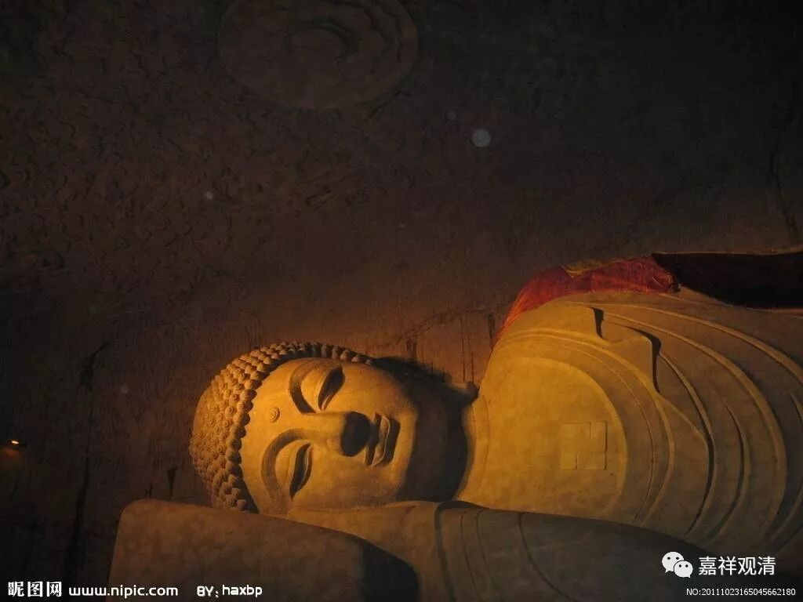
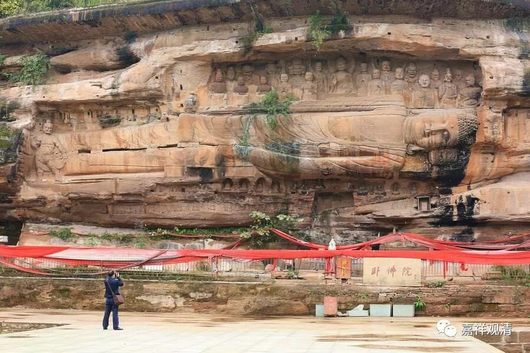
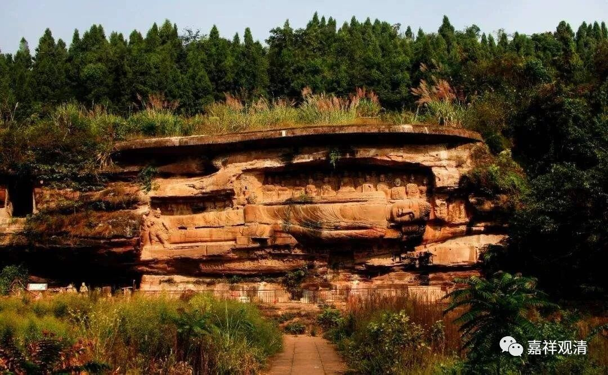
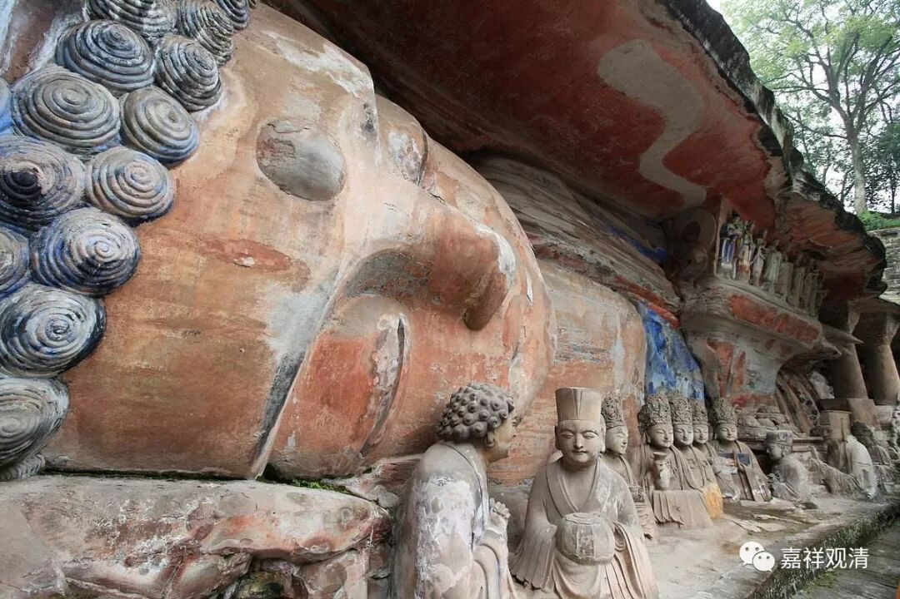
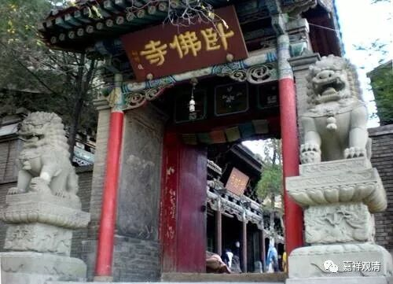
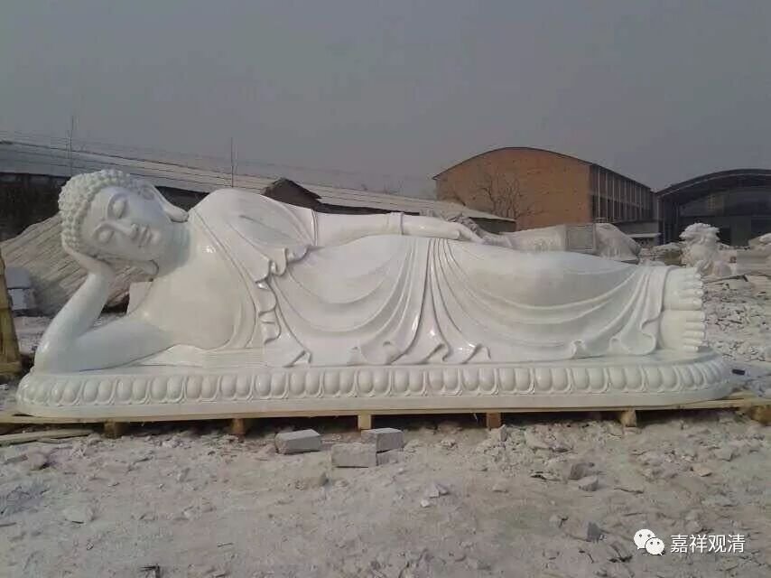
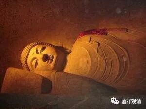
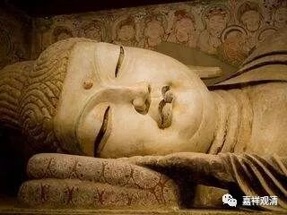

**《善说精髓》031（中）**

** “精勤修习寤瑜伽，”**

** **

就是白天应该怎么做，晚上应该怎么做。晚上应该右侧卧，而且睡四个小时，从晚上十点到凌晨两点。唉，只给四个小时……困啊，十点睡我没问题，但两点起绝对是个问题。那么，《瑜伽师地论》里面就对我们稍微好一点，从九点到三点，给了六个小时。谢谢弥勒菩萨！

（哎，从这个角度来看的话，我们现在也可以再加两个小时，调整到八点到四点，对吧？你想想，释迦牟尼佛是公元前五百年，是吧？弥勒菩萨讲《瑜伽师地论》大概是公元三到四世纪，是吧？差不多隔了八百年。到我们今天，又过了一千七百多年，那我们再加两个小时也不多嘛。从释迦牟尼佛到《瑜伽师地论》加了两个小时，现在我们再加两个小时，八个小时睡觉，好像也可以嘛。要不再出来个菩萨批准一下呗……）

** “眠时身仪正知行，”**

** **

睡觉的时候，身体应该怎么样？应该右侧卧。

很有趣的是，好像在中国某个地方的石窟当中，佛是左侧睡觉的。不知道是哪个佛，挺奇怪的，从来没有左侧卧的说法，一直都是讲右侧卧的。我已经发现过两次了，就是没记下来，在中国某个地方的石窟。（四川资阳安岳卧佛院。介绍说是中国唯一的左侧卧的佛像……呵呵，其实就是错的形象。）

佛是右侧卧的，我们常见的卧佛的形象实际上是佛的涅槃像。就是说，这尊佛的样子，并不是佛在睡觉的时候我们供着，而是涅槃的时候就是这个样子。

在兰州五泉山的半山腰有一个“卧佛寺”，供了一尊卧佛。有一次我住在那里，走进卧佛殿的时候，有一个居士在那里拜，然后和边上一朋友念叨：“你看这佛爷，睡得可真香啊！”（突然之间就令我想到了《没完没了》那部电影，里面傅彪扮演的那个角色就是去寺院里拜佛：“佛爷，您好好睡啊，别打扰您。待会我们收拾我们的，别惊着您了。”）

虽然叫是叫“卧佛殿”，但实际上是佛的涅槃像。这种形象很多地方都有，但记住，右侧卧才是对的。我们也应该学佛，右侧卧。这就是“眠时身仪”。手放在耳朵下面就行了，并不如很多卧佛像所表现的用肘支起来。

不应该是这种

应该像这样

** “眠时身仪正知行，”**

** **

** “正知行”**，就是正知而行。正知，怎么说呢？就是时时保持一个警惕心来观察自己，就好像从自己的心分出来一点，用这个分出来的心来观察自己的行为。

