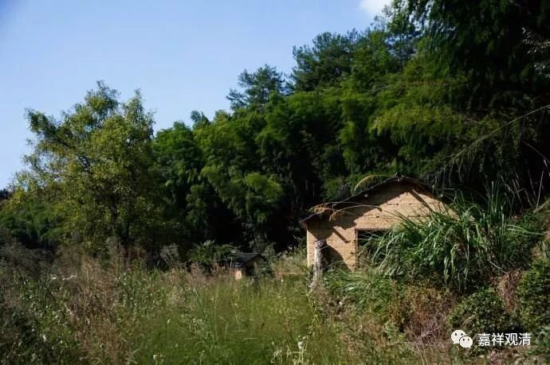
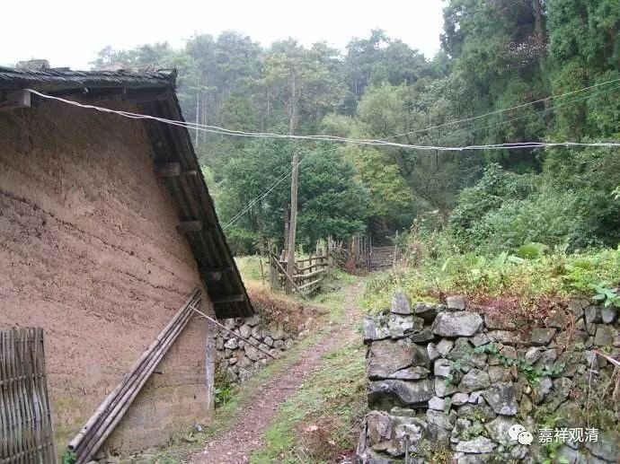

**《善说精髓》031（下）**

** “加、正、结行、座间修，”**

** **

在加行、正行、结行和上座的中间修行的时候。

** “至观皆同正行别。”**

** **

这个** “至观”**是什么意思呢？从“依止善知识”开始，一直到修止观，就叫** “至观”**，明白吗？就是从这里开始，一直到《广论》的最后，加行、结行、座间修，大的方向是一样的。那么，在什么地方会不一样呢？** “正行别，”**就是在正行的地方会不一样。在修“依止善知识”的时候，主要就是依止善知识。在修止观的时候，他的正行就是止观。其他的内容都是一样的，其他的大的方向都是一样的——这就是** “加、正、结行、座间修，至观皆同，正行别。”**

在座间还可以看一些和正行相关的书，比如你在修止观的时候，就要看止观方面的书，对你观修止观会有帮助嘛。你在修“依止善知识”的时候，就多读诵《华严经》相应的章节，正行修到哪里，座间修的学习内容就延伸到哪里。

这个就叫** “至观皆同”**，一直到《广论》最后的观察修的那一段，都是一样的，把其中正行的内容换掉就可以了。

** “（丁二）须以两种修法而修之原由：**

** **

** 烧洗珍宝成堪能，如是于黑白业果，**

** 厌离净信之作意，猛利长时观察修。”**

** **

两种修法，一个是观察修，一个止住修，是吧？

** “烧洗珍宝”**,这个珍宝可能是指金银。一般的珍宝不需要烧洗的，一般的珠宝如果去烧洗的话，心痛啊！那么，黄金、白银差不多这样去烧洗、锻练。这是古代的冶金知识了，不多追究了。

** “堪能”**是什么意思呢？就是把黄金当中的杂质去除了以后呢，想做什么都很容易。简单说，** “堪能”**就是“可以”。

** “如是于黑白业果，厌离、净信之作意，猛利长时观察修。”**

** **

“黑白业果”就是善恶业的取舍；“厌离”指厌离三恶趣，“净信”就是皈依三宝——这些应该要观察修。这些内容都需要你对比起来看，观察抉择——什么好？什么不好？然后去观察修。

** “随所欲成止观故，”**

** **

就是按照你自己的想法要能够成办止观。“** 随所欲**”就是把这些内容修习成熟，能随心成办、任运成办。

** “修无常是上观修，”**

** **

修无常还是比较推荐的，“** 修无常”**就是观死无常。对最初的修行者而言，观死无常是最好的观察修了——能知世间无可执持，一切世间终究散坏。

** “如修奢摩他之时，多观非妙须止修。”**

** **

在修止的时候呢，修** 奢靡他**的时候，你如果多观察、多分别的话，就会对止造成一些障碍——这里主要是指初学的人。如果在后面修止观双运以后，你在修止的时候会帮助观，修观的时候会帮助止。但是在刚开始的时候，你在修止的时候如果多观察的话，就会障碍止，所以在这个时候就要** “多观非妙须止修”**，要把心静下来去修止。

** “是故智者孤萨黎，止与信等定应修，”**

** **

有些人认为：“哎呀，如果你要做法师的话，你就应该多做观察修，如果你是闭关住山的话呢，你就应该多止住修。”有人有这样的说法。那么，这里的意思是，这种说法是错误的。

** “是故智者、孤萨黎，止与信等定应修”，**这里前后对应，即：** 1、智者定应修止；2、孤萨黎（住山、闭关的）定应修“信”等观察修。**智者也应该要止住修的，同样，住山的这些人呢，也应该要观察修。比如你修“信”的时候也要观察，后面会讲到，要观察三宝的次第的差别、三宝的数量的差别、补特伽罗的差别等等，这些信等皈依的内容都是要分别的。

就是，不管是做法师也好，做住山的山林派也好，止住修和观察修这两方面都是需要的。

