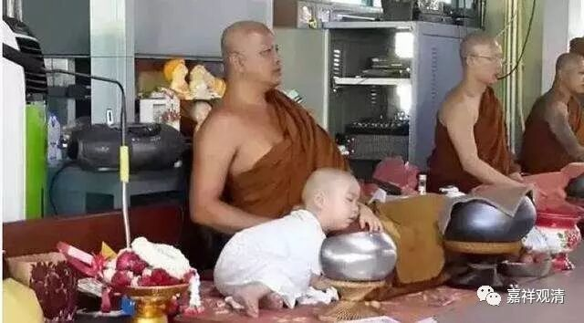
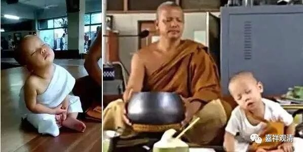

**《善说精髓》讲记 032（上）**

** “止住观察二皆须。”**

** **

所以对任何一个行者（不是武松、不是悟空）而言，止住修和观察修都是必不可少的，既需要让心安静下来，也需要明辨二谛的内容。有些人单纯地说“不要多想”，至少也是不圆满的。玩一下文字的话，就是“静”、“虑”“** 二皆须**”。

** **

** “又沉掉是住心障，”**

** **

又，另外。“** 沉、掉”，**就是“沉没”和“掉举”。沉没，讲得稍微通俗一点，差不多就是慢慢、慢慢地打瞌睡了。昏沉也是，昏是比较粗的。昏和沉还有点不一样。总得来说，沉呢，是指我们的兴奋力有点不够啊；昏呢，程度比沉没更强一点。掉举呢，就是相当于我们又太兴奋了。打坐的话，差不多就是这两方面的问题，沉、掉——要不然就是想打瞌睡了，要不然就是想很多很多的事情，连前两年人家欠我的钱都想起来了。

禅宗里面有个故事，发生在高旻寺，在清末的时候高旻寺比较有名，曾经有一段时间高旻寺也是没钱的。以前的寺院和今天不一样哦，以前的寺院经常有开不了锅的事情，现在的寺院开不了锅的情况基本上没有，就好像我们白云寺里的油都吃不完，太多了。

那时，高旻寺附近有一个卖豆腐的老太太，有一天她给寺院送去了豆腐——和尚的蛋白质来源。这么胖的和尚基本上都是靠豆腐喂大的，所以卖豆腐的老太太对我们是有恩的。她做了豆腐就送到寺院里面去，然后和知客商量说：“我看见你们天天打坐，我能不能也进去打坐啊？”

高旻寺以前是绝对不允许女性进禅堂打坐的，绝不允许的。可能那个时候高旻寺实在是太缺银子了，而且这位老太太可能是一位长期的施主，寺院就让她进去打坐了。

老太太打坐出来以后就说：“我现在知道了，打坐非常好！”别人就问她为什么，她说：“几年以前人家欠我的债，我都全想起来了。”（呃……这就是，散乱了。）

也好，这样看起来，禅修至少在讨债方面还是有点现实意义的。

** “又沉掉，”**一个是沉没，一个是掉举。** “是住心障，”**把我们的“心”“住”下来的一个障碍。我们这两天微信上也在发一些解释住心和九住心的内容，九住心在止观当中都有。

