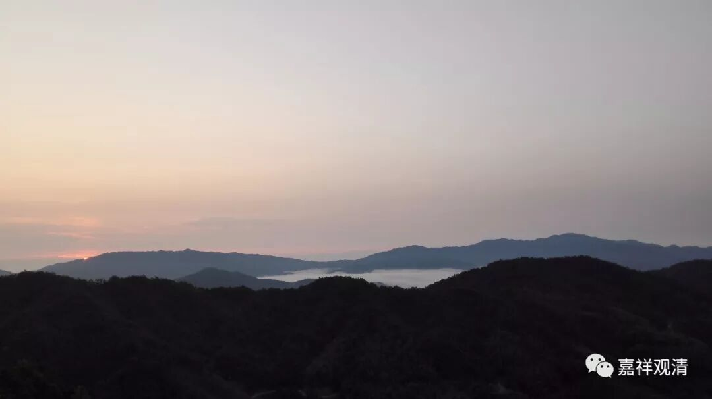

**《善说精髓》讲记 033（上）**

** “（戊一）有暇：**

** 边地、根不具、倒见，无佛教；四人无暇，**

** 长寿天并三恶趣，离此八种说为暇。”**

** **

那么，这个** “暇”**呢，就是有空闲的时间，无暇，就是没有闲暇。这里一共有八个，我们倒过来讲。

首先，你投生在长寿天和三恶趣——地狱、饿鬼、畜生的话，你基本上是没有办法去学佛的，那就是** “无暇”**。这里文字上说** “长寿天”**，其实意思是把天都算进去了，有些地方则说是两个天：一个是无想天，是外道定；一个是非想非非想天，也是不能起内道修行的。这两个呢，都是不能起内道的心的，所以这两个也是称为** “无暇”**。如果你是在非想非非想天，要起下界的心，然后才能修的。

另有些地方说（比如本论）说“长寿天”，是要把所有的天都算进去，在天当中呢，有些耽着禅定，有些耽着欲乐，所以呢，都不怎么喜欢修行——虽然有部分天人有修行的意乐，但总体上来说偏于享乐，不了解脱。所以，一部分人认为，综合起来，所有天道都算无暇。

我最近突然发觉这个说法有点道理啊，因为有人给我提醒了一下，确实有这个情况，一般的人确实是“无苦无出离”。如果环境条件太好的话，他不怎么想修行的，他不觉得需要修行。

刚才讲的这四个都不是在人道的。那么，在人道是什么情况呢？有四：

第一个就是，你总算出来做人了，但是“** 无佛教”——**佛没出世。就是你出来的时候，佛不在，那也倒霉，不能够学习。

第二个，你出来的时候佛也在了，但是地方不对，在“** 边地”**。比如佛在印度，你却在南极，那也学不到，因为你不在佛面前嘛。

第三个呢，你也做人了，佛也出现了，你跟佛也差不多在一个地方。又有另外一个麻烦，你做人的时候，“** 根不具”——**眼睛和耳朵这些都有点问题，眼睛看不见，耳朵听不到，也很悲催，又学不到。

第四个，实际上就是第八个** “无暇”**了，前面的几个条件都具备了，也做了人了，佛也出世了，你跟佛或者说佛教也在同一个地方了，眼耳鼻舌身基本上也还长得不错，最后一个，“** 倒见”**你的脑子不行。怎么跟你讲，你都不信，而且觉得自己是对的，佛教讲的，怎么都不对——世智聪辩。

这八种就是八** “无暇”**，其中四种属于不是人道里面出现的，另外四种属于在人道当中出现的。这八个当中具备任何一个，都是没有办法学佛的。这个** “无暇”**是没有时间，或者说根本没有机会去学佛。

