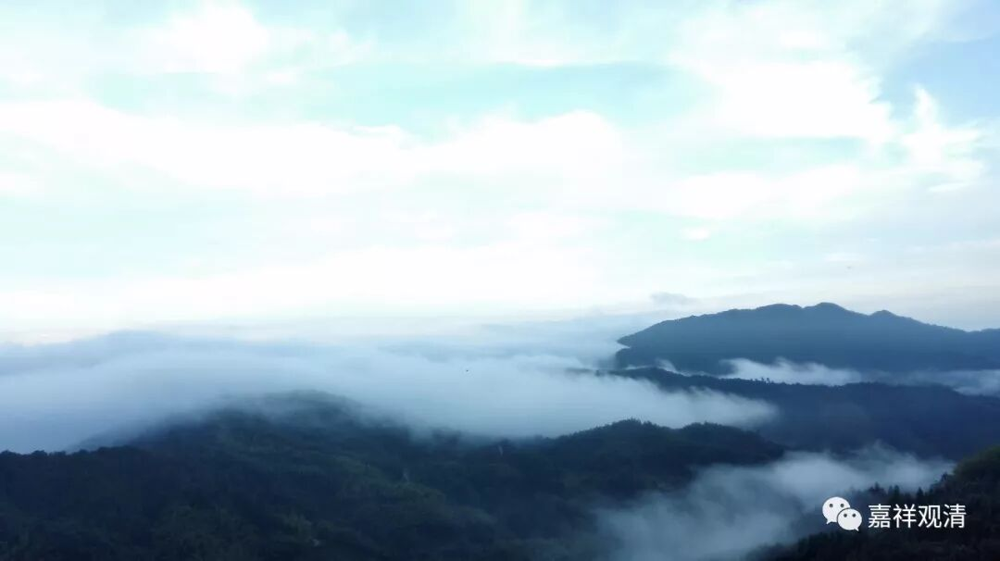

**《善说精髓》033（中）**

** “（戊二）圆满。**

** 分二：（己一）自圆满；（己二）他圆满。”**

** **

** “自圆满”**就是在自己这方面的，** “他圆满”**就是在环境方面的。

环境方面的内容有很多。比如说，我们这里有位法师，写了论文说道次第也是修行的环境，大家可以去看一看这篇论文，已经发表了。（人家泰国方面要求写的是佛教的环境，佛教有环境，她写的是《道次第在汉地的传播》，八竿子都打不着。）

最近我们收到的一篇论文也是一样，要求主题是中观，结果八竿子打不着地把元朝华严宗的一位法师介绍了一遍，而且也没有任何理论的内容。其实他真要想写成中观的话，还是可以写的，因为那位法师虽然算是华严宗的，但是他注解过《肇论》。你就把他注解《肇论》的思想发挥一下，至少可以算是一篇和中观有关的论文。他可能不知道《肇论》是中观的吧，这方面也没展开，这篇论文就直接被我们毙掉了。我就是做恶人的，直接说“毙掉”。写论文的人还是我们这里某个人的师兄弟呢。

** “（己一）自圆满：**

** 人复生中诸根具，未作无间信三藏。”**

** **

** “自圆满”**呢，有五个。

第一条，** “人”**，就是在自己这方面，能够做到人了。

第二个呢，** “生中”**，是指生在“中国”。这个“中国”在以前印度的说法是指生在摩揭陀国，因为佛长期在那里教化众生嘛。后来呢，广义的“中国”就是指有四众游行的地方。四众就是出家的男众、女众和在家的男众、女众，也有一种说法是指出家的男众的两类和出家的女众的两类。这个** “生中”**，就是“生在中国”——中印度恒河流域，或者有佛法传播的地方。（哎呀，今天的中印度，环境方面实在是太糟糕了。）

** “诸根具”**，也就是前面讲的，眼耳鼻舌身意基本上都还正常，大致上过得去就可以了。哪怕你是近视眼，总能够看一看吧，至少不出问题。这就是诸根具足。

** “未作无间”**，这一世没有作五无间业，也没有那些因为五无间业未报完而延续下来的的那些障碍。比如说，你前几世作了五无间业，然后下了地狱，这一世出来就会有各种障碍出现——那也根本没法学习的，障碍太大。

五无间业——杀父、杀母、杀阿罗汉、破和合僧、恶心出佛身血。给佛打针出血，就不算的啊。（那时候有针灸吗？也可以有吧。古印度的外科手术据说很发达的。）我以前上大学的时候，经常去宝华山，因为傅老师经常在宝华山讲课，和那些小和尚们都很熟。我们就给他们按摩，脑袋上也按摩，然后他们的有一个僧官就说了：“哎呀，我们和尚的这个头啊，就两种人可以打，一种是剃头的，一种就是你们医生。”

** “信三藏”**，这个** “信三藏”**是指相信经律论三藏，总的来说就是指相信佛法。

这五个“内圆满”，就是自己方面圆满的部分。

