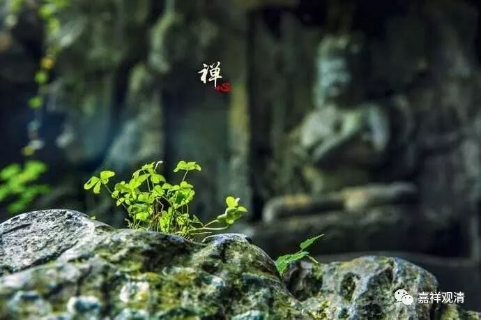

**《善说精髓》033（下）**

** “（己二）他圆满：**

** 佛降、说法、圣教住，随转、有他具悲悯。”**

** **

** “他圆满”**或者说** “外圆满”**呢，就是在环境方面圆满的部分。这个在《瑜伽师地论》当中前后讲的稍微有点不一样，有些地方讲四个，有些地方讲五个，大致上没什么大的差异，就是大致上的意思是差不多的。

** “佛降”**，佛出世的时候。

** “说法”**，佛也在说法。据有些经典说，有些佛出世因为没有相应度众生的因缘就没有讲法——当然按大乘后来的“理论”说佛都要讲法的。

** “圣教住”**，有教法住世。比如说，我们现在有佛教图书馆，有人在讲经。

** “随转”**，《广论》里说“随教转”，就是还有人按教法去实践成功的，有证正法住世。比如今天，山里面也还是有住山的、也有闭关的，趋向于实践、修正的，他们里面也有修行成功的——这就是有“证正法”住世。

这两条是说有教正法和证正法住世。《俱舍论》说：“佛正法有二，谓教证为体”，说的就是这里的“教正法”和“证正法”。

** “有他具悲悯”**，

这一点也很重要，就是有施主、有人给你送饭吃。不过现在好像问题不大，只要上个美团，啥都有。但是在山里面就比较困难，你叫个美团，让人家怎么送呢？“我在半山腰的那一棵歪脖树下，左边第三棵树后面的一个山洞里面。你到那颗歪脖子树下就叫一声，我会出来拿的。钱我已经埋在树下了，你到树下取吧。”哈哈……还是得有人护持啊！

这里“他圆满”一共五条：1、有佛在世；2、佛说教法；3、教正法住世；4、证正法住世；5、有施主供养你。

今天，释迦佛圆寂了，也不再说法了，所以有些地方就说我们现在缺“他圆满”中的前两条。还有一种理解，说我们现在属于释迦佛出世教化的年代，所以“佛出、说正法”这两条依旧圆满。

