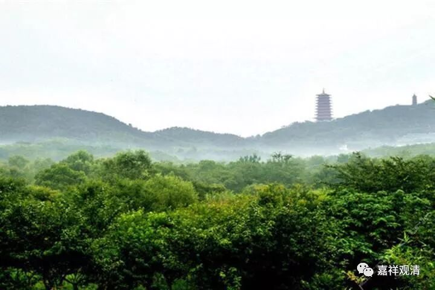

**《善说精髓》讲记035（上）**

** **

我们一般都看得比较近，不能看得远。如果看得远的话，就出家了，对吧？我觉得在这方面比较困难。假如有一款机器，能够让你现在就看到某一件事情五十年以后，甚至一百年以后会是什么很好的结果，大概人人都会去做了，是吧？问题都是我们不能“现见”。所以呢，就不容易去做这件事情，在这方面也不太相信。

当然，这并不是佛的问题。经常有人向我提出这个问题：“为什么佛不来救我？”按说，到现在已经有无量的佛出世了，是吧？按照数学的规律来说，每个人头上摊到一个佛是绝对没有问题的。其实真正的意思是，即使每个人头上摊到一百个佛也是没问题的。可是，他们为什么不来救我呢？

当时我正好看到一段佛经，马上就抄给提问的人，告诉他说这个并不是佛的问题。好像是在《阿含经》当中也提到这样的意思：太阳是一直在那里照耀着的，你自己不长眼睛，又能怪谁呢？

一开始我忘了具体的内容，就告诉他说：“瞎子看不到太阳，这不是太阳的过错。”然后对方就反驳说：“那你为什么不让瞎子睁开眼睛看得到呢？”我回答说：“其实经典里面是这样说的：你并不是真正的瞎子，是你自己闭着眼睛不肯睁开，却愣要说为什么阳光没有照到自己。那是你自己的问题，而不是太阳的问题，而我们总是觉得是太阳的问题。”

“我已经准备好了，为什么师父还不到我这里来？为什么佛还不到我面前来教导我？”我们总是觉得自己很冤枉。实际上，只要佛菩萨或者师父没办法教导你，就肯定是你自己这方面的力量还没成熟，对吧？

还是那句话：你自己这个杯子没准备好，那怎么也装不了东西。这不是倒水的人的问题。佛菩萨一直在伸着手，是你自己不伸手啊。

