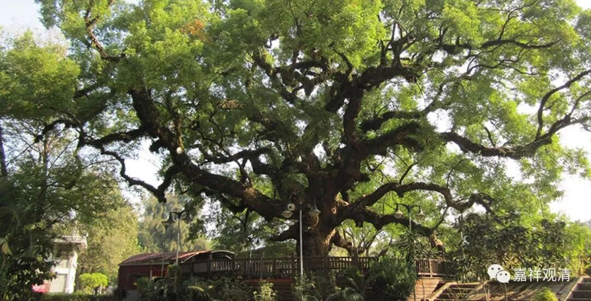
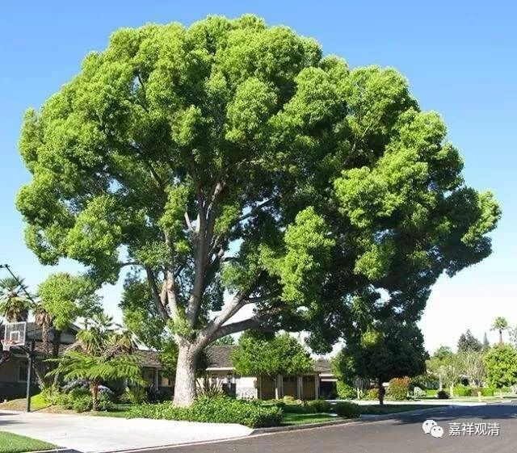

**《善说精髓》讲记 038（上）**

我们继续讲学《善说精髓》。前面说了三士道的总纲。

“三士道”，包括了上士道和共下士、共中士的部分——这些是道次第的核心部分。

** “于共下士道次第修心**

** （丁二）正取心要之理。**

** 分三：（戊一）于共下士道次第修心；（戊二）于共中士道次第修心；（戊三）于上士道次第修心。**

** （戊一）于共下士道次第修心。**

** 分三：（己一）正修下士意乐；（己二）发此意乐之量；（己三）除遣此中邪执。”**

** **

“共下士道”分三，1、正修的内容；2、标准是什么；3、破除错误的理解。后面“共中士道”、“上士道”基本上也是一样的这三个大科，科判大的框架都差不多。

** “（己一）正修下士意乐。**

** 分二：（庚一）发起希求后世之心；（庚二）依止后世安乐方便。**

** （庚一）发起希求后世之心。”**

** **

** 发起希求后世之心，**不是说马上去下一世，这个绝对不是让我们去跳楼啊。** “希求后世之心”**就是看待后世比现世重要的意思。我们不要为了这辈子，为了眼前的利益去做一件事情，要看得长远一点。如果你能看得久远一点，你这个人就是有水平的。如果只能看得很近的话，水平、能力就不是很高的，是吧？如果你看得近的话，那前面讲过，连畜生也能做得到——老鼠也会为了过冬储存粮食嘛！

据说做生意、做企业好像也是这样，是吧？每年能够赚数十亿的，如过江之鲫——发财的人多得不得了。如果连续三十年，生存一百年的老企业——哇！那才不得了。这个才是厉害，是吧？是要看时间长的，看更长远的。那些暴发户一样的企业，往往成了我们眼前的流星，很多著名企业上一版教科书里还是成功案例，下一版书里面就成了失败典型……

你们看，我们现在门口有一棵香樟树，结了果子就掉下来，是吧？然后呢，这么小的果子，可以长成这么大一棵树。现在边上已经有一些小的香樟树长出来了，我准备捡一点回去，到莲花山上丢一丢，说不定哪天也会长成一大片香樟林。（你们想自己种香樟树，或者搞个香樟树的小盆景也可以，自己去捡好了，每天门口都掉一大堆，扫都扫不完。）

所以很小的种子，以后也会有很大的结果。那么，我们人也是一样，不管是善也好，是恶也好，很小的善恶的种子种下去，将来也会有大的结果。所以，“眼光要放远一点”，不要只看到眼前的一点点肉屑……

