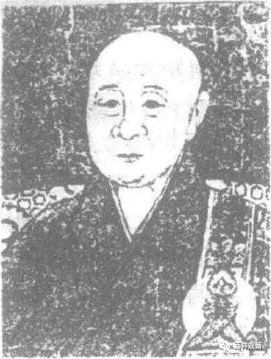
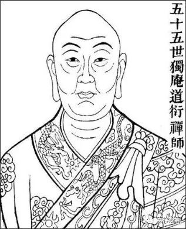
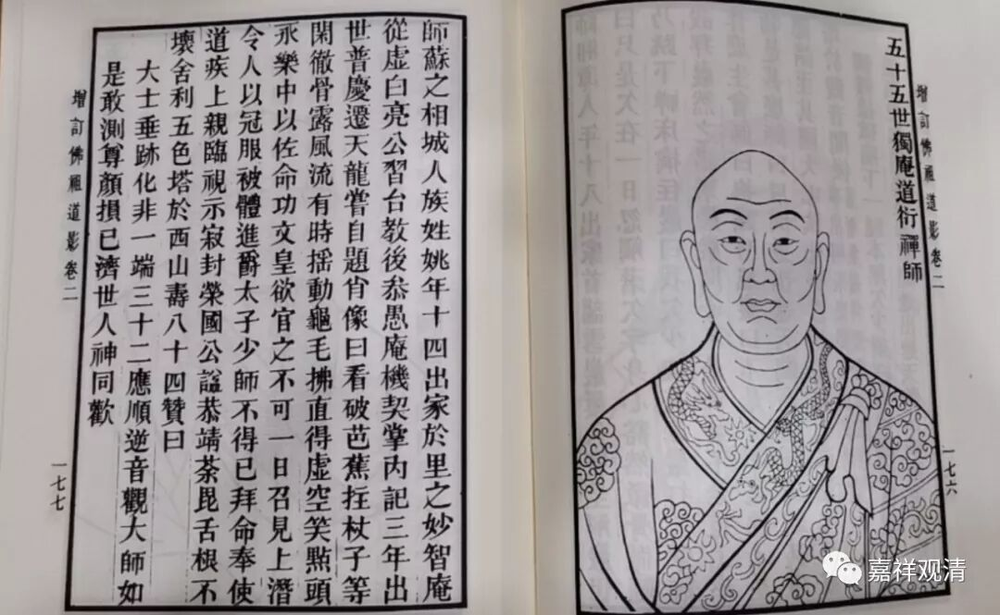
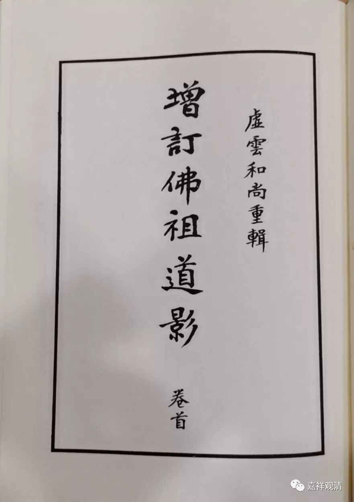
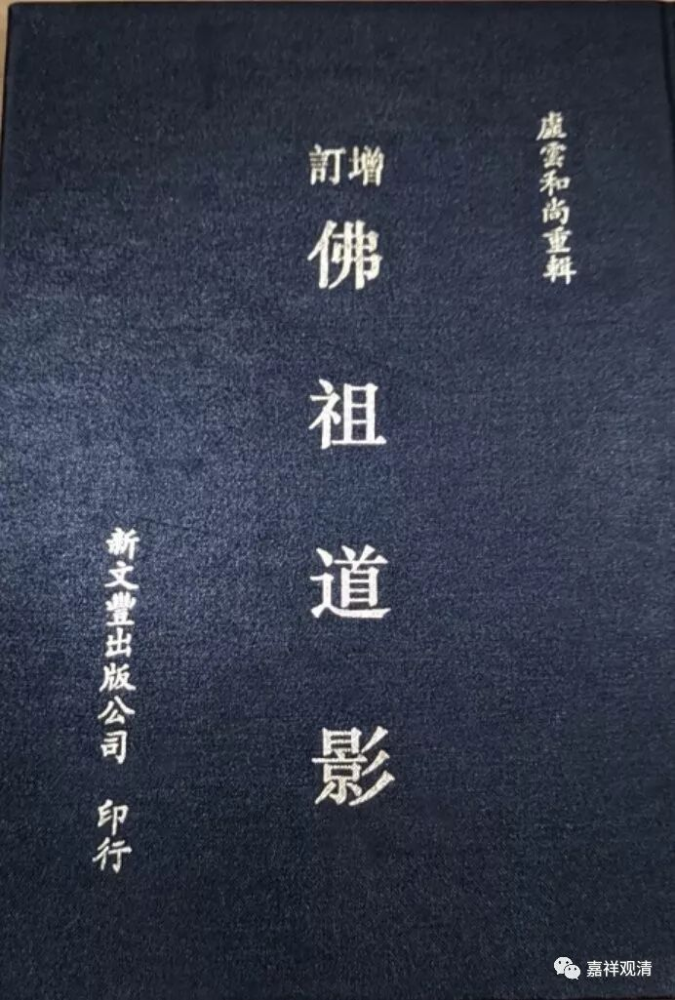
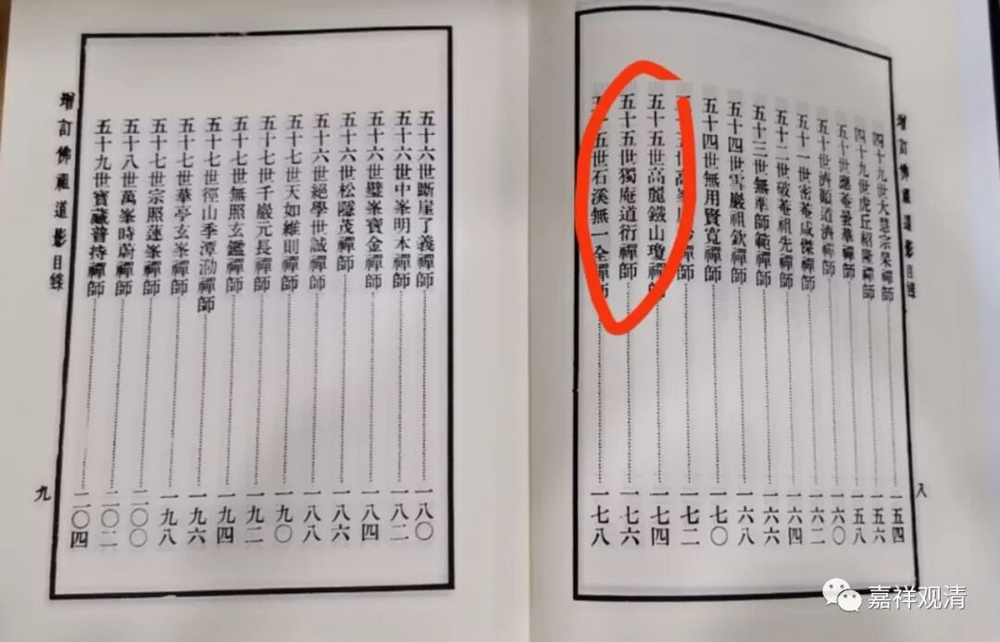
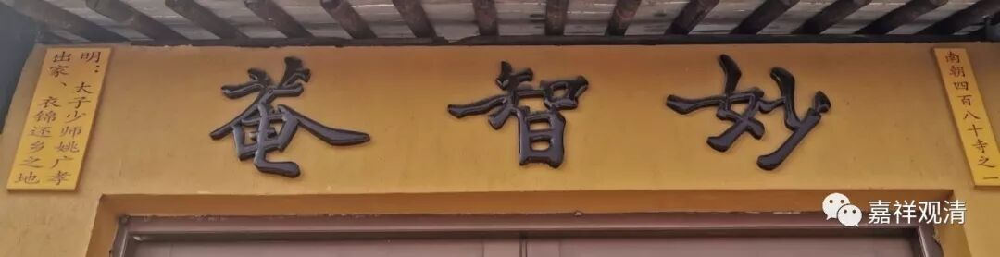
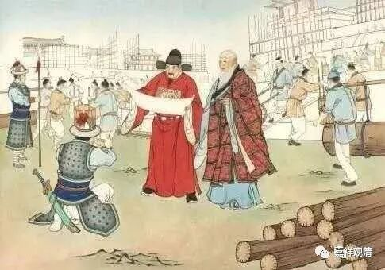

**谈谈独庵道衍禅师的传承**

这里略梳理一下姚广孝的禅宗传承。

从六祖大师算起：

六祖慧能——南岳怀让——马祖道一——百丈怀海——黄檗希运——临济义玄——兴化存奖——南院慧颙——风穴延沼——首山省念——汾阳善昭——石霜楚圆——杨崎方会——白云守端——五祖法演——圆悟克勤——大慧宗杲——拙庵德光——妙峰之善——藏叟善珍——元叟行端——愚庵智及——獨庵道衍

有学者说姚广孝是“临济宗第二十二代”，其实不然。从临济宗创始人临济义玄禅师算下来，独庵道衍禅师是第十八代，《灯录》里说的“大鉴下二十二世”、“大鑑下二十二世”，是指六祖慧能下二十二世，“大鑑”（大鉴）是慧能大师的谥号。有些《灯录》作“南岳下二十一世”，南岳，即六祖大师弟子南岳怀让。

妙智庵这幅碑刻应该出自《增广佛祖道影》

妙智庵碑和《增广佛祖道影》都做第五十五世

这是从佛祖释迦牟尼一直排下来的：西天二十八祖，东土六祖（达摩大师是西天第二十八代、东土第一代，重合），六祖慧能大师是第三十三代，六祖下二十二世，所以正是“五十五世”。

有些《灯录》记载姚广孝，作“杭州府天龙斯道道衍禅师”，这是因为他曾经住持过杭州天龙寺，“斯道”是道衍禅师的字。

有些做“北京顺天府庆寿独庵道衍禅师”，这是因为后来在北京住持庆寿寺。

又有做“少师斯道道衍禅师”，少师是他的职务。

还有做“长洲广孝斯道道衍禅师”，长洲，即地名，在苏州。广孝，是朱棣赐名。

