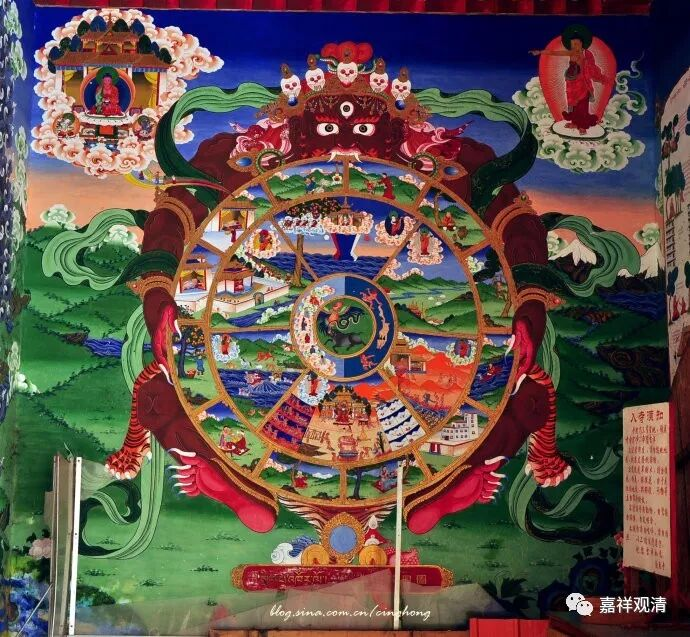
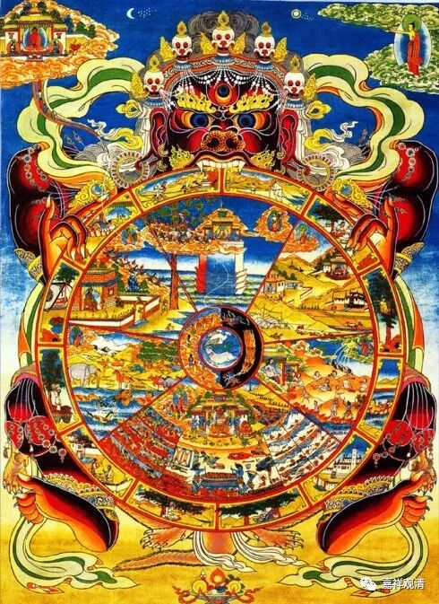

**《善说精髓》039（下）**

** （子一）思死主决定当来无缘能令却退：”**

** **

** “死主决定当来”**就是死要来了，把他拟人化就变成“死主”。唐卡里面也有一样的意思，在一个大唐卡里，一个阎罗的口里面有六道，对吧？意思就是，六道都是他管着的。（大家要唐卡的话，我们可以私人定制。）

** “无缘能令却退”**，

没有办法能让它退。

** “旋即死故难无畏：”**

** **

死是不可以打招呼的，随时会来，没准备好的人，你要让他没有担心地去迎接死亡，他是做不到的。

** “三有无常如秋云，”**

** **

秋天的云变幻非常快。三有就是指轮回。三有——欲有、色有、无色有，这三界是如此的无常，就像秋天的云不断不断地变化。

** “众生生死等观戏，”**

** **

众生的生死就像看戏一样。一场演完了，下一场……

** “众生寿行如空电，”**

** **

我们的寿命就像空中划过的一道闪电，从时间上来说太短了。

我们来这样看，这个地球已经四十五亿年了，整个的宇宙一百三十多亿年，如果把它看作一天的话，我们人类好像只是最后一秒钟或者最后几分钟的时候才出现的。在这其中，我这一个人的生命几乎连光都看不到了，嗖地一下就过去了。

窗外的这些树，我们的这些房子，现在看起来好像是我们在利用它们。如果它们是有生命的话，它们看我们，会觉得我们好像一下子就没有了。一个人过来以后就死了，然后下一世又来了——如果他们看得出下一世的话。

我们的生命实在太短了，周围的树木、建筑物的生命都要比我们要长得多。我们现在欣赏那些宋代的杯子，什么钧窑啊、汝窑啊等等，假如它们是有生命的，它反观我们：“呦，这是我第九十个守护者……呦，这个小赤佬转世又来守护我了。”它们的生命比我们长多了。

当然，这只是一个比喻。我们的生命实在是太短暂了，没有把握。众生的寿行就像空中的闪电一样。

** “犹崖瀑布速疾行。”**

** **

就像断崖的瀑布，一点都不停下来，刹那刹那地、不断不断地往下倒。

** “若能向內思无常，”**

** **

回过来，观察一下死无常。

** “万物无不示此理。”**

** **

我们从周围就能很直观地看到，“无常”这个事情对我们来说真的是很直观的。比如说，今天我也观察到了无常——我开始用暖水杯（泡枸杞）了。我很奇怪啊，我发了这条消息以后大家都在笑。其实差不多也是这个无常的意思，就是我们要过了一段时间以后才发觉自己老了，实际上是刹那刹那变老的，是吧？

** “万物无不示此理”**，

世间的事物都是这样，就是你观察到和没观察到而已。最近关之琳又出来了，不是演戏，是综艺节目。大家都在感叹这个那个的，和以前有什么不一样了，好多都是在和年轻时期比较，其实人都是不断地在变化的，是吧？

这里** “子一”**的意思就是，死是一定会来的，无人能令它退却，你没有办法能够让它走。你怎么能够让它走呢？难道你说“我给你们地狱多打点钱，我们买你们的股票，别来找我”？或者你要躲到什么地方去？——这都躲不过的。

以前曾经有个预言，说2012年12月若干号是世界末日。兄弟们都很恐慌，结果我有一个兄弟——希望他没在听，就买了一辆悍马车，把所有现金都兑换成金子，就准备在12月的时候就开着车去西藏躲过这场灾难。

然而，躲得过去吗？应该躲不过去吧？如果真该你死的话，你想躲也躲不过去。首先，他太迷信了。其次，他以为他开着悍马车驮着金子就能够躲过这场灾难吗？假如真有灾难的话，这哪躲得过啊。老实说，你就是金子再多，你逃到某个地方去了，到时候一个馒头的价格比金子还贵呢，那个时候金子也没用。再说了，你那悍马车太费油了，那时候路上还有油吗？

