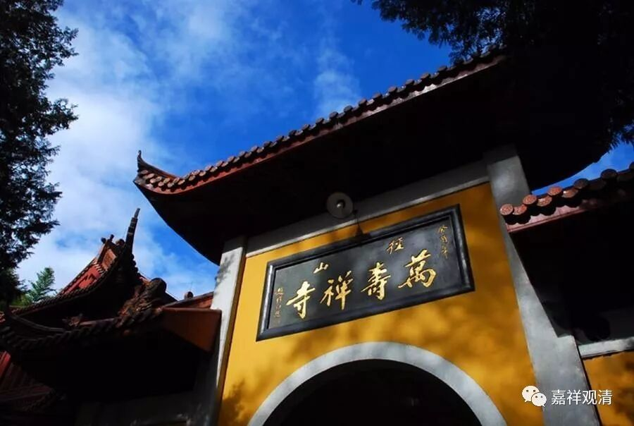
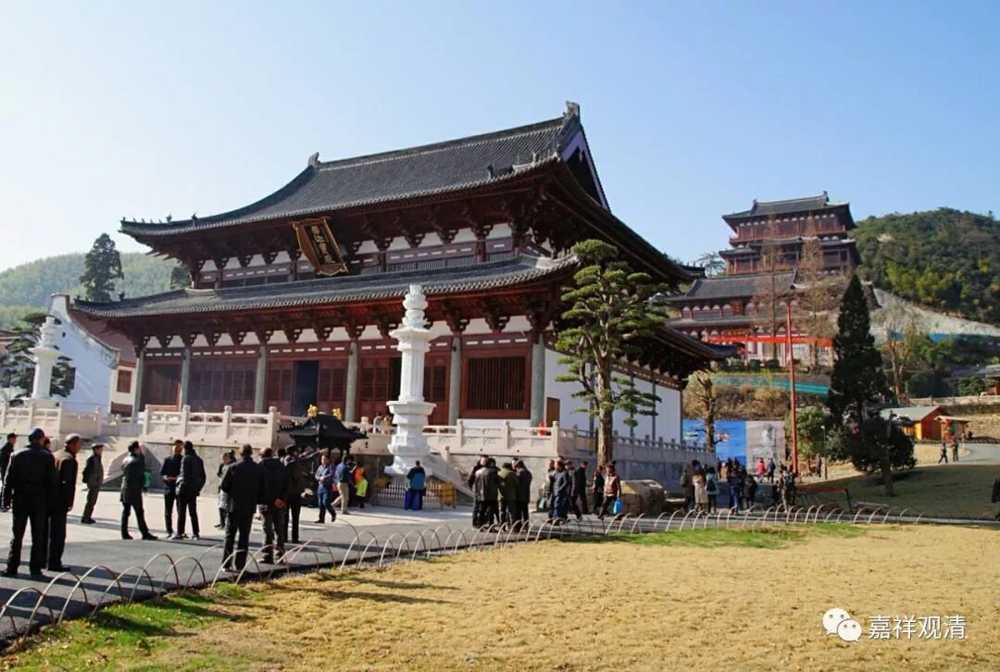
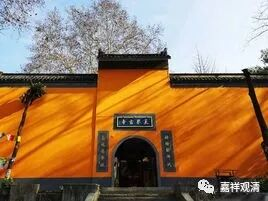
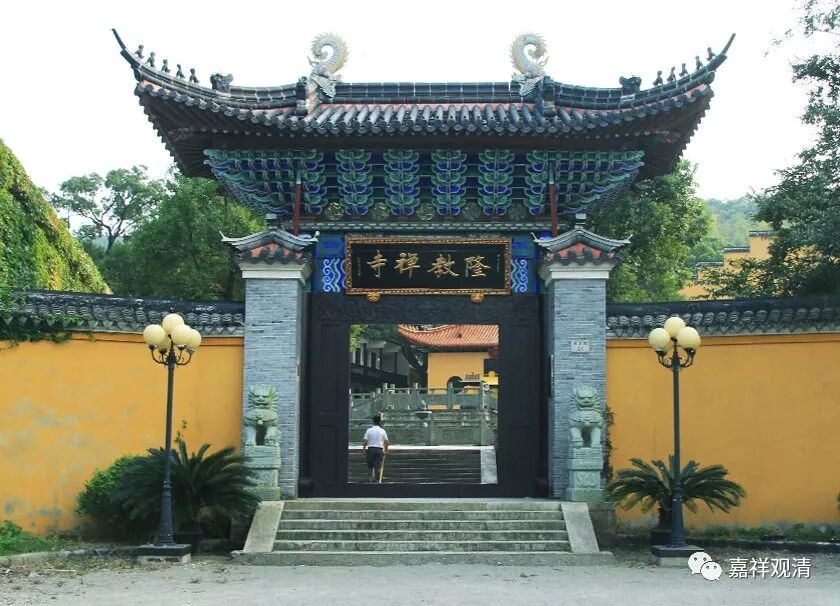
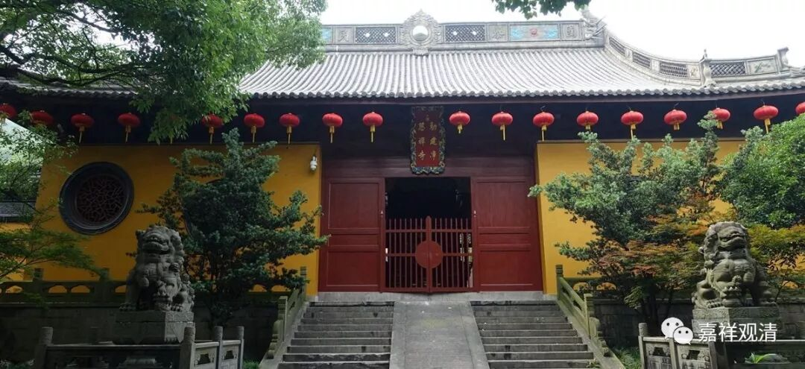
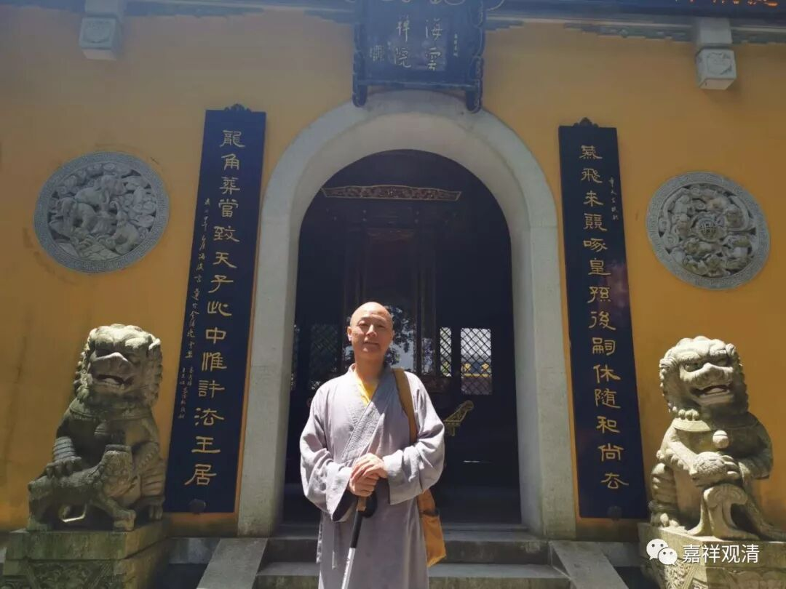

**元明“五山十刹”制度的一例**

** ——愚庵智及禅师履历**

南宋至明代初年，以禅宗为主的中国佛教形成了一套半官方的丛林等级制度——“五山十刹”和相关的“甲刹”等丛林高下排列（暂时找不到很好的词）。

我们先以元末明初愚庵智及禅师为例来大致了解一下名僧在“五山十刹”制度下的“进步”之路。

先介绍一下五山十刹（地名用今天的行政区划，便于大家了解）：

五山：1、临安（西天目山）径山寺；2、杭州灵隐寺；3、杭州净慈寺；4、宁波天童寺；5、宁波阿育王寺。

十刹：1、杭州中天竺；2、湖州道场寺；3、南京灵谷寺；4、苏州光孝寺（今不存）；5、宁波雪窦寺；6、温州江心寺；7、福州雪峰寺；8、婺州双林寺；9、苏州虎丘灵岩寺；10、天台山国清寺。

径山寺

五山之上，元代有加了最高等级的大龙翔集庆寺，明代改为大天界寺。

我们以愚庵智及禅师为例

首先，在穹窿山海云院（明天聊这个寺院）出家……十七岁受具足戒……四处游历、开悟……（穹窿山海云院已恢复）

32岁，“江南行宣政院举师，出世昌国之隆教”这是由官方“举”荐“出世”（另一种为丛林僧众推选“出世”），到舟山隆教寺做住持。这第一次“出山”，官方叫“出世”。隆教寺也是古来名寺。（此寺已渐渐恢复）

35岁，“转”舟山普慈禅寺，这个寺院是当时舟山的首寺，管理诸寺院。这里的“转”，已经是“升迁”。普慈寺的地位已经接近“甲寺”的地位了。（此寺今不存）

48岁，“太尉丞相达识帖穆尔”请入杭州净慈寺。杭州净慈寺“五山”中排名第三。愚庵智及禅师没有担任过十刹的住持，直接接了净慈寺。（已恢复）

51岁，“承奉行宣政院官疏请，入寺”，住持临安天目山径山寺。径山寺为五山之首。（已恢复）

63岁，任南京大天界寺住持。此寺位居“五山”之上。（已恢复）

65岁。回穹窿山海云院（愚庵智及出家的寺院）。

68岁圆寂。

愚庵智及禅师另有四位弟子住持“五山十刹”：

空叟忻悟禅师住持杭州灵隐寺（五山第二位）；

用愚希颜禅师住持天童寺（五山排名第四）；

东生德明禅师住持宁波阿育王寺（五山第五位）；

南琛智宝禅师住持虎丘灵岩寺（十刹第九位）。

还有一位弟子就是少师独庵道衍禅师。

