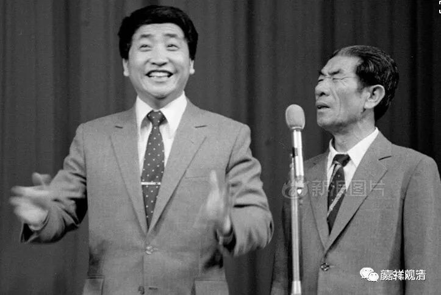
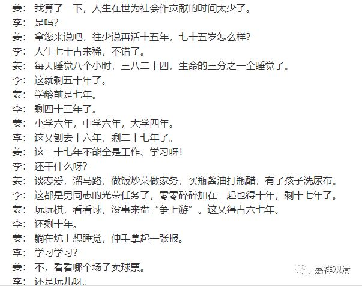
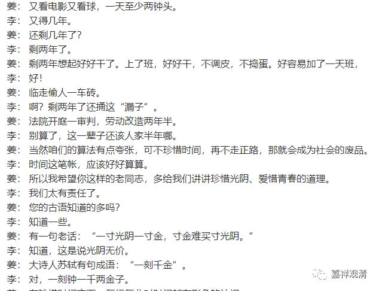

**《善说精髓》040（中）**

** “寿无可添”**。

有人说：“我念一部《长寿佛仪轨）》，看看能不能长寿。”应该说，如果是说福报的话，还能够增加一点，如果说真正的寿命的话，一般以我们的能力，大概没有可能增加。我们这种修行算什么本事啊？最多就是念两句，哪有增寿的本事啊！如果是罗汉的话，有这个本事的，《瑜伽师地论》说，阿罗汉要增长寿命修大乘发的话，通过“愿智”是可以把这个福报转变为寿量的。我们能够在念经的时候，有很少的一点点时间不打妄想，已经很不错了。不要以为我们自己念经，就有多大本事了。

** “（子三）思于生时亦无暇修法而决定死：”**

** **

就是我们现在好了，有时间修法吗？

以前姜昆、李文华讲过一个相声《时间与青春》，说一辈子把时间都浪费了，最后好不容易做了点好事，结果临了，偷人一车砖头，还被判了两年半……一生的时间全浪费了。

我们这一辈子，三分之一的时间用来睡觉，是吧？然后，做小孩子的时候也不知道修行，年老了修行也困难了，是吧？中间年轻的时候还有很多很多其他的事情——吃饭、睡觉、洗衣服、上网、八卦……能够修行的时间非常少。一辈子加起来的修行时间能不能超过五年？我们自己看看能不能超过五天？

朱自清先生也写过：“洗手的时候，日子从水盆里过去；吃饭的时候，日子从饭碗里过去；默默时，便从凝然的双眼前过去。我觉察他去的匆匆了，伸出手遮挽时，他又从遮挽着的手边过去……”

** “顽稚衰耄不念法，”**

** **

小孩的时候，年纪大的时候，要思维法都不容易的。

** “中为饮食睡病耗，”**

** **

中间的时候呢，我们的寿命被饮食所消耗、被事业所消耗、被疾病所消耗。

** “虽住百年少有修。”**

** **

哪怕是活一百年，修行的时间也很少。

** “今日死生虽不定，”**

** **

今天是死还是生呢？我们也不知道。

** “诸具思择执死方，”**

** **

最好呢，你还是想想“可能会死”比较好。执着于“可能会死”的这一方，你还会努力；执着于“可能多半不会死”的话，就不会努力。比如现在，我们估计大家都是不努力的。

** “执不死则悔而亡，”**

** **

如果老是执“不死”的一方呢，最后死的时候会后悔，因为没有准备好。

