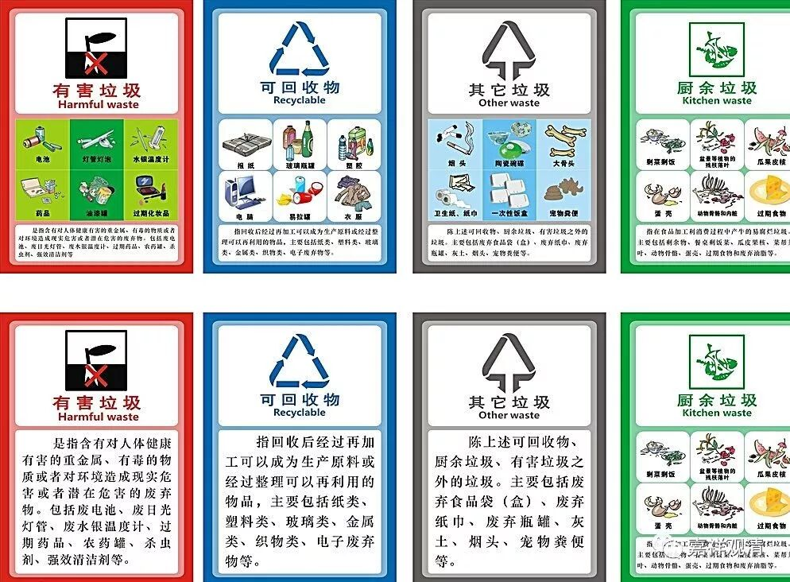
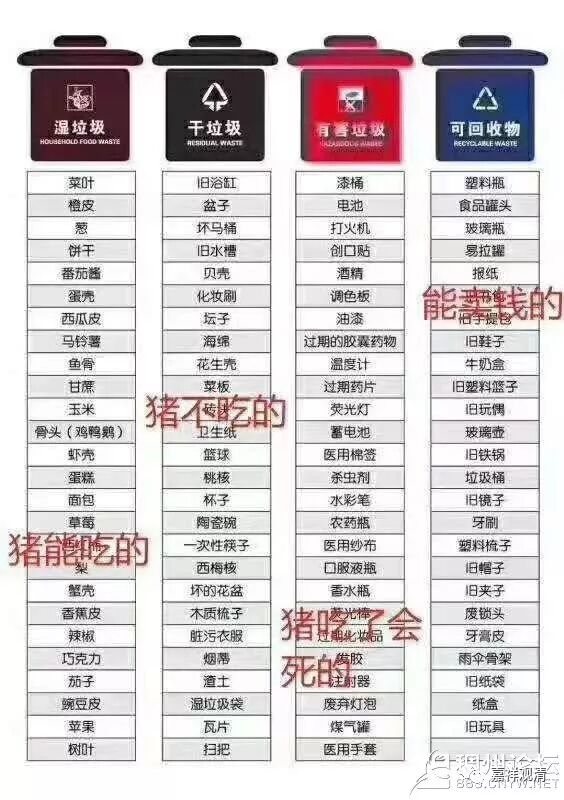

**“所知是常”和垃圾分类**

摄类学里面入门之初就有一个折腾死外行的问题：所知是常还是无常？

正常人类会说：“有为法无常，无为法常……”

可是摄类狂魔会告诉你：“单论所知，常还是无常？！”

正常人类觉得智商被侮辱了：“所知分‘常’和‘无常’，现在问‘所知本身是常还是无常？’无聊啊！！！”

正常人类说：“比如说，垃圾分为干垃圾，湿垃圾，可回收，有害四类，要分四个桶子装。有了垃圾，就要分门别类……谁会无聊去想，那垃圾本身属于哪一类呢？”

（补充一段垃圾分类小知识，直观版——

猪能吃的：湿垃圾；

猪不能吃的：干垃圾；

猪吃了会死的：有害垃圾；

卖了可以买猪的：可回收垃圾。）

摄类狂魔解释说：“总的垃圾也可以分啊！”（正常人类说：罚款！！！）

摄类狂魔继续说：

“总的垃圾里面，因为是有‘有害垃圾’的，就总的算‘有害垃圾’，因为，猪吃了会死的。

同样，所知分常、无常，但无为法比较重要，所以，要说‘所知是常！’”（正常人类：自己搞的一套标准嘛！）

“比如，苹果有一块烂了，我们说苹果烂了；路面有一段在修，我们说路在修……”

正常人类：好吧，好吧，反正你说啥都是对的，你总有理！（小知识：这是双重肯定表否定的特殊用法哦……哈哈哈哈）

 ……

