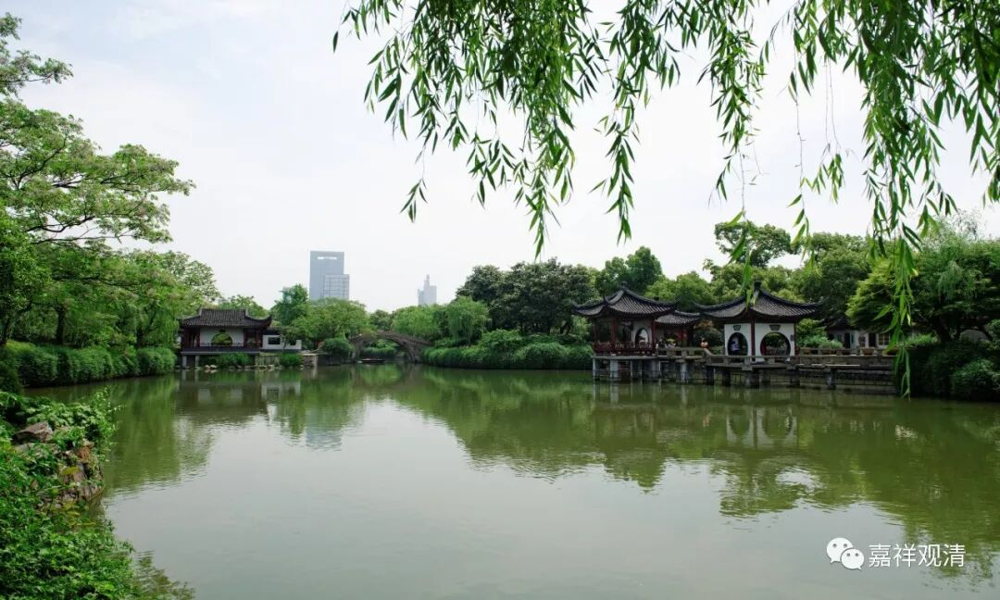

**《善说精髓》041（中）**

** “（子二）思身极脆弱故死无定期：**

** **

** 身弱不堪抗死缘，”**

** **

我们这个身体极其脆弱，心脏里面稍微出一点点问题，或者脑、肾稍微出一点点问题，我们就翘掉了。这段时间我一直在锻炼，锻炼后发现也没什么用，外强中干。我好像跑步还行,跑完步感觉自己挺有力的，但是稍微走几步，又觉得自己没气了。这个事情呢，西方和东方各有各的说法，还是东方比较有道理，所以除了跑步以外，我又把保温瓶拿出来了，在里面泡上人参和黄芪。外面（肌肉、骨骼、关节）要强，里面（气血阴阳）也要强。

** “身弱不堪”**，我们的这个身体非常脆弱。龙树菩萨的《中观宝鬘论》当中讲，四大（地、水、火、风）本身是不合的，它们能够在一起不出问题，这个才难。中医里面讲，金木水火土这五行，它们能够相生相克地在一起“和平共处”，我们的身体能够不生病，这才是本事，几乎是做不到的，所以在中医看起来，没几个人是纯健康的。好不容易西医看上去健康吧，中医就说是外强中干，这个气虚、那个血虚，又是脾虚，又是火旺……总之，健康才难，身弱不堪。

** “（子三）思死缘极多活缘稀少：”**

** **

能够给我们作为活缘的不多，但是能够作为死缘的却非常多，走在路上随便碰到什么事情就不行了。现在是我们伟大祖国多少岁生日啊？68岁生日。伟大的祖国，实在太伟大了。这两天国外到处出事，加拿大和荷兰出事了，欧洲也出事了，美国也出事了，大家都觉得祖国怎么这样好。你不知道在哪里上了什么船，或者在哪里又上了什么地铁，就出事了，完全不知道……爱国主义大课堂就在境外啊，到处走一走，还是中国好啊！（中国八大菜系和丰富的蔬菜、素食馆就是我的不共“活缘”！）

况且所有的活缘全都是死缘。你吃得多了，也可以撑死，也可以过敏死，也可以噎死，甚至喝口凉水都可以塞牙，是吧？你做什么事情，说得过分一点，都有可能……我很有可能现在翻书的时候碰到了墨汁，我是会过敏的，脸就肿起来了，心脏也出问题了，肾脏也出问题了，然后就翘掉了。都是有可能的，对吧？——这就是死缘极多，活缘稀少。

所有的活缘也都是死缘。我们现在觉得很好吃的东西，在你最后的时候，吃下去全都不消化。活缘少，而且会变成死缘，就是所有的活缘都可以成死缘。想想是不是特别有道理？

** “活缘少复成死缘，汝定死故当重法。”**

** **

所以我们一定会死，应该要取舍，要取法。

以上这写就是** “死无定期”**这一段应该要多加思维的。有能力的话，自己在这个框架下面扩充思维的内容

