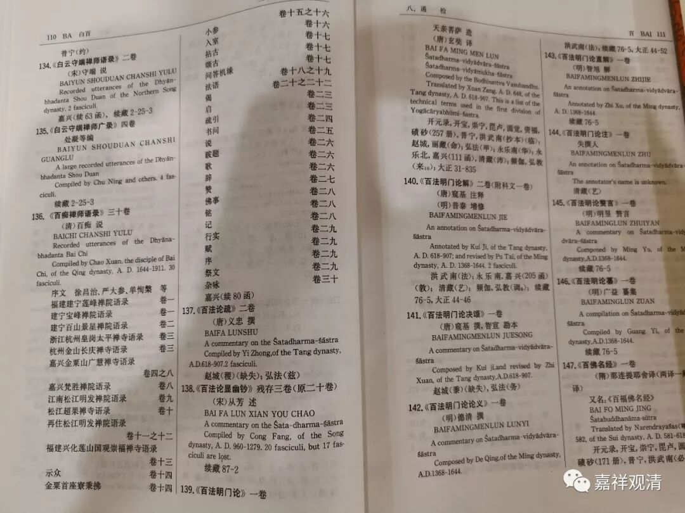
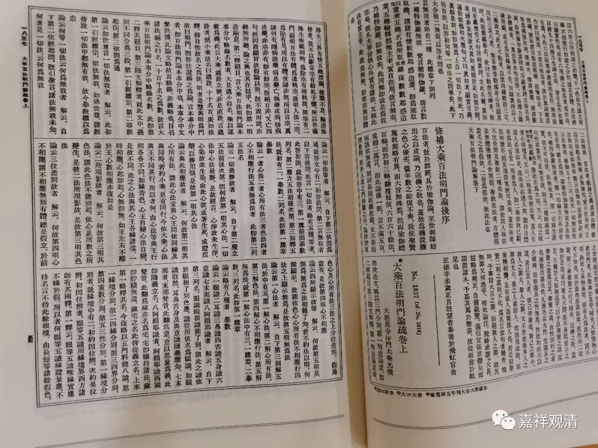
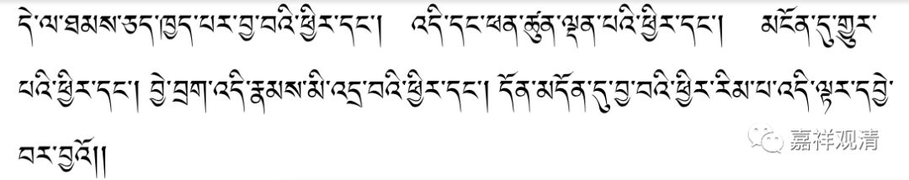

**《大乘百法明门论》的版本问题**

带着“清代国人识字率”的问题入睡，醒来第一个想法是，“《百法明门论》的版本差异”该扯一下了。

《百法》的原文极短，但也明显地出现了版本源流问题，甚至由于翻译原本的选择错误，还带偏了藏译（及解读）。

首先，《大乘百法明门论》有个小标题《<本地（事）分>中略录名数》，一般都认为是《瑜伽师地论·本地分》，然而仔细观察，其实应该是《<显扬圣教论·本事分>中略录名数》。（见另文《心所品类定型史》）

第二，《百法》里这一段，有两个版本，正确的版本是：

“一切最勝故，與此相應故，二所现影故，三（分）位差別故，四所顯示故。”

但有个错误的版本被沿用了：

“一者、最勝故，二、與此相應故，三、所现影故，四、分位差別故，五、所顯示故。”

后说至少见于：

1、《大乘百法明門論解》唐慈恩法師窺基註解·明魯庵法師普泰增修（大正藏）

2、《百法明門論纂》明匡山五乳廣益纂釋（卐字续藏）

3、《大乘百法明門論註》（龙藏）

此三版本中，1、3版本解释不误。而且都出自明以后，难道是明代出现的版本差异吗？

不是。

我们看藏译本

对译的汉文版本居然是“一者、最勝故，二、與此相應故，三、所现影故，四、分位差別故，五、所顯示故”这个错误的版本。

《大乘百法明门论》的藏译本是南宋小皇帝从汉文本翻译的，也就是说，宋元之际，或者说最迟在元代，《百法明门论》已经有了流通的错误版本了——版本之误至少不是从明代才开始的。

第三、《百法论》的作者。藏译说是护法，而它又是从汉译转译的，汉译可是明确说“天亲译”。

第四、藏译中还出现了次序问题。1、八识的次序；2、五遍行的次序；3、随烦恼的次序；4、不定心所的次序；5、不相应行的次序。这个也需要进一步观察。

第五、尚有“不动无为”和“不动灭无为”；“法无我”与“法无法”的问题……

……

看来《百法明门论》也有不少问题该整理一下呢。

故知：人文研究的第一道关就是版本！

