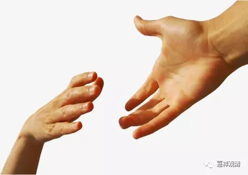

**《善说精髓》042（下）**

** “（壬二）应归依此之因：”**

** **

应该归依的理由。

** “自已解脱诸怖畏，”**

** **

佛自己呢，已经解脱了一切怖畏。

** “善方便救他人怖，”**

** **

他也有能力，有各种善巧方便，救度众生远离怖畏、解脱怖畏。

** “大悲遍转堪归依。”**

** **

而且呢，他的大悲心对任何一个众生都能够生起。他不是只对某些人能够生起，比如只对中国人能够生起，或者只对印度人能够生起，如果这样的话就不是你归依的对象了。比如说，他的大悲心如果只对希伯来人能够生起，那就不应该是可归依的对象。

** “外缘佛成虽不缺，”**

** **

现在，关于归依的对象，佛爷他那里早就准备好了，该具备的条件一点都不缺少，而我们自己的问题出现了。

** “内缘归依当至诚。”**

** **

我们这里，内因缘方面，能归依的心还没有生起，所归依的那里已经准备好了。

对于《掌中解脱》的解释是有两种说法的：一种说法是说，解脱在我们的手上，就是这本《掌中解脱》。另外一个说法，是益西旺秋格西说的，就是佛菩萨的手早就伸出来了，而你的手有没有伸出来呢？意思就是说，解脱的问题仅仅在于你的手有没有伸出来。（但当时有很多格西都笑着说这种说法是不对的，永嘉仁波切也是笑人之一。至少我听说过有这样两种说法。）

跟格西们呆在一起是很有趣的，他们互相之间是不会随便投降的，死也要扛住的。至少在辩论、讨论某件事情的时候是这样的，绝对不投降的。格西们都是汉子啊！

** “（壬三）如何归依之理：**

** 如何方成归依者：”**

** **

怎么样归依呢？

** “圆明相好庄严身，”**

** **

佛呢，具备了圆明相好——圆满、光明、三十二相、八十种好，作为他的身的庄严。

** “由一音酬各各问，”**

** **

意思就是，大家每个人都在说出自己的问题，而佛一回答，大家就觉得：“哎，佛回答了我的问题。”就是说，“佛以一音演说法,众生随类各得解”——可能是神通吧。

** “智悲遍转所知轮，”**

** **

对一切法，佛的意都是能够通达的，智慧和慈悲在任何地方都能够生起。

以上是赞叹佛的身语意功德圆满。

** “事业任运不间断，”**

** **

利益众生的事业从来没有间断的时候。

** “此是略说佛功德；”**

** **

这里是简短地说一下佛的功德。

佛的功德对我们来讲，最主要的就是讲经——“示法性谛令解脱”。不过这也差不多是大部分人的“理解”吧，对于很多人来说，如果佛真的出现在他面前，他也就是：“要不请佛念念经，回向一下？”——人们需要的是保佑不是解脱！

