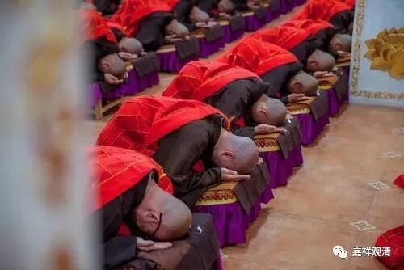
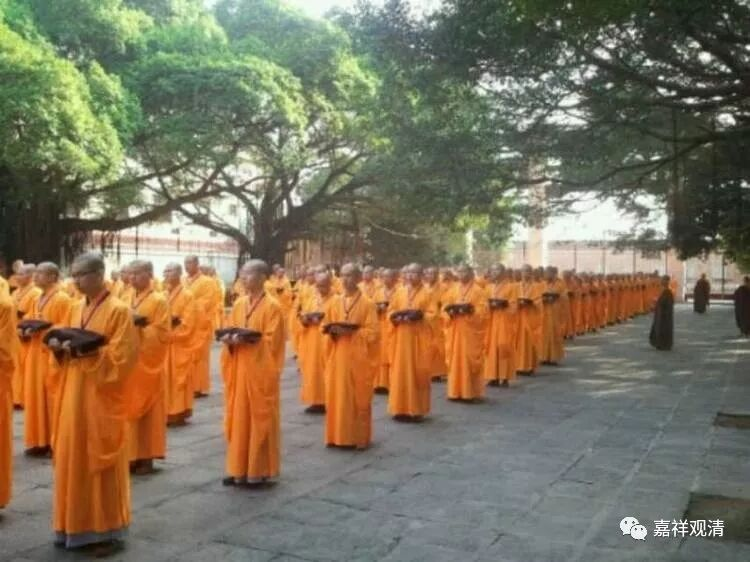

常有新人问我们：“大师，你们衣服的颜色是有（级别）讲究的吗？”

一般我没空回答时，会说现在没有什么讲究，不表示僧界级别。其实僧人服色，略有来历，只是现在确实没人讲究，也没什么人知道了。

明初，官方对僧人的衣色做过规定。据《明太祖实录》、《礼部志稿》记载：

**“禅僧，茶褐常服，青绦（“绦”，《实录》作“条”）、玉色袈裟；讲僧，玉色常服，绿绦、浅红色袈裟；教僧皂常服，黑绦、浅红袈裟。”**

常服

绦

袈裟

禅僧

茶褐

青

玉色

讲僧

玉色

绿

浅红色

教（瑜伽）僧

皂

黑

浅红

按，这里的“讲僧”，实际就是元代说的“教僧”，也就是天台、华严、唯识、中观一类研习教理讲经说法的僧人；“禅僧”比较好理解，就是值得禅宗僧人；明代的“教僧”，实际指向的是“瑜伽僧”，就是念经念咒做超度法事的，今天大多这类都自称为“净土宗了”。“律宗”被无视了！

明代禅、讲、律（这些正宗）的出家人地位下降、瑜伽僧地位被（底层人士）朱元璋拔高了，他认为前者“务以修心养性，独为自己而已”，后者“益人伦、厚风俗，其功大矣”。

不同佛教宗派的僧服用不同的颜色，其最初在印度也曾经是这样的（龙树菩萨当年尚未归依大乘准备自搞一套的时候，就定了僧服式样及颜色）。后汉安世高译《大比丘三千威仪》卷下末描述袈裟的颜色时说起过：

** “萨和多部（有部）者，博通敏智，导利法化，应着绛袈裟。**

** 昙无德（法藏部）部者，奉执重戒，断当法律，应着皂袈裟。**

** 迦叶维部（饮光部）者，精进勇决，极护众生，应着木兰袈裟。**

** 弥沙塞部（化地部）者，禅思入微，究畅玄幽，应着青袈裟。**

** 摩诃僧衹部（大众部）者，勤学众经，敷演义理，应着黄袈裟。”**

现在，属于混穿了。

又，今天，杏黄海青红袈裟已经作为很多大寺院的标准制式礼服了，但在帝制时代，杏黄色海青在民间禁止穿的，清代皇家寺院礼服才允许用杏黄色。今天……反正都随便啦……

