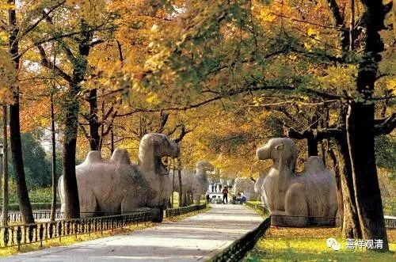

**
**

** 朱元璋这个赶经忏的小和尚**

** 害了佛教
**

关于中华历史上的灭佛运动，我们常常说的是“三武一宗”（没时间去追究了，但我估计这个词是宋初出现的）。其实此后灭佛运动并不少见，北宋和明代，都有几次官方的灭佛运动，甚至洪武初年，由小和尚而大皇帝的朱元璋颁布的一些自认为整理、扶植佛教的诏令，也是佛教自胜转衰的一大关键。

有明之初，自元而明颇有几个高僧团队在为历史输送人才，但自此以后，僧界人才绝迹，原因就是——整个佛教的大格局被朱元璋搞坏了！

小沙弥皇帝可能在“微时”受了几次委屈，一做皇帝便来找机会报仇：

** “（瑜伽僧）各有故旧檀越所请做善事，其僧如科仪教为孝子顺孙以报劬劳之思在上而追下者，得舒慈爱之意，此民之所自愿，非僧窘于衣食而干求者也，官民敢有辱慢是僧者，治之以罪！”（《趋避条例》）**

** “……应供民间者听，从僧民两便，愿请者愿往，任从之……敢有仍前拘矜者，其僧纲、僧正、僧会杖一百，工役三年！”（《申明佛教榜册》）**

这是说，僧人出去念经，并不是为了衣食。今后无论官民，谁要是敢看不起——治罪！小和尚要是出去念经，如果僧官敢不准许的，打一百板，劳役三年！——真是一眼就可以瞧出来小朱朱还是沙弥的时候曾经受过那些苦啊！

他还说：

** “禅与全真，务以修身养性，独为自己而已，教（瑜伽，就是做佛事的应赴僧）与正一，专以超脱。特为孝子慈亲之设，益人伦、厚风俗，其功大矣哉”。**

意思是：讲经打坐纯为自己其实不咋地，会超度的才厉害！

这样拔高“教僧”（民间应赴僧），压制禅、讲、律僧（他还杀了好几个明初的高僧！），直接导致佛教僧人地位在一般人的眼里自明而起一大变化，从高洁大行的出世行者一变为谄事鬼神的俗和尚，其影响直至今日，瑜伽僧的杂碎功课统一了“丛林”，僧人竞以背诵应赴“功课”而得度！此风从明初以来竟成循例！可以说，朱元璋的种种佛教诏令，对佛教在中国的正常传播产生了极其恶劣和负面的影响！

可以说，有明一代的佛教政策，直接击垮了中国佛教，其影响远远超过三武一宗！（有明一代至少可以数出两个皇帝对佛教的负面影响不逊于三武一宗。）

