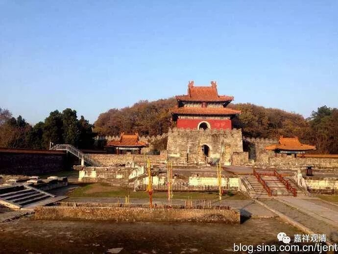
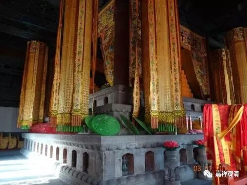
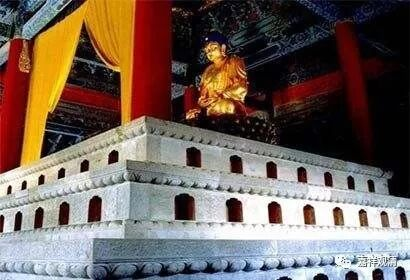
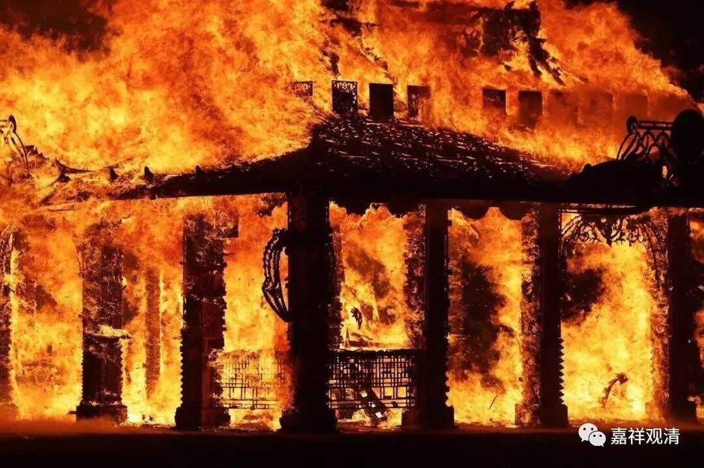
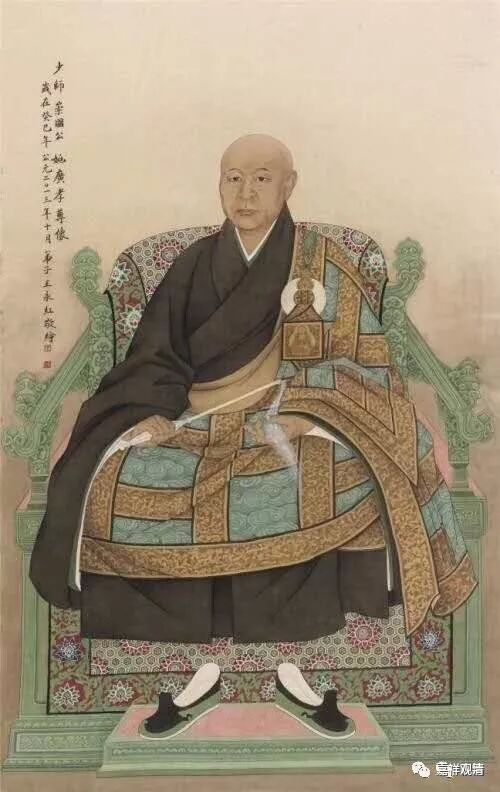
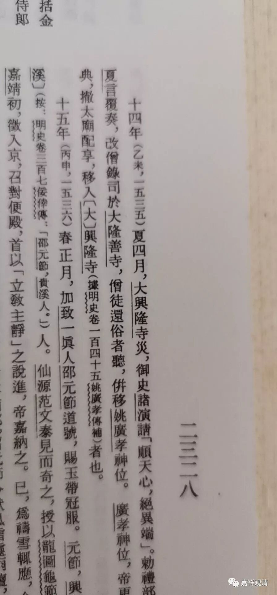

**明嘉靖灭佛远超“三武一宗** ”

明中期，明世宗（嘉靖）信仰道教，他在位日久，对佛教的一系列迫害政策，影响深远，对佛教的破坏力，远胜“三武一宗”。

佛教出家人最重要的是受戒，继朱元璋裁除律寺后，嘉靖进一步禁止佛教戒场传戒。明·圆澄《慨古录》说：

**“今太祖将禅、教、瑜伽（禅教一门、瑜伽一门）开为二门。禅门受戒为度，应门（瑜伽）纳牒为度。自嘉靖间，迄今（1607）五十年，不开戒坛。而禅家者流，无可凭据，散漫四方。致使玉石同焚，金鍮莫辨。”**

说从嘉靖开始直到明末，戒坛禁绝数十年，正统出家比丘无法正常得戒——这一现象是佛教在中国自有传戒以来未有之事。

嘉靖一朝，数度停废戒坛——嘉靖五年五月，“** 诏严禁西山戒坛**”，并令榜谕全国，** “犯者罪无赦”**；二十五年七月把天宁寺建坛说法的通法师及寺主** “俱令锦衣卫捕系鞠问，余下礼部禁治”**；四十五年九月，“** 诏顺天抚、按官严禁僧尼至戒坛说法，仍令厂、卫、巡城御史通查京城内、外僧寺，有仍以受戒寄寓者，收捕下狱**”。

不许传戒，也不许讲经，人数稍多，便视同白莲教等民间宗教。圆澄《慨古录》说：

“** 今之丛林，众满百余，輙称红莲、白莲之流，一例禁之，致使吾教之衰，莫可振救。**”

嘉靖十五年五月，他下令拆毁禁中大善佛殿，殿内有金、银函，贮佛骨、佛头、佛牙等，“** 乃燔之通衢，毁金、银像凡一百六十九座，……一万三千余斤。**”

道衍禅师姚广孝有“靖难”辅佐之功，配享成祖庙。嘉靖认为僧人不能有此“殊荣”。嘉靖九年，他下令将姚广孝移祀大兴隆寺，十四年大兴隆寺着火，又移至隆善寺。令大兴隆寺僧人还俗。

《明史纪事本末》

其他毁坏佛教之事尚多。我们常说的“三武一宗”之祸，而嘉靖之祸，过“三武一宗”远矣！

中国佛教，至明而极衰，嘉靖一朝，是其关键！

