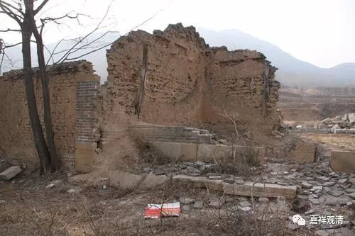
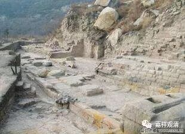

**明代佛教为自古未有之谷底**

明代的佛教（主要明代中后期的佛教，前期承继了元代佛教的余响）在中国佛教史上可以说是波谷了，汉地自有佛教以来从未如此之衰败。

首先，“律宗”被无视甚至消灭。元代的宗教管理对汉传佛教有禅、教、律之划分，但到了明代，改为禅、讲（即元代的“教”）、教（即“瑜伽宗”、应赴僧）宗，直接无视（取消）了律宗。明代中期嘉靖信道教（实际是“扶箕”、“采战”之流的民间宗教、邪教），数数禁止佛教开坛受戒，佛教律制的崩坏直接导致正统佛教收到了毁灭性的打击！

其次，拔高瑜伽宗（经忏佛教），把它置于禅教之上，并给以褒奖，这反而令僧人平均素质急速下降，社会地位也随之急堕，经忏佛教因为经济原因正式走上前台。

第三，丛林制度崩坏。禅宗自唐以来经实践确立的、符合中国文化的（《百丈清规》）丛林制度因禅讲没落、经忏崛起而衰弱，禅宗迅速没落，教下诸宗至明代而极衰。

第四、佛教“名山”制度崩坏，佛教重心下移。自南宋以来的“五山十刹”讲修考功晋级制度在明代被实际打破，禅讲高僧考功、升级无门，继之兴起的“四大名山”信仰的仅为单纯地民间朝山信仰，佛教重心下移。

第五、民间宗教管理失控，在整顿不利的同时佛教却被殃及。罗祖教、无为教、大乘教等民教宗教数十成百地大量兴起，不仅大局上管理失控，而且宫廷数次参与其中（如孝定太后信奉大乘教，明末甚至有民间宗教攻入皇宫数日）。然而在治理民间宗教之时，佛教反遭到池鱼之殃。

……

总之，中华文明，自明而一变，略得“安慰”的是——佛教不是其中唯一倒霉的！

