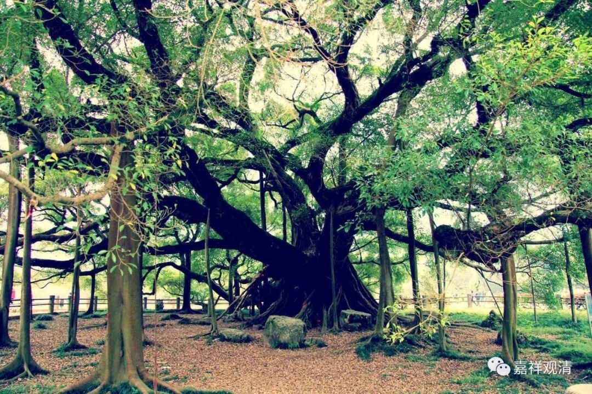

**《善说精髓》044（下）**

** “（子一）业决定理：**

** 从总善与不善业，生总苦乐、”**

** **

总的善呢，生起总的乐；总的不善呢，生起苦。别的善呢，生起别的乐；别的不善呢，生起别的苦。别的意思是特殊的、特别的。总的，是就大的方向来讲。

** “别苦乐，从细二业差别起；”**

** **

别的苦乐，从微细的善恶的** “业差别”**而生起苦乐。这里的苦乐是指我们一般人所讲的苦乐，就是受上面的苦和受上面的乐，是感觉、感受上的苦乐。

** “（子二）业增长广大：”**

** **

你造作了以后，为什么增长广大呢？我们所造作的恶业——负面的业，之后又有我们的烦恼进行滋润，就不断不断地就让它增长。善业也是一样，如果我们造了善业，然后有正面的思维，生起很多善的心所，也会令善业增长广大。就像一颗种子最终长成一片树林……

那么，反过来也是一样。假如我们造作了恶业，在未感果之前，我们的烦恼一直在断除，烦恼越来越少了，甚至消除了。那以前所造的业也就渐渐衰弱了，甚至感果的力量被对治了、不生起了；如果我们的善业造作了以后，烦恼生起得比较多，那这个善业也会渐趋衰弱。

我们门口有很多的种子，种子应该“能生”，但绝大部份是没机会生起的——因为生起的因缘“坏”了。我们进进出出早就把它们踩坏了，或者被扫到垃圾桶里填还了，或者埋在土里却缺乏阳光雨露……等等等等，这些种子就完了，生成大树的作用就没有了。但只要“能生”的因缘没有坏，那他们即使最后被埋到地底下，过了几百年，又被挖出来，考古人员把它们重新激活，最后还是可以长成一棵香樟树。

所以，一切这些，就是因果：因缘、果报。

