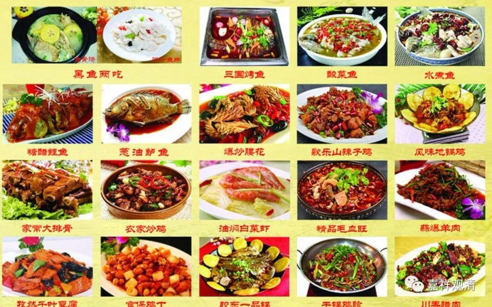
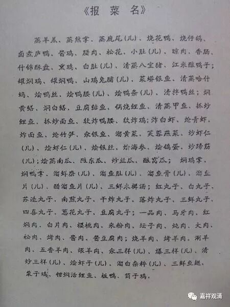

经典里经常可以看到世尊赞叹比丘应该“易养、易满”，如《根本说一切有部毗奈耶》：

**“世尊以种种呵责多欲不足难养难满，赞叹少欲知足易养易满，知量而受修杜多行……”**

《瑜伽师地论》总结的“沙门庄严”（《遁伦记》总结为十四庄严，余论多做十七庄严）也说：

** “正信而无谄，少病精进慧，**

** 具少欲喜足，易养及易满，**

** 杜多德端严，知量善士法，**

** 具聪慧者相，忍柔和贤善。”**

那么，什么是“易养、易满”，“易养”、“易满”有什么差别呢？

一般的教典对此不再细作分别，往往就连着说下来了，而我们“凡有言说都有实义”的有部则没“放过”他们。首先在《发智论》里说：

** “云何易满？**

** 答：诸不重食、不重噉、不多食、不多噉、不大食、不大噉、少便能济——是谓易满。**

** 云何易养？**

** 答：诸不饕餮、不极饕餮、不耽、不极耽、不嗜、不极嗜、不好咀嚼、不好甞啜、不选择而食、不选择而噉、趣得便济——是谓易养。”**

《大毗婆沙》对此未广分别，仅说文字是后排比，每一段里的意思是一样的。就是说，“难养”就是吃得多（胃口大也不行啊），“易养”就是吃得不多；“难满”就是贪吃、挑食、反复品味，“易满”就是不贪吃、不挑食、不反复品味。

若从阿含、戒经原文来看，“难养难满”、“易养易满”的内容并不仅限于饮食，是包括了吃穿住用（衣服、饮食、卧具、医药）的泛泛而谈。（有部的好处是几乎啥都有答案，另一面却是相对比较僵化，不活泼。）

