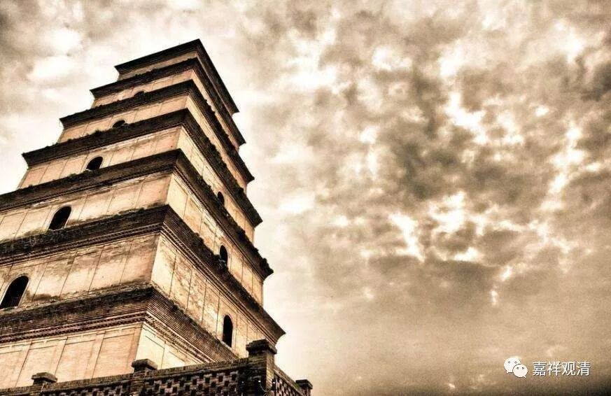
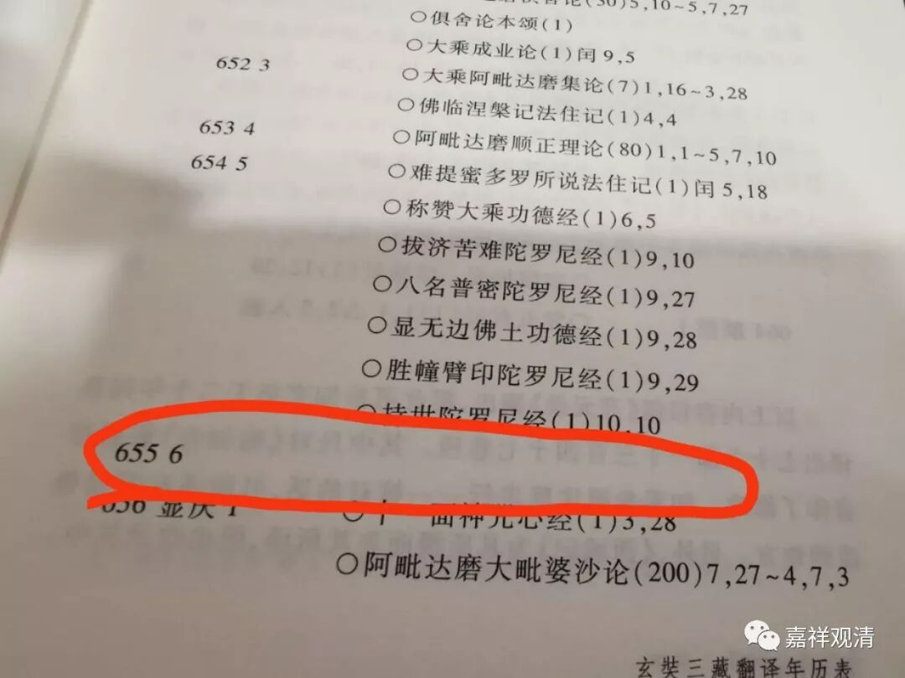
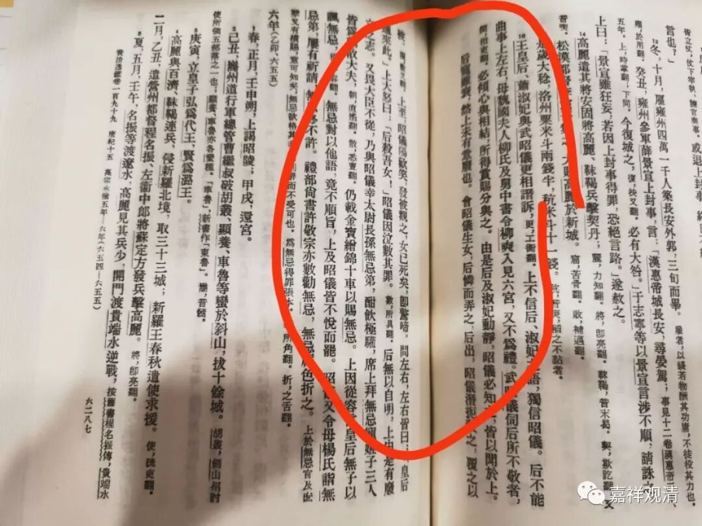
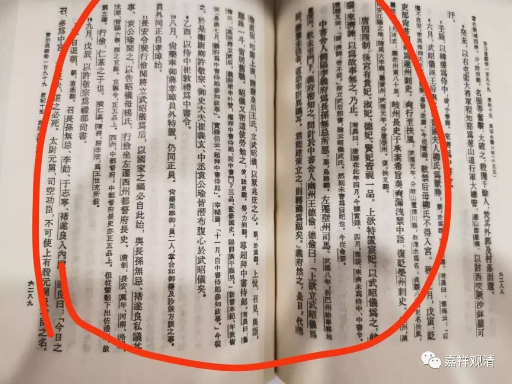
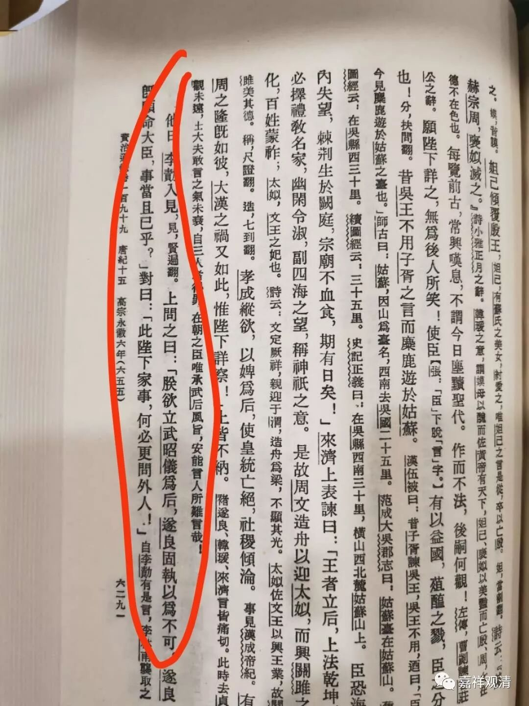
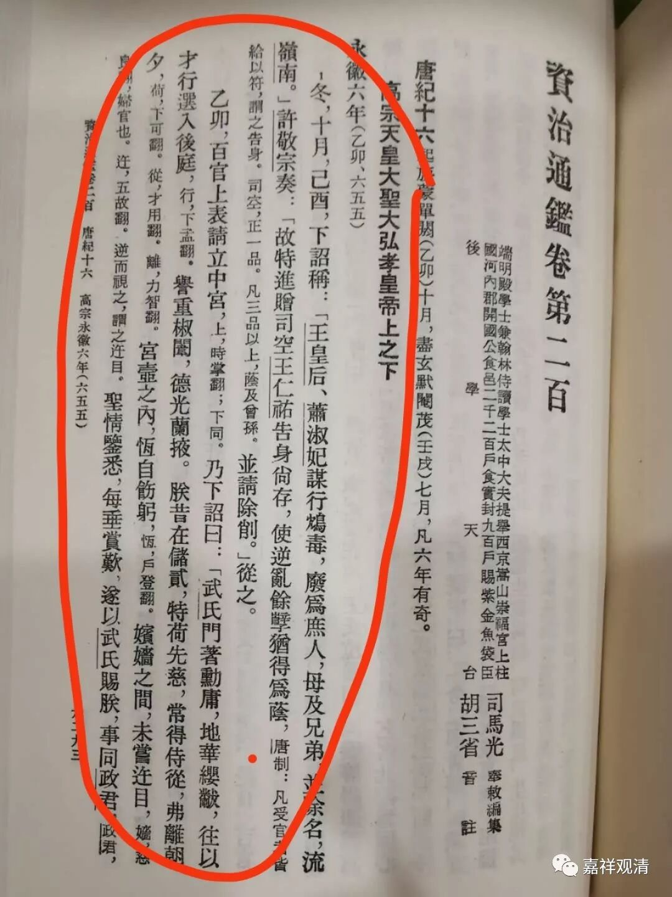

**《读书札记》**

** 玄奘法师那年干啥了？**

杭州佛学院慧观法师有翻译宇井柏寿的《瑜伽论研究》，昨天拿出来读，第一篇是《玄奘三藏翻译年历表》……忽然发现一个很奇怪的事情——永徽六年玄奘法师没有交过任何翻译作品！

这是比较奇怪的现象，一般来说，皇家译场总会赶节日（比如皇上、皇后生日）交几篇（哪怕是短篇，甚至有直接从长篇的阿含、戒经里面抠一段出来单行的）祝祝寿应应景，这一年皇家译场完全不交任何重大成果，一定是出什么大事了！

也有《玄奘年谱》说此年重译《因明正理门论》，但此论篇幅不大，之前（公元六四八年）已经翻译完毕。有说这年主要是和吕才辩论因明，但此事不大，纯粹是个因明外行瞎折腾而已……

另有年谱说此年起译《大般若经》，而宇井表翻译《大般若经》事系于显庆五年（公元660年。按：此处或有脱漏。本文说完成于龙朔10月20，未及年份）。暂先不论《大般若经》起译年代，因为即使其他翻译《大般若经》的年份，也还有小篇的译作问世。

一查《资治通鉴》，明白了！这年，废王皇后、立武则天为皇后！朝廷大震。由于这些名臣有些都以挂名润文等等形式参与译场，所以，交项目的事情也一并停了。而且这么大的事，玄奘法师不方便站位表态，所以这年玄奘法师的译场没有交卷……

和尚，像玄奘法师这样的大和尚，也不好当啊！

