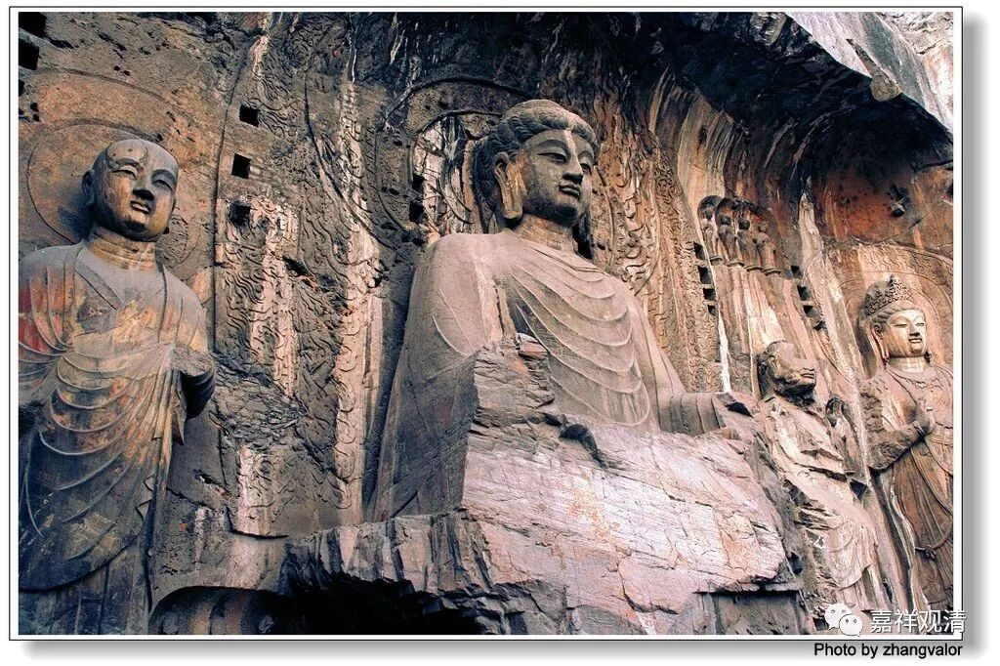
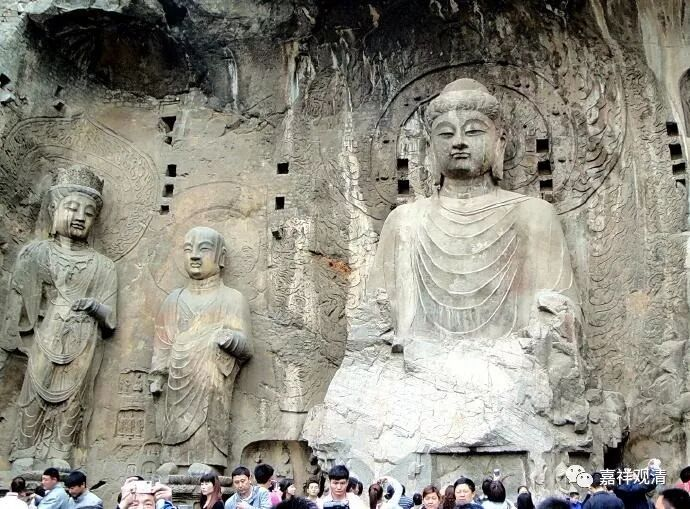
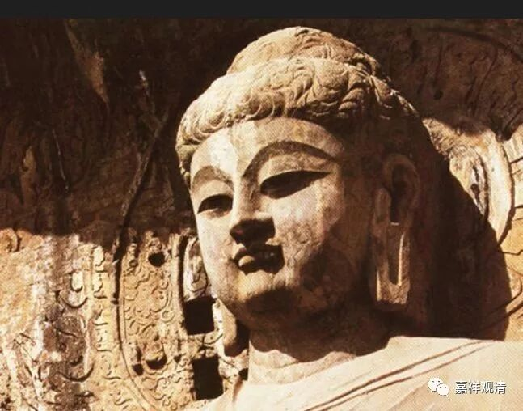
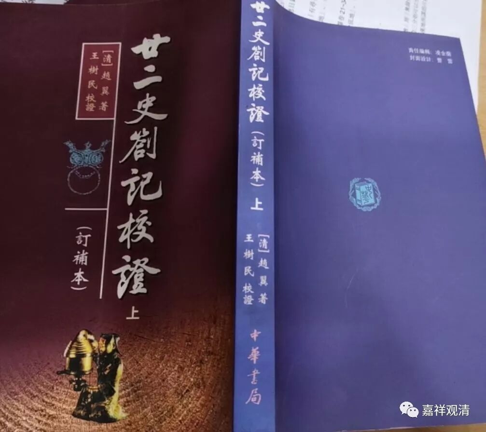
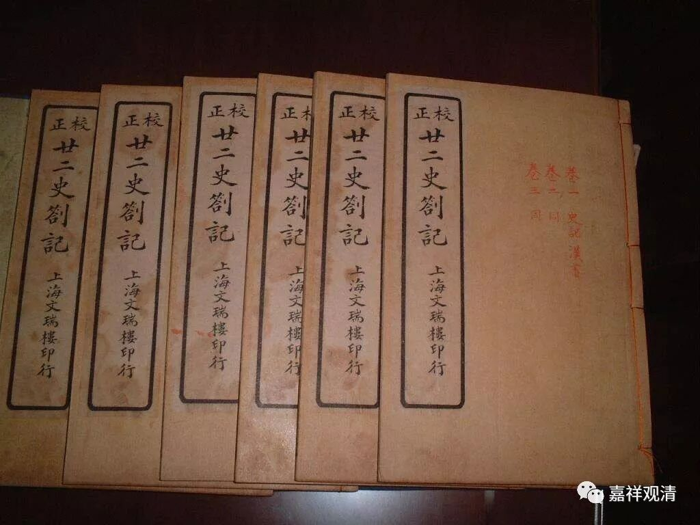
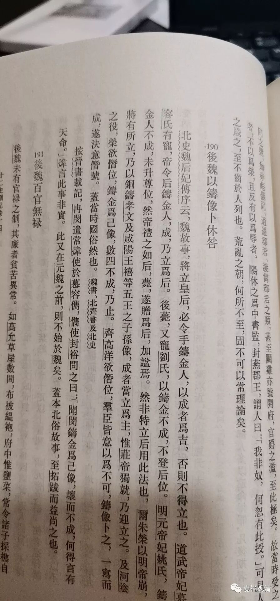
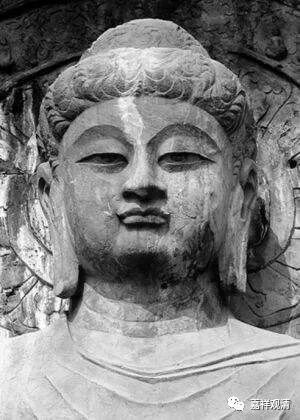

**北地信仰**

** ——造像上位！**

上次说道武则天上位是初唐一个大事件，玄奘法师负责的皇家译场因此有一年多没有上交成果。为了证明自己的位置是“天授”、“神授”，武则天做了一件事情——LOOK

用自己的形象造了尊（卢舍那）佛！

用自己的形象造佛像——这个动机可不单纯！（她的前夫也做过——这件事情可大了，我一般不说出来得罪人，想要知道的可以使劲打赏）什么目的呢？就是表明：我成功了，我可以！

佛教传来中国，由东汉而大唐已有七百年历史了，传来过程中，中国北方民族中出现了一个有趣的“小信仰”——（争议中）能用自己的形象造佛的才可以当皇帝。比如云冈石窟有“昙曜五窟”就是北魏的五位皇帝：第十九窟北魏开国皇帝拓跋珪，第十八窟明元帝，第二十窟太武帝，第十七窟的交脚菩萨代表太武帝之子，尚未即位就死去的景穆帝，第十六窟文成帝。

清·赵翼《二十二史札记》卷十四有“后魏以铸像卜休咎”：

说北魏立后必须要铸佛像，成功则的立后，不成功的话，皇上再喜欢也封不了后。不仅如此，连要做皇帝，假如大家不同意，也要建一尊佛像，成功的话，表示有“天意”。这似乎是当时北方民族通用的“信仰”。（《金史》中也记载说契丹诸帝有金像，应该是同样的意思。）

这种铸像，不一定是铜质，很多都是凿山为窟的石窟佛像，但都得像本人，否则怎么算是你（为你造）的呢？比如昙曜五窟的佛像都是皇帝本人的形象，“某”皇帝的像也是其本人形象（具体我们慢慢聊），武则天的这一尊（称为“卢舍那佛”）也是。

铸像干什么呢？并不是代表“我信佛”“求保佑”或者“我曾经出家”，而是对大家说——“我成功了，我可以（做皇后、做皇帝）！”

        修改于