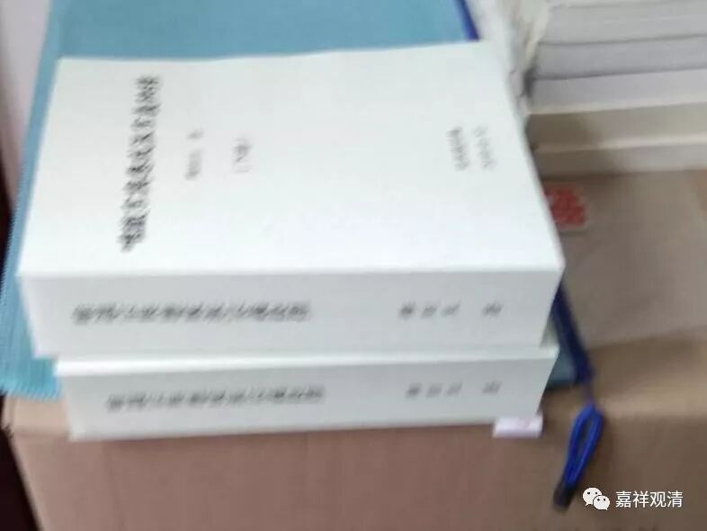
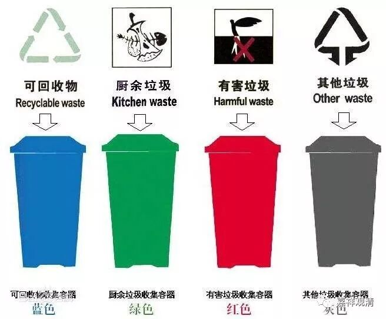

**“我觉得这篇还可以抢救一下”**

今天ZZ法师发来某某法师的硕士学位论文，可能是涉及唯识的原因，让我帮忙看看提提意见。

随便翻一翻，第一反应，论文做的还是很不错的，文献的基础扎实，大量的脚注，还有很多图表帮助理解，我先夸了几句……

稍微仔细看就有点问题了，首先篇幅太长了，一篇硕士论文有两百多页。再读下去，发现这个篇幅问题可能就是论文最大的问题——废话实在太多了，正文和注解都算，至少应该删掉三分之二。

还有一个佛教圈法师们论文常见的一个问题——基础太差！文字能力和行文逻辑都比较欠缺。（前两天看到ZS法师自信满满的大作，弯弯出版商给出的，上下两册五号字排版密密麻麻大概有五六千页，我感觉比《资治通鉴》篇幅要广，但是文字和行文能力的上限（其实他的阅读能力也是）应该是北上广重点小学三四年级。那本“书”我觉得吧……假如全文读完的话一定会拉低智商。）

ZS法师的“神作”

这篇论文也有这个问题，比如花了不小的篇幅考证A书作者，可是A书和B文之间的关系搞清楚了吗？A书的作者就是B书的作者吗？即使A书全抄B书，也不能证明A书就是B书作者呀？

另外法师们的论文还有一个常见的问题，就是体例很怪，很多文章其实不是论文，有时候我说更像博客。这篇论文也有类似的问题，我和ZZ法师都觉得更像是《某某经疏札记》或者《某经读书笔记》，全文内容非常分散，看起来像是作者手上宝贝太多，想要全部呈现出来（我怀疑是《讲记》、《经疏》看多了），因此论文写得实在像件百衲衣。其实说起来都是基础问题……

最近上海垃圾分类，我们也可以借用来给“垃圾论文”开开玩笑：

这类中心不清楚写成《札记》的论文呢，属于“可回收论文”——改改有用，可以抢救一下；

ZS法师那种百万字论文，就属于“厨余论文”——让他自然腐朽吧；

那些数据造假的论文，属于“有毒论文”——别信、远离！

那些林林总总食之无味的，属于“干（其他）论文”，因为打印出来也是干垃圾。

如果没内容、废话多、数据造假、还兼抄袭的……就直接拉出去毙了吧！

