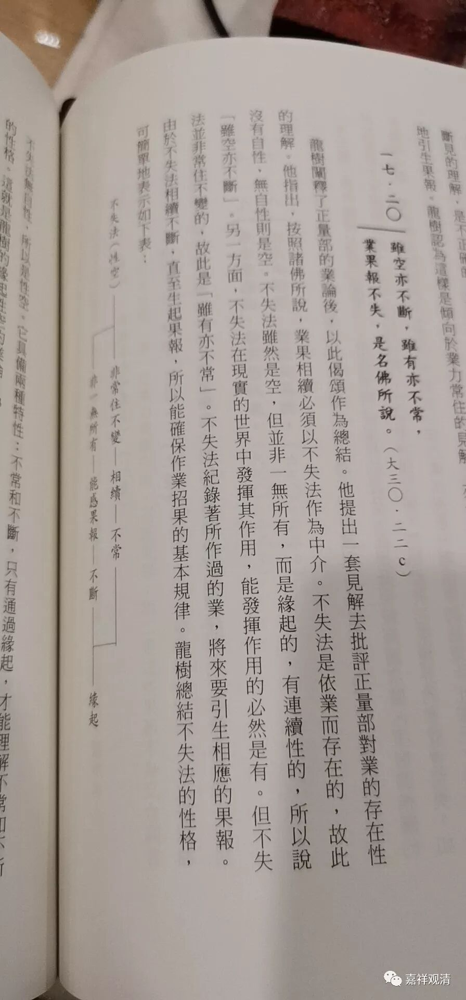
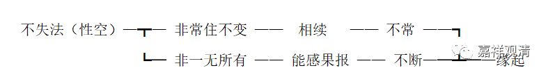

**《中论》“虽空亦不断”新解质疑**

《中论·观业品》的17·20颂

** “虽空亦不断，虽有亦不常，

**业果报不失，是名佛所说。”

** 

此颂在中观系统中向来见有两种解读：

一、早期中观师：汉译《青目释》和《大智度论》为代表的早期中观论典中都认为此一颂是自宗所许。其中《大智度论》提到此颂三次，都当作自宗来做引证。

二、中晚期诸论大乘论师：《佛护释》、安慧《中论释》、清辨《般若灯论》、月称《明句论》则认为此颂是正量部的所许。把“不失”看作是正量部主张的“不失法”。

今天读到吴汝钧教授的《龙树中论的哲学解读》，发现新说他是把上二说合起来解读的。即：把此颂读为龙树自许，把“不失法”按龙树的习惯解释为“无自性的不失法”。（按：若依《青目释》和《大智度论》的读法，应该读为“业无自性”而业不失坏。）若依这个解读，龙树在《中论》里要建立“不失法”了——这是不见于任何《中论》注释的。

《龙树中论的哲学解读》P250：

** “龙树阐释了正量部的业论后，以此偈颂作为总结。他提出一套见解去批评正量部对业的存在性的理解。他指出，按照诸佛所说，业果相续必须以“不失法”作为中介，不失法是依业存在的，故此没有自性，无自性则是空。不失法虽然是空，但并非一无所有，而是缘起的，有连续性的，所以说“虽空亦不断”。另一方面，不失法在现实的世界中发挥其作用，能发挥作用的必然是有。但不失法并非常住不变的，故此是“虽有亦不常”。不失法记录着所作过的业，将来要引生相应的果报。由于不失法相续不断，直至生起果报，所以能确保作业招果的基本规律。龙树总结不失法的性格，可简单的表示如下表：**

** **

** 不失法（性空）—┳— 非常住不变 ——  相续   —— 不常 ——┓**

** ┗─ 非一无所有 —— 能感果报 —— 不断—─┻─—缘起**

** **

** 不失法无自性，所以是性空。它具备两种特性：不常和不断，只有通过缘起，才能理解不常何不断的性格。这就是龙树的缘起性空的业论。”**

在补充的注解里面还接着提到：

** “显然龙树在这一总结的偈颂中，重在不失法的空的性格上。即是说，不失法可保证业果联系的关系，但它不是具有自性的常住不变的东西。”**

本书在对《中论17·20》一颂的解读上，把此颂读为龙树自许，把“不失法”按龙树的习惯解释为“无自性的不失法”。（按：若依《青目释》和《大智度论》的读法，应该读为“业无自性”而业不失坏。）以成立“不失法”来成立“缘起性空”“不常不断”。若依这个解读，龙树在《中论》里是要建立“不失法”的——但这是不见于任何一种《中论》注释的（也未见其他中观师建立过“不失法”）。

也许本书是没有注意到中观师在解读这一颂时的差别吧。

