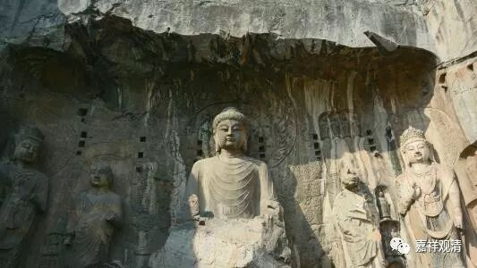
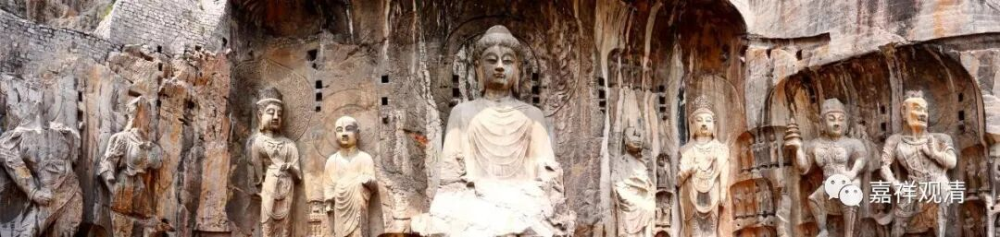
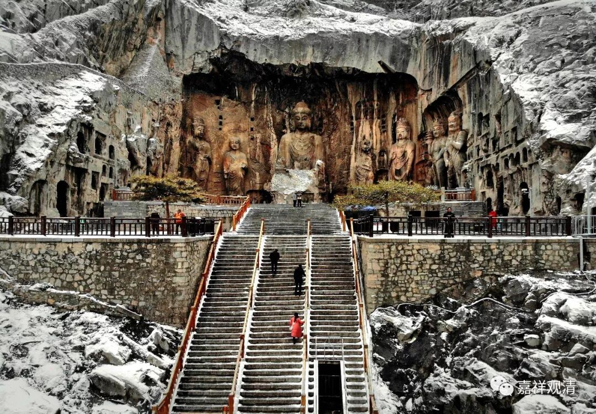

**
**

** 杜甫和奉先寺**

话说我们的诗圣杜甫也在武则天、李治造的奉先寺住过，还写了首诗《游龙门奉先寺》：

“已从招提游，更宿招提境。

阴壑生虚籁，月林散清影。

天阙象纬逼，云卧衣裳冷。

欲觉闻晨钟，令人发深省。”

这是说，在庙里旅游了吧，还带住宿的。这时候杜甫才二十五岁，应该还没太大名气吧。可见庙里有“宿坊”，今天日本庙里的宿坊是跟咱学的，哈哈。

奉先寺的建造在雕凿完龙门卢舍那大佛之后。龙门卢舍那大佛——那尊武则天，和周围罗汉、菩萨、供养人像是咸亨三年（公元672年）四月初一开凿的，至上元二年（公元675年）十二月三十完工，这日子都是专门挑好的吧。四月初一，就是通常说的萨嘎月的第一天咯，十二月三十完工，正赶上元旦“献礼”。开凿石窟，武则天捐了20万贯！（人家随便动动手都不小的功德。）

寺院比凿大佛要快得多，调露元年（公元679年）八月十五中秋节建的，第二年正月十五建成（这又都是挑的好日子），五个月搞定，速度够快的！今天我们用水泥钢筋估计冬天这五个月一般都拿不下来，帝制时代皇帝要点干啥真是容易啊！

