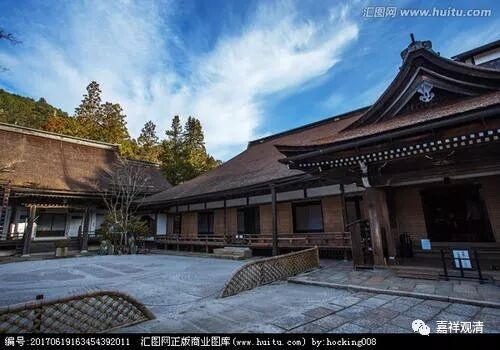
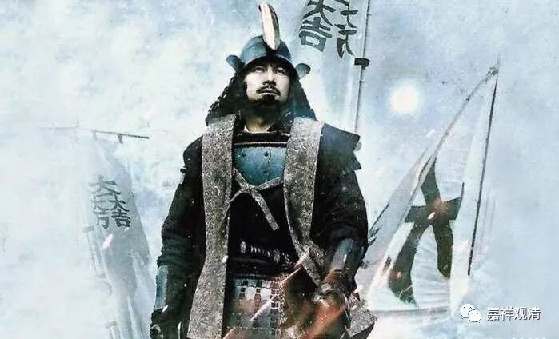
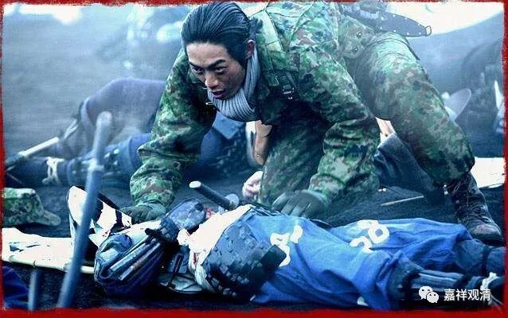
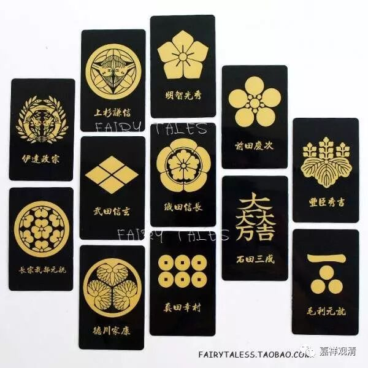
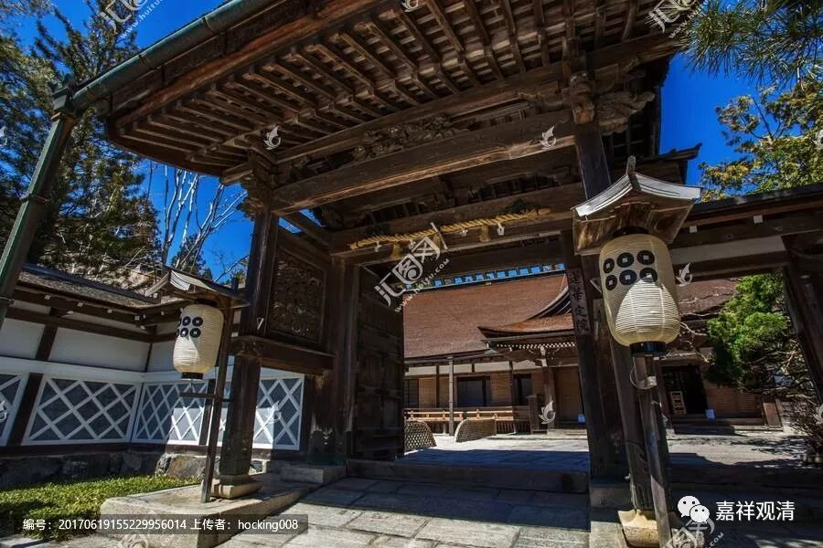

黄泉路上“六枚铜钱”

最近日本新拍了一个战国片子——《关原之战》。

看了介绍，似乎围绕着战国著名“关原之战”的故事展开的。（搜索了一下，还有一个日本连续剧类似于《寻秦记》的《自卫队和关原之战》，反町隆史演的。）

《战国自卫队——关原之战》

我对日本战国了解不多，只是有几个很耳熟的名字而已。上次去日本京都、高野山，战国里的故事和人物稍微活了一点。在高野山的墓园里有好几位战国名人的墓葬，我记得就有明智光秀、德川家康。

部分日本战国时期家纹

真田家六枚铜钱的家纹令我比较有印象。记得高野山来回晃荡的时候，路过“莲花定院”，就在路边，门口俩灯笼，云丹（还是巴丹？忘了是哪个丹了）提醒我们——看见六枚铜钱没有，这是真田家的家纹（类似家徽），意思是黄泉路上买路钱（也有说代表六道的）。

莲花定院，灯笼上六枚铜钱，就是真田家的家纹

关原之战后，真田家一分为二，战败的一方真田昌幸和真田幸村被逼退居高野山莲花定院“清修”。后来真田幸村继续反对德川家康力竭而亡，被誉为“日本战国第一兵”。

真田家后来一直资助高野山莲花定院，成为寺院大施主，又因为两位真田家的英雄曾在此“静修”，所以现在寺院门口仍旧挂上真田家的家纹——

六枚铜钱！

