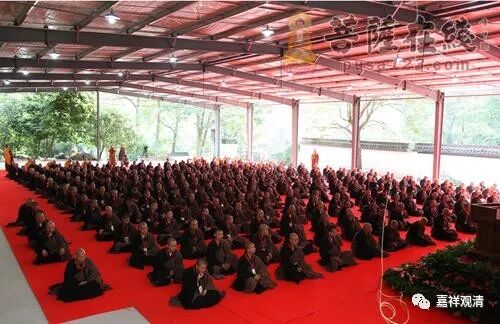
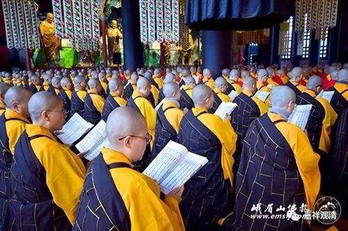
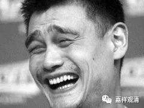

**“老阿姨”的典故**

有一次去师父那里求法，师父一高兴，给我们看了个手机里的视频，指着视频里一个女人说“……你看这个三十多岁的老阿姨blablabla……”

我还没反应过来，一起听法的俩三四十岁“女生”已然摆出哀怨的表情盯着师父了：“三十几岁就老阿姨了啊（我们也就那点年纪啊）……”我是幸灾乐祸，师父只能“顾左右而言他”（哈哈……）。于是我们有了个典故——老阿姨。

最近读《佛教汉语研究》，发现“阿姨”居然出典还真是在佛教里的，很可能这个词是佛教传到俗语当中去的。

《杂阿含经》卷45：

** “语比丘尼言：‘阿姨！欲何处去？’”**

《摩诃僧祇律》卷12：

** “中有比丘尼谓诸人言：‘止！止！阿姨！当自观察，我等违世尊教，得此供给已自过分。’”**

《四分律》：

** “檀越问：‘阿姨！三种药粥美不？’”**

上述经律中，“阿姨”的“姨”就是“优婆夷”的“夷”，指的是女性。上述用例中都是指的出家的“尼众”，其实今天藏人管出家女性叫“阿尼”，也是同一个意思了。

《古今图书集成·神異典》第七十四卷

** “《齐春秋》：晋安王子懋字云昌，武帝子也。年七岁时，母阮叔媛常病危，笃请僧行道。有献莲花供佛者。众僧以铜甖盛水，花更鲜。**

** 子懋流涕礼佛，誓曰：‘若使阿姨护祐，愿华竟斋如故。’**

** 七日斋毕，华更鲜红，看视甖中，稍有根须。阮病寻差。世称其孝感。”**

这里的“阿姨”，有人说专指母亲，其实应该是泛指信佛的女性。

《宗门拈古》卷四：

“大阳因僧问；不借时机用，如何话祖宗？

师曰：老鼠咬腰带。

拈云：象林则不然。老鼠勘破** 阿姨**禅。”

这是禅宗里的“阿姨”了。禅宗灯录经常用到俗语。禅宗公案里面有“老婆禅”、“老婆心切”的用法，其中“老婆”是指老婆婆。这则“拈古”里化用“老婆禅”的用法，说“阿姨禅”，意思基本是一样的——这已经接近今天的“老阿姨”的用法了。

这样看来，师父说的“老阿姨”一点没错啊！（哈哈哈哈哈……）

** 赞我！**

