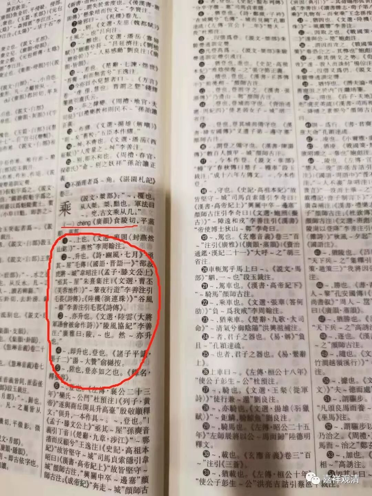
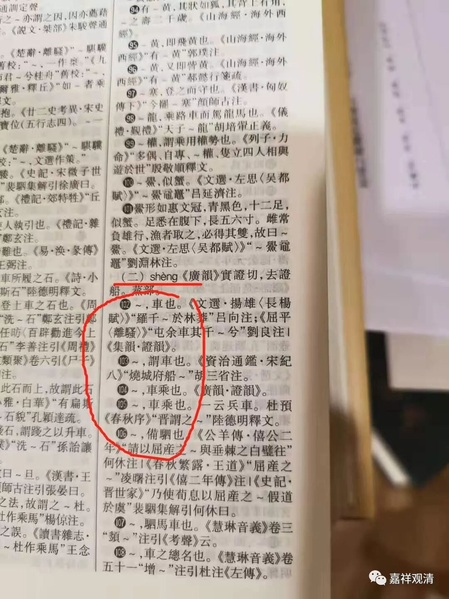

**“大乘”的“乘”到底该念什么？**

“小乘”、“大乘”、“声闻乘”、”缘觉乘“、“佛乘”的“乘”，一般人都念做[ chéng ]，现今各类词典和“度娘”里也告诉我们作为“佛教的教理和教派”的“大小乘”应该念[ chéng ]甚至还不忘了提醒“不该念[ shèng ]”。其实这才是读错了。

“乘”的读音有二：1、[ chéng ]（成）；2、[ shèng ]（胜）。

做[ chéng ]读时，本意是上、升、登、乘车、載。

我们看一下《故训汇纂》吧。（不多打字了，直接上图）：

做[ shèng ]读时，本意是车乘、车。

也看一下《故训汇纂》（继续偷懒——上图）：

我们再看“大乘”“小乘”。他们对应的梵文。以“大乘”为例，“大乘”的梵文是mahāyāna（大乘、摩诃衍那）、“摩诃”（mahā）是“大”，“衍那”yāna是“乘”，这里的“乘”意思是如“车船等运载工具”，而不是如一般汉文释经里说的“运载”、“承载”的意思。

对应上面的两种解释，“承载”意该念“[ chéng ]”，而“车乘”应该念“[ shèng ]”，那么，“大乘”“小乘”明确应该念[ shèng ]（胜）。其实今天我们宝岛很多师父们是念如“大胜”[ shèng ]的，他们的念法是对的！

作为上海人就比较简单了，本来方言里就是念 shèn的，我听四川的师父的方言里好像也是直接念成shèng的，对这些方言控来讲，读音倒是正确的了。

